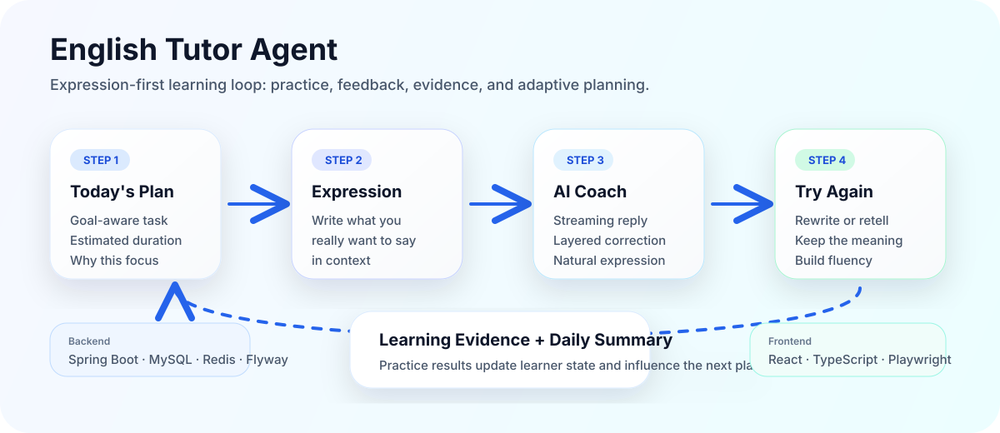
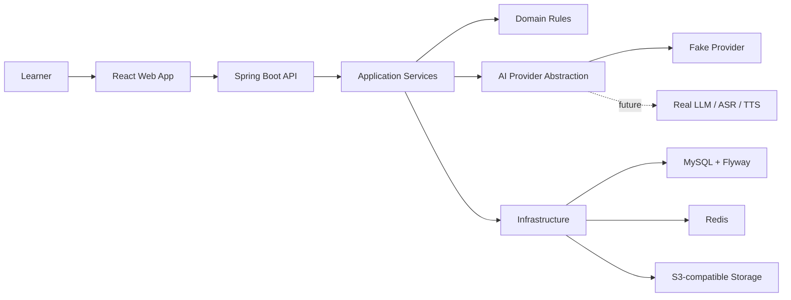

# English Tutor Agent

> Web-first AI English Expression Coach：围绕“表达 → 纠错 → 再输出 → 形成学习证据 → 调整下一次计划”的英语学习闭环。

<p>
  
  
  
  
  
  
  
</p>

## Demo

演示地址：`https://your-production-demo-url.example.com`

> 生产环境部署完成后，将这里替换为真实 URL。当前仓库已提供生产部署文档和脚本，见 [Production Deployment](docs/deploy/PRODUCTION_DEPLOYMENT.md)。

## 项目定位

English Tutor Agent 不是一个“通用聊天机器人外壳”，而是一个面向英语学习的智能表达教练。它把用户每天的表达练习拆成可追踪的学习闭环：先给今日计划，再让用户主动输出，随后提供分层纠错、自然表达建议和 Try Again，再把练习结果转成学习证据，用于下一次计划调整。

当前版本已经完成到 **M3 Web Expression Coach MVP**：Web 端表达教练主路径、后端文字学习闭环、Fake AI Provider、Playwright E2E 和生产部署脚本均已具备。



## 解决什么问题

很多英语学习产品和通用 AI 对话存在三个痛点：

| 痛点 | 常见结果 | English Tutor Agent 的做法 |
|---|---|---|
| 只纠错，不形成长期学习 | 用户知道这句话错了，但不知道下一次练什么 | 每次训练生成 learning evidence，并驱动下一计划 |
| 反馈太碎或太重 | 用户被打断、害怕表达 | 分层纠错，只突出少量高价值问题 |
| AI 输出不可控 | 难测试、难复现、难上线 | Provider 抽象 + Fake Provider + JSON Schema/业务校验 |
| 学习流程每天重新开始 | 没有画像、没有状态、没有持续性 | 用户目标、偏好、能力画像、计划和会话状态持久化 |

## 核心能力

- Web Expression Coach：输入英文或中英混合表达，获得流式教练回复。
- Layered Correction：错误定位、规则解释、自然表达建议分层展示。
- Try Again Loop：引导用户改写/复述，而不是停留在“看答案”。
- Today Plan：根据用户目标、偏好和能力状态生成今日训练任务。
- Daily Summary：训练完成后生成总结，并展示下一计划变化。
- Learning Evidence：把练习结果转成可追踪证据，服务后续复习和计划调整。
- Fake AI Provider：无需真实 API Key 即可本地演示、测试和 CI 验证。
- Contract-first：OpenAPI、JSON Schema、Flyway migration 和自动化校验共同约束实现。

## 项目优势

### 1. 学习闭环优先，而不是功能堆叠

项目从第一版就围绕“主动输出 + 纠错 + 再输出 + 证据沉淀”设计，避免做成只会回答问题的聊天框。

### 2. 可测试的 AI 架构

业务领域不直接依赖 LLM、ASR、TTS SDK。真实 Provider 接入前，默认使用确定性的 Fake Provider 跑通流程，单元测试和 E2E 不依赖付费模型。

### 3. 模块化单体，边界清晰

后端采用 Java 21 + Spring Boot 模块化单体，按 domain / application / api / infrastructure / agent / observability 拆分，保留未来演进空间，但不提前引入过度微服务复杂度。

### 4. Web-first 快速验证

V1.0 先验证表达教练的核心价值；Android 语音、ASR/TTS、听力和 IELTS Speaking 后续按里程碑推进。

## 当前进度

| Milestone | 状态 | 说明 |
|---|---:|---|
| M0 工程基线 | DONE | 后端、Android、基础设施、CI、Fake Provider |
| M1 首次使用与初评 | DONE | 目标、偏好、自评、初评、初始画像、首个今日计划 |
| M2 文字学习闭环 | DONE | Training Session、SSE、纠错、学习证据、每日总结 |
| M3 Web 表达教练 | DONE | Web MVP、Try Again、总结页、Playwright E2E |
| M4 语音与听力 | TODO | Android 录音、音频上传、ASR、TTS、弱网恢复 |
| M5+ 长期复习 / IELTS / 发布加固 | PLANNED | 启动前再细拆任务，避免提前堆空壳 |

## 技术架构



### 后端模块

```text
server/
├── tutor-domain          # 聚合、值对象、确定性领域规则
├── tutor-application     # 用例编排、事务边界、业务流程
├── tutor-api             # HTTP Controller、DTO、SSE 映射
├── tutor-agent           # AI Provider 抽象、Fake Provider、Prompt/结构化输出策略
├── tutor-infrastructure  # JDBC、缓存、对象存储、外部适配器
├── tutor-observability   # 观测、审计、指标扩展点
└── tutor-bootstrap       # Spring Boot 启动入口、Flyway migration
```

### 前端模块

```text
web/
├── src/app               # 应用入口与全局样式
├── src/features/coach    # 今日表达教练、流式回复、纠错面板、Try Again
├── src/features/onboarding
├── src/features/summary
├── src/shared/api        # Typed REST/SSE API client
└── tests/e2e             # Playwright 主路径 E2E
```

## 快速开始

### 1. 启动基础设施

```bash
cp .env.example .env
docker compose --env-file .env up -d
```

本地默认依赖：

- MySQL: `localhost:3306`
- Redis: `localhost:6379`
- MinIO: `localhost:9000`

### 2. 启动后端

```powershell
cd server
.\mvnw.cmd clean verify
.\mvnw.cmd -pl tutor-bootstrap spring-boot:run
```

健康检查：

```text
GET http://localhost:8080/actuator/health
```

### 3. 启动 Web

```powershell
cd web
pnpm install
pnpm run dev
```

Web 默认连接 `http://localhost:8080`。如需连接其他后端：

```powershell
$env:VITE_API_BASE_URL="https://your-api.example.com"
pnpm run dev
```

## 常用命令

```powershell
# 项目结构、OpenAPI、JSON Schema、示例校验
python scripts\validate_project.py

# 后端测试
cd server
.\mvnw.cmd clean verify

# Web 单元测试 / 构建 / E2E
cd web
pnpm test
pnpm run build
pnpm run e2e
```

## 生产部署

已提供一套单机生产部署参考：

- Nginx 提供 Web 静态资源；
- `/api/` 和 `/actuator/` 反代到 Spring Boot；
- systemd 托管后端；
- MySQL、Redis、S3 通过环境变量接入；
- 敏感信息全部留在 `production.env`，不提交到仓库。

入口文档：

- [Production Deployment](docs/deploy/PRODUCTION_DEPLOYMENT.md)
- [production.env.example](scripts/deploy/production.env.example)
- [Linux deploy script](scripts/deploy/deploy_production.sh)
- [Windows-to-Linux deploy script](scripts/deploy/deploy_production.ps1)

## 目录导览

```text
english-tutor-agent/
├── android/              # Android Compose baseline，语音/听力后续推进
├── contracts/            # OpenAPI、JSON Schema、示例契约
├── docs/                 # PRD、设计、ADR、计划、部署、测试策略
├── evaluation/           # AI 评测说明与后续扩展点
├── infrastructure/       # 本地基础设施说明
├── scripts/              # 校验、部署、外部基础设施检查脚本
├── server/               # Java 21 + Spring Boot 模块化单体
└── web/                  # React + TypeScript Web Expression Coach
```

## 路线图

- M4：Android 录音状态机、音频上传、ASR Provider、TTS Provider、低置信度确认、弱网恢复 E2E。
- M5：长期复习、动态掌握状态、Review Scheduler、周报。
- M6：IELTS Speaking Part 1/2/3、完整模拟、Rubric 练习参考评分。
- M7：隐私删除、监控告警、成本指标、发布灰度、回滚和正式发布。

## 安全与隐私边界

- 不提交密钥、Token、真实用户录音或隐私数据。
- 日志不得输出完整授权头、密钥和不必要的用户原文。
- AI 输出必须先解析、再 Schema 校验、再业务校验。
- IELTS 评分仅作为练习参考，不得声称为官方成绩。
- 数据库结构只能通过 Flyway 前向迁移。

## 文档入口

- [PRD](docs/prd/ENGLISH_TUTOR_AGENT_PRD_v1.0.0.md)
- [Design README](docs/design/00_README.md)
- [Current Task](docs/plans/CURRENT_TASK.md)
- [Task Backlog](docs/plans/TASK_BACKLOG.md)
- [Definition of Done](docs/process/DEFINITION_OF_DONE.md)
- [Production Deployment](docs/deploy/PRODUCTION_DEPLOYMENT.md)

## License

License 尚未声明。公开分发或商用前请先补充许可证。
