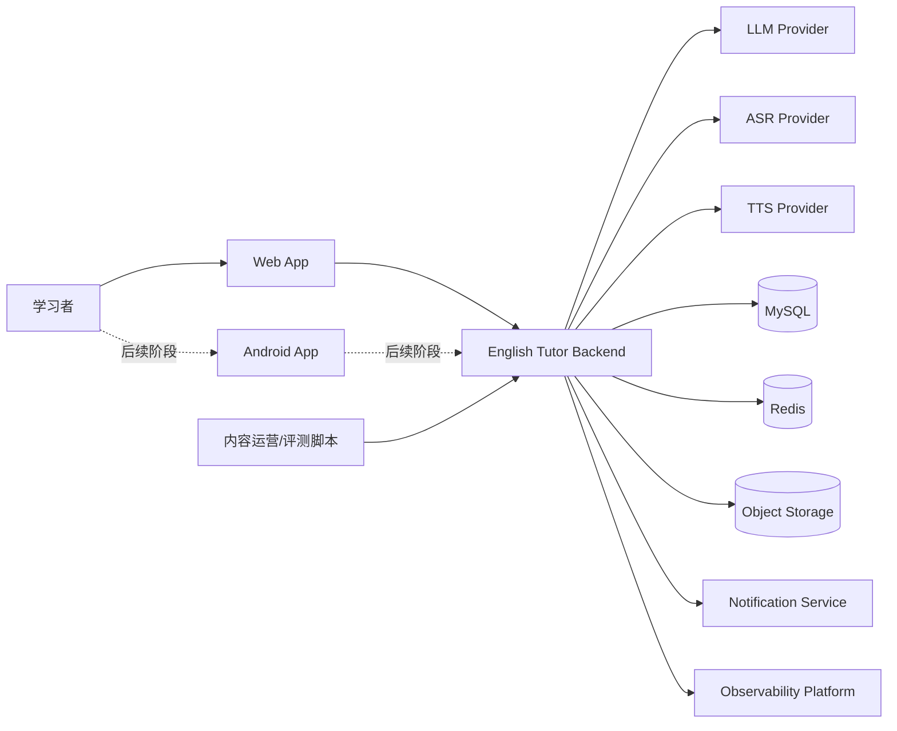
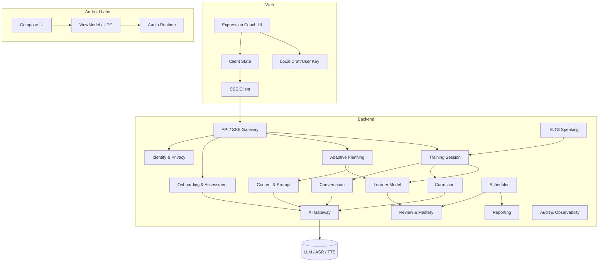
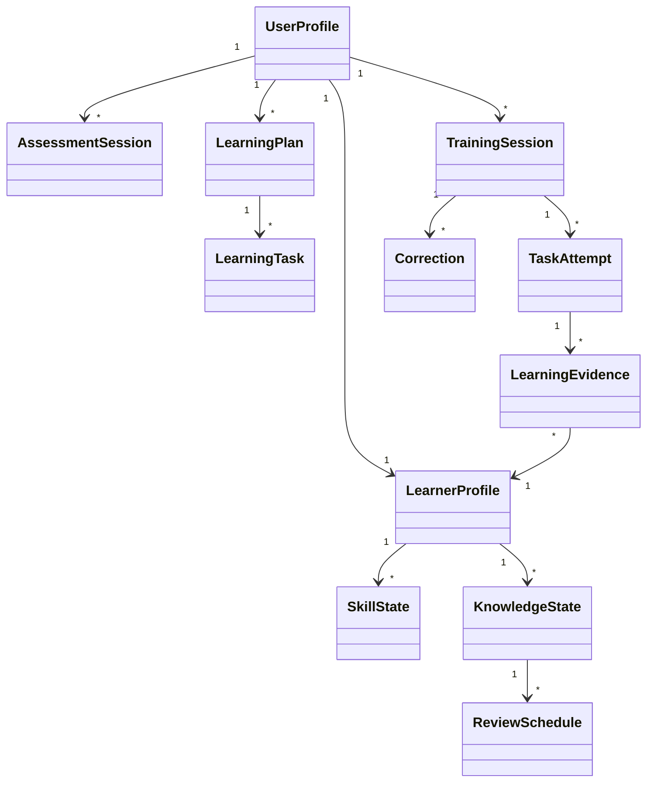
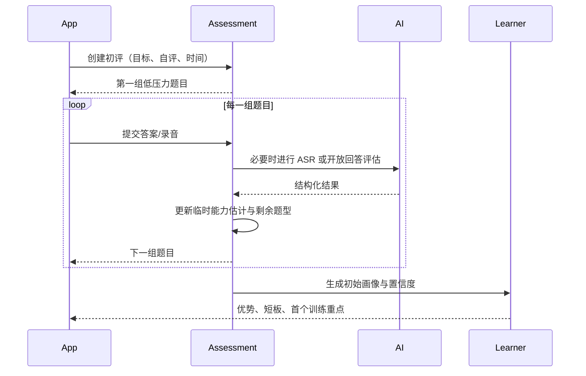
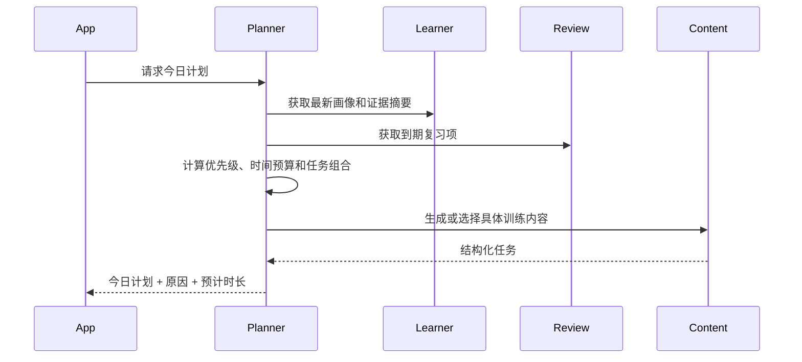
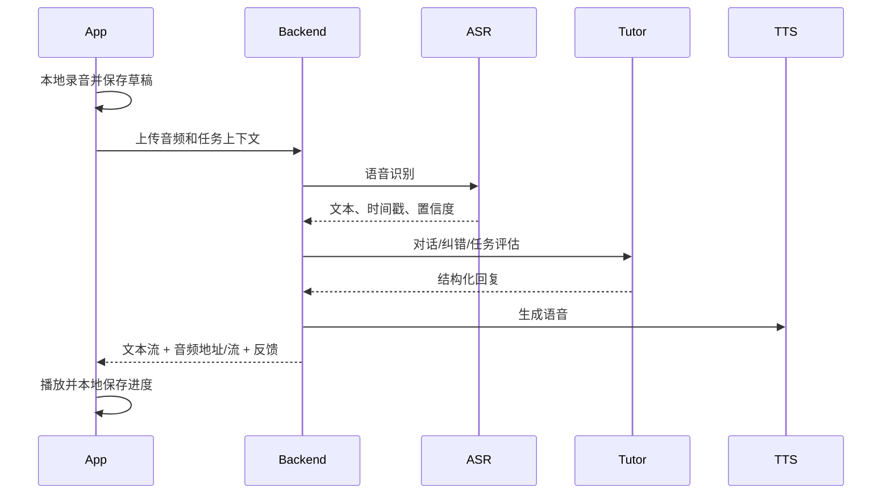

# English Tutor Agent 概要设计

> 文档版本：`1.0.0`  
> 设计输入：`ENGLISH_TUTOR_AGENT_PRD_v1.0.0.md`  
> 状态：概要设计基线初版，含 2026-08-10 Web-first 修订

---

# 1. 设计目标

## 1.1 业务目标

系统需要实现以下核心闭环：

```text
轻量评估
→ 建立学习者画像
→ 自动生成计划
→ Web 文字表达训练
→ 语法纠错与自然表达优化
→ Try Again 再输出
→ 记录学习证据
→ 每日总结
→ 生成下一次计划
```

用户只决定学习目标、可用时间和临时需求，系统负责日常教学决策。

## 1.2 技术目标

- V1.0 首版优先支持 Web 文字表达教练；
- 普通文字回复快速流式开始；
- 表达纠错可展示错误定位、规则解释、自然表达和 Try Again；
- 语音链路后移到 M4，可显示录音、上传、识别、生成、播放状态；
- 模型或网络失败不丢失用户已完成的学习内容；
- 学习计划和能力变化可解释、可追踪；
- AI 供应商可替换；
- 支持逐步演进，不为第一版引入不必要的微服务复杂度。

## 1.3 设计原则

1. **业务决策确定性优先**：学习优先级、复习到期和掌握状态由规则引擎负责；
2. **模型生成受约束**：模型输出必须匹配 Schema，失败可重试和降级；
3. **证据驱动**：画像变化只能由学习证据触发；
4. **模块化单体**：边界清晰，但首版统一部署；
5. **客户端可恢复**：关键进度先本地保存，再与服务端同步；
6. **隐私默认可控**：用户可关闭原文/录音保存和执行删除；
7. **纵向闭环交付**：按 M1–M7 逐段实现，不按技术层横向堆代码。

---

# 2. 系统上下文



## 2.1 外部角色

| 角色 | 与系统关系 |
|---|---|
| 学习者 | 在 Web 完成表达输入、纠错、再输出、总结和数据管理 |
| AI Provider | 提供 LLM、ASR、TTS 能力，可由一个或多个厂商组成 |
| 对象存储 | 后续保存音频、生成的听力资源和可选原始录音 |
| 通知服务 | 后续 Android 本地提醒为主，可接推送 |
| 内容运营 | 管理场景模板、评测集、禁用内容和版本 |

---

# 3. 总体架构

## 3.1 逻辑架构



## 3.2 物理部署架构

第一版建议部署为：

```text
Web App
    │ HTTPS / SSE
Nginx / API Gateway
    │
English Tutor Backend（单实例起步，可水平扩容）
    ├── MySQL
    ├── Redis
    ├── Object Storage
    └── 外部 AI Provider
```

Android App 后续阶段接入同一 API，不改变后端领域边界。

部署约束：

- 后端保持无状态请求处理，学习状态落库；
- SSE 连接通过粘性会话或共享状态支持扩容；
- 语音二进制不进入数据库，V1.0 Web 文字链路不依赖对象存储；
- 异步任务使用数据库 Outbox + Worker 或 Redis 队列；
- 首版无需 Kafka，除非日后并发或异步链路明显增长。

---

# 4. 模块划分

## 4.1 后端业务模块

| 模块 | 主要职责 | 对应 PRD |
|---|---|---|
| Identity & Preference | 用户、目标、时间、纠错、提醒和隐私偏好 | FR-ONB、FR-REM、FR-DAT |
| Assessment | 自评、题目编排、初评会话、结果归一化 | FR-ASM |
| Learner Model | 多维能力、知识状态、学习行为和证据聚合 | FR-PRO |
| Adaptive Planning | 决定今日任务、时长、难度和计划解释 | FR-PLN |
| Training Session | 统一管理训练会话、任务进度和恢复 | FR-TRN |
| Conversation | 文字/语音场景对话和上下文管理 | FR-CON |
| Correction | 错误检测、自然表达、反馈时机和纠错数量控制 | FR-COR |
| Review & Mastery | 复习调度、迁移、延迟验证和掌握状态 | FR-REV |
| IELTS Speaking | Part 1/2/3、完整模拟和参考评分 | FR-IEL |
| Reporting | 每日总结、周报、阶段测验和趋势 | FR-RPT |
| Content & Prompt | 题目模板、场景素材、Prompt、版本和质量标签 | FR-TRN-006 |
| AI Gateway | Provider 抽象、路由、重试、结构化输出和成本 | 全部 AI 功能 |
| Audit & Observability | Trace、调用日志、指标、审计和问题追踪 | NFR |

## 4.2 Web V1.0 模块

| 模块 | 主要职责 |
|---|---|
| app | 路由、布局、全局 Provider 和启动流程 |
| shared/api-client | REST、SSE、错误转换和幂等请求头 |
| shared/session | 开发期用户键、会话草稿和最近一次训练状态 |
| features/onboarding | 最短目标、偏好和初评入口 |
| features/coach | 表达输入、流式回复、纠错面板和 Try Again |
| features/plan | 今日任务、计划原因和下一计划变化 |
| features/summary | 每日总结、练习证据和下一步建议 |
| features/settings | 隐私、原文保存开关和本地数据清理 |
| testing | Mock API、SSE fixture 和 Playwright 主路径 |

## 4.3 Android 后续模块

| 模块 | 主要职责 |
|---|---|
| app | Application、导航、全局依赖和启动流程 |
| core:model | 客户端领域模型与 DTO |
| core:network | REST、SSE、上传、认证和错误转换 |
| core:database | Room 缓存、草稿、上传任务和同步状态 |
| core:audio | 录音、音量、播放、音频焦点和权限 |
| core:designsystem | 组件、主题、状态和无障碍规范 |
| feature:onboarding | 目标、自评和初评 |
| feature:home | 今日计划、原因和快速调整 |
| feature:training | 听力、对话、跟读、复述和通用任务容器 |
| feature:ielts | Part 1/2/3 与完整模拟 |
| feature:progress | 画像、趋势、周报和阶段测验 |
| feature:settings | 提醒、隐私、数据删除和偏好 |
| sync | WorkManager 同步、失败重传和提醒安排 |

---

# 5. 核心领域对象



核心对象说明：

- `UserProfile`：用户目标和偏好；
- `LearnerProfile`：当前多维能力画像；
- `SkillState`：听说读写、语法、词汇、自然度等能力状态；
- `KnowledgeState`：具体知识点、词块、错误模式的掌握状态；
- `AssessmentSession`：初评或阶段测验；
- `LearningPlan`：某日或某阶段的任务计划；
- `LearningTask`：计划中的具体任务；
- `TrainingSession`：一次连续训练；
- `TaskAttempt`：用户对一个任务的作答；
- `LearningEvidence`：用于画像更新的标准化证据；
- `Correction`：纠错与自然表达建议；
- `ReviewSchedule`：某知识状态的下一次复习安排。

---

# 6. 核心流程概要

## 6.1 初评流程



## 6.2 每日计划流程



## 6.3 语音训练流程

第一版采用半双工：



## 6.4 学习证据更新流程

```text
TaskAttempt
→ Evidence Normalizer
→ 去噪与置信度计算
→ 更新 SkillState
→ 更新 KnowledgeState
→ 更新 ReviewSchedule
→ 记录 ProfileChangeLog
→ 使后续计划缓存失效
```

---

# 7. Agent 架构概要

第一版不设计为多个完全自治 Agent 相互自由协商，而采用**确定性工作流 + 专项智能组件**：

```text
Learning Orchestrator
├── Assessment Engine
├── Planning Engine
├── Conversation Coach
├── Correction Coach
├── Review Engine
├── IELTS Evaluator
├── Content Generator
└── Learner Model Updater
```

原则：

- Orchestrator 决定调用顺序；
- 规则引擎决定是否需要调用某个组件；
- LLM 负责语言理解、内容生成、开放回答评估；
- 数据写入由应用服务验证后完成，模型不能直接修改数据库；
- 首版不引入 MCP 动态工具发现，内部工具使用白名单注册。

---

# 8. 数据架构概要

## 8.1 数据分类

| 分类 | 存储 | 示例 |
|---|---|---|
| 核心业务数据 | MySQL | 用户、计划、任务、画像、证据、纠错 |
| 短期状态 | Redis | SSE 会话、幂等键、临时锁、限流、缓存 |
| 二进制内容 | 对象存储 | 录音、TTS 音频、听力素材 |
| 客户端缓存 | Web localStorage/sessionStorage；后续 Android Room | 今日计划、任务进度、表达草稿、最近报告 |
| 配置与 Prompt | Git + 数据库发布表 | Prompt 文本、场景模板、版本 |
| 可观测数据 | Metrics/Logs/Traces | latency、token、ASR 失败、trace |

## 8.2 一致性原则

- 关系数据库是学习状态的最终事实来源；
- Web 本地状态和后续 Android Room 都只是客户端缓存，不独立决定长期画像；
- 音频上传使用临时上传凭证或后端中转；
- 任务提交使用幂等键；
- 画像更新与证据写入在同一事务或可靠异步事件中完成；
- 对象存储删除失败进入补偿任务。

---

# 9. 接口架构概要

## 9.1 协议选择

- 普通业务：HTTPS REST JSON；
- 文字流式回复：SSE；
- 音频上传：后续阶段使用 multipart 或预签名 URL；
- 音频播放：后续阶段使用 HTTPS Range；
- 实时全双工：后续版本考虑 WebRTC/WebSocket；
- 通知：后续 Android 本地 WorkManager，可接 FCM。

## 9.2 API 分组

```text
/api/v1/auth/*
/api/v1/profile/*
/api/v1/onboarding/*
/api/v1/assessments/*
/api/v1/plans/*
/api/v1/training-sessions/*
/api/v1/conversations/*
/api/v1/audio/*
/api/v1/reviews/*
/api/v1/ielts/*
/api/v1/reports/*
/api/v1/settings/*
/api/v1/data-privacy/*
```

---

# 10. 非功能架构

## 10.1 性能目标

| 场景 | 目标 |
|---|---|
| 今日计划读取（命中缓存） | P95 < 500ms |
| 普通 REST 查询 | P95 < 800ms |
| 文字对话首个 SSE Token | P95 < 2.5s，弱网除外 |
| ASR 短录音完成 | 10 秒录音 P95 < 4s，依 Provider 调整 |
| TTS 首段可播放 | P95 < 3s |
| 初评提交 | P95 < 2s，不含开放语音分析 |
| 错误恢复 | 任务提交重试不产生重复证据 |

## 10.2 可用性

- 核心 API 月可用性目标 99.5%；
- 单一 AI Provider 故障时可切换备用或降级文字；
- 初评和训练支持断点恢复；
- 不因报告生成失败阻塞训练结果保存。

## 10.3 安全与隐私

- 全链路 HTTPS；
- Token 身份认证；
- 服务端对象级授权；
- 录音、原始文本与摘要分级控制；
- 删除请求可追踪并具备补偿；
- 日志默认不记录完整原始对话和音频内容；
- Prompt 输入进行角色隔离和注入防护。

---

# 11. 技术选型说明

## 11.1 后端基线

选择 Java 21 + Spring Boot 4.1.0 + Spring AI 2.0.0：

- 新项目可以使用当前稳定技术栈；
- Spring AI 支持 ChatClient、流式调用、结构化输出、Memory 和 Tool Calling；
- 保留自有 Provider、Agent 和学习领域接口，避免业务绑定框架细节。

## 11.2 Web V1.0 基线

采用组件化 UI + 单向数据流 + API Client：

- 首页直接呈现今日表达教练任务；
- 对话页通过 SSE 渲染 assistant 流式回复；
- 纠错面板固定展示 grammar feedback、natural expression 和 Try Again；
- 本地保存开发期 `X-User-Key`、草稿和最近一次会话；
- E2E 以 Playwright 验证从输入到纠错再输出的主路径。

## 11.3 Android 后续基线

采用 Compose + UDF + Repository：

- 页面状态由 ViewModel 管理；
- UI 使用不可变 `UiState`；
- 用户事件向上发送；
- 本地 Room 作为弱网缓存；
- WorkManager 处理持久化同步和提醒；
- Media3 处理听力与 TTS 播放。

## 11.4 为什么不拆微服务

- 第一版业务仍在快速验证；
- Agent、计划、画像和训练存在较强事务关联；
- 当前团队规模和预期流量不足以抵消分布式复杂度；
- 模块化边界可在未来按真实瓶颈拆分。

---

# 12. 里程碑映射

| 里程碑 | 设计交付范围 |
|---|---|
| M1 | Onboarding、Assessment、Learner Profile、首个 Plan |
| M2 | Training、Conversation、Correction、Evidence 更新 |
| M3 | Web Expression Coach、SSE、Correction Panel、Try Again、Web E2E |
| M4 | Audio、ASR、TTS、Listening、Android 上传恢复 |
| M5 | Review、Mastery、Weekly Report、Stage Assessment |
| M6 | IELTS Part 1/2/3、完整模拟与参考评分 |
| M7 | 隐私、观测、弱网、性能、灰度与发布门禁 |

---

# 13. 概要设计验收

- [ ] 所有 P0 需求均有归属模块；
- [ ] Web 和后端边界清晰；
- [ ] 初评、计划、训练、证据、复习形成闭环；
- [ ] Web 文字表达、纠错和 Try Again 链路均有可实施方案；
- [ ] AI Provider 可替换；
- [ ] 数据保存、关闭和删除具备架构支持；
- [ ] V1.0 范围未依赖语音、听力、Android 或全双工实时语音；
- [ ] 能按 M1–M7 分阶段运行验证。
