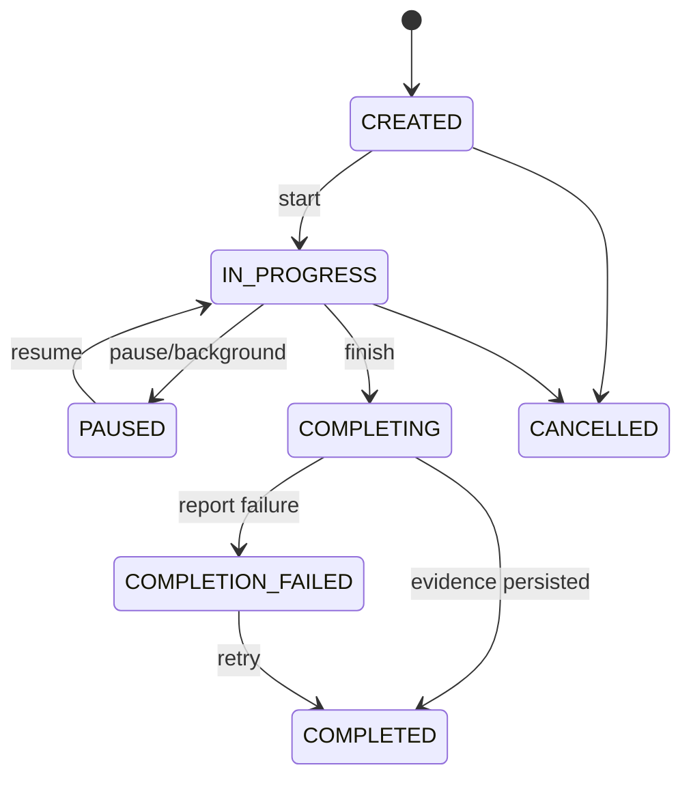

# English Tutor Agent 后端详细设计

> 架构形态：模块化单体  
> 技术基线：Java 21、Spring Boot 4.1.0、Spring AI 2.0.0、MySQL、Redis

---

# 1. 工程结构

## 1.1 Maven 模块

```text
english-tutor-agent-server/
├── tutor-bootstrap              # 启动、配置、装配
├── tutor-api                    # Controller、DTO、SSE、异常转换
├── tutor-application            # 用例服务、命令查询、事务边界
├── tutor-domain                 # 聚合、值对象、领域服务、事件
├── tutor-agent                  # Agent、Prompt、结构化输出、AI 策略
├── tutor-infrastructure         # DB、Redis、对象存储、Provider 实现
├── tutor-observability          # Trace、Metrics、审计和 AI 调用记录
└── tutor-test-support           # Fixture、Fake Provider、测试容器支持
```

依赖方向：

```text
bootstrap → api → application → domain
bootstrap → infrastructure → application/domain
bootstrap → agent → application/domain
observability 被外层适配器引用，不反向依赖业务
```

## 1.2 包结构

按业务模块优先，不使用按 Controller/Service/Mapper 的全局分层：

```text
cn.forever24.tutor
├── identity
├── onboarding
├── assessment
├── learner
├── planning
├── training
├── conversation
├── correction
├── review
├── ielts
├── reporting
├── content
├── ai
├── privacy
└── shared
```

每个模块内部可采用：

```text
<module>/
├── api
├── application
├── domain
└── infrastructure
```

---

# 2. 架构模式

## 2.1 命令与查询

不引入完整 CQRS 基础设施，但在代码层区分：

- Command：改变状态，要求幂等和事务；
- Query：读取投影，允许缓存；
- Domain Event：模块间异步协作；
- Integration Event：未来跨进程扩展使用。

示例：

```java
public record SubmitTaskAttemptCommand(
        String userId,
        String sessionId,
        String taskId,
        String idempotencyKey,
        AttemptPayload payload
) {}
```

## 2.2 聚合边界

| 聚合 | 聚合根 | 一致性边界 |
|---|---|---|
| 用户偏好 | UserProfile | 主要目标、时间、纠错与隐私偏好 |
| 初评 | AssessmentSession | 当前题目、答案、进度和完成状态 |
| 学习计划 | LearningPlan | 当日计划及任务顺序 |
| 训练会话 | TrainingSession | 任务进度、尝试和结束状态 |
| 学习者画像 | LearnerProfile | 能力摘要、画像版本 |
| 知识掌握 | KnowledgeState | 某知识项状态和复习时间 |
| IELTS 模拟 | IeltsSimulation | Part 状态、录音、评分与报告 |

学习证据可高频追加，不要求每次加载完整 LearnerProfile 聚合。画像更新由专门应用服务在事务中执行。

---

# 3. 应用服务设计

## 3.1 OnboardingApplicationService

职责：

- 创建用户产品档案；
- 保存主要目标与偏好；
- 校验只能有一个主要目标；
- 判断是否可以进入初评；
- 目标修改后发出 `PrimaryGoalChangedEvent`。

核心方法：

```java
OnboardingProgress getProgress(UserId userId);
void savePrimaryGoal(UserId userId, PrimaryGoal goal);
void savePreferences(UserId userId, LearningPreferences preferences);
AssessmentSessionId startInitialAssessment(UserId userId);
```

## 3.2 AssessmentApplicationService

职责：

- 根据自评创建题目蓝图；
- 获取下一批题；
- 处理选择、文字和语音答案；
- 维护评估时间与题量预算；
- 生成标准化证据；
- 完成后创建初始画像和首个计划。

关键约束：

- 目标 8–10 分钟；
- 每个能力至少产生一条有效证据；
- 高自评用户开放题比例提高；
- 题目不够时允许动态生成；
- 初评评分失败时保留答案，可异步重算。

## 3.3 LearningPlanApplicationService

职责：

- 获取或生成今日计划；
- 合并临时需求；
- 根据时间预算进行任务选择；
- 对生成计划进行业务校验；
- 计划变更保留原因与版本。

```java
LearningPlanView getTodayPlan(UserId userId, LocalDate date);
LearningPlanView regenerate(UserId userId, PlanAdjustment adjustment);
void acceptPlan(UserId userId, PlanId planId);
```

计划生成幂等键：`userId + localDate + profileVersion + adjustmentVersion`。

## 3.4 TrainingSessionApplicationService

职责：

- 开始、恢复和结束训练；
- 控制任务顺序；
- 保存草稿和尝试；
- 调用对应任务执行器；
- 聚合本次总结；
- 发布学习证据。

任务执行器接口：

```java
public interface TaskExecutor<P extends TaskPayload, R extends TaskResult> {
    TaskType supports();
    R evaluate(TaskContext context, P payload);
}
```

任务类型通过注册表路由，不使用长 `if/else`。

## 3.5 LearnerModelApplicationService

职责：

- 接收标准化证据；
- 去重、校准置信度；
- 更新能力和知识状态；
- 写入画像变化日志；
- 使计划缓存失效。

```java
ProfileUpdateResult applyEvidenceBatch(
    UserId userId,
    List<LearningEvidence> evidences,
    EvidenceSource source
);
```

## 3.6 ReviewApplicationService

职责：

- 查询到期复习；
- 根据掌握状态选择任务形式；
- 创建迁移和延迟验证任务；
- 根据结果调整下次复习时间；
- 避免机械重复。

## 3.7 ConversationApplicationService

职责：

- 管理对话会话上下文；
- 读取当前任务、用户目标和相关历史问题；
- 流式生成自然回复；
- 后置或并行执行纠错；
- 保存最小必要上下文和证据。

## 3.8 IeltsApplicationService

职责：

- Part 1/2/3 训练；
- 完整模拟状态机；
- 计时与不打断策略；
- 结束后统一评分；
- 生成“AI 练习参考”报告和后续任务。

---

# 4. 事务与一致性

## 4.1 事务边界

| 操作 | 事务内容 |
|---|---|
| 提交任务答案 | Attempt + EvidenceOutbox + SessionProgress |
| 完成初评 | Assessment + InitialProfile + InitialPlan |
| 更新画像 | EvidenceConsumed + SkillState + KnowledgeState + ChangeLog |
| 完成训练 | SessionFinish + SummaryDraft + ReportOutbox |
| 删除用户数据 | DeletionRequest + 状态冻结；异步删除外部对象 |

## 4.2 Outbox

使用 `domain_outbox` 表保存可靠异步事件：

```text
业务事务提交
→ OutboxPoller 获取待处理事件
→ 调用画像更新/报告/对象删除
→ 成功标记 DONE
→ 失败指数退避
→ 超过阈值进入 DEAD 并告警
```

首版无需 Kafka。后续如果拆服务，可将 Outbox 发布至消息队列而不改变领域事件。

## 4.3 幂等

以下操作必须携带 `Idempotency-Key`：

- 创建评估；
- 提交评估答案；
- 开始训练会话；
- 提交任务尝试；
- 完成会话；
- 上传完成确认；
- 删除数据请求。

服务端保存请求指纹、状态码和响应摘要。相同键、不同请求体返回冲突错误。

## 4.4 并发控制

- 聚合表使用 `version` 乐观锁；
- 同一天计划生成使用 Redis 短锁 + 数据库唯一键；
- 同一训练任务只允许一个最终提交；
- 画像更新按 `userId` 串行化批次处理，避免更新丢失；
- SSE 断线重连使用事件序号，不重复写业务数据。

---

# 5. 训练会话状态机



关键规则：

- `PAUSED` 不视为失败；
- 任务答案保存后即形成 Attempt，但证据可异步评估；
- `COMPLETED` 以核心答案和证据持久化为准，报告失败不回滚训练；
- 会话超时自动暂停，不自动提交未完成任务。

---

# 6. 对话与流式输出

## 6.1 SSE 流程

```text
POST /conversations/{id}/messages
→ 保存用户消息
→ 返回 streamId
→ GET /streams/{streamId} 或直接 SSE 响应
→ event: status
→ event: text_delta
→ event: correction_ready
→ event: audio_ready
→ event: done
```

首选单请求 SSE：提交消息后保持连接。客户端断线时以 `Last-Event-ID` 恢复；如果 Provider 不支持续流，则服务端返回已缓存完整回复。

## 6.2 上下文构建

只注入必要上下文：

1. 当前系统教学规则；
2. 当前目标与场景；
3. 当前任务说明；
4. 最近有限轮对话；
5. 与当前表达相关的高频错误；
6. 用户当前难度与纠错偏好。

不把完整长期历史直接塞入 Prompt，避免成本、隐私和上下文污染。

## 6.3 纠错时序

- 严重影响理解：对话生成前或同时触发重述；
- 中等错误：回复后发送 `correction_ready`；
- 轻微自然度：会话总结时处理；
- 纠错失败不阻塞对话回复。

---

# 7. 音频链路

## 7.1 上传设计

推荐两种模式：

### 小音频直接上传

- 适用于 60 秒以内回答；
- Android multipart 上传后端；
- 后端计算 SHA-256、校验 MIME 和时长；
- 保存对象存储后提交 ASR。

### 大音频预签名上传

- 用于 IELTS Part 2 或完整模拟；
- 客户端申请上传凭证；
- 直接上传对象存储；
- 调用 complete 接口确认；
- 服务端异步校验并处理。

## 7.2 音频格式

首版建议：

- 录音：AAC-LC in M4A，单声道，16kHz 或 24kHz；
- 若 ASR Provider 偏好 PCM，可由客户端或服务端转码；
- 最大单段时长按任务限制；
- 上传前记录本地时长和文件大小；
- 禁止把 Base64 音频放入 JSON。

## 7.3 ASR 结果

标准结构：

```json
{
  "text": "Today I fixed a database issue.",
  "language": "en",
  "durationMs": 4210,
  "confidence": 0.91,
  "segments": [
    {"startMs": 0, "endMs": 1200, "text": "Today I fixed"}
  ],
  "providerMetadata": {}
}
```

低置信度时：

- 展示识别文本供用户确认；
- 允许修改文字再提交；
- 不把明显 ASR 错误直接作为用户语言错误；
- 发音分析必须区分识别置信度和发音证据。

## 7.4 TTS

- 文本回复先于完整 TTS 返回；
- TTS 可按句生成，首句完成即可播放；
- 音频结果缓存按文本哈希、语音角色和语速复用；
- 用户可取消播放但不取消已生成的文字回复。

---

# 8. 内容与 Prompt 管理

## 8.1 资源结构

```text
resources/
├── prompts/
│   ├── conversation/
│   ├── correction/
│   ├── assessment/
│   ├── content-generation/
│   └── ielts-evaluation/
├── schemas/
├── rubrics/
└── seed-content/
```

Prompt 头信息：

```yaml
name: correction_analyzer
version: 1.0.0
schema: correction-result-v1
locale: zh-CN
enabled: true
```

## 8.2 发布模型

- Git 中保存源文件；
- CI 校验 YAML、Schema 和测试样例；
- 发布后写入 `prompt_release`；
- AI 调用日志记录 Prompt 版本；
- 支持按百分比灰度；
- 不允许在线直接覆盖生产 Prompt 而无版本记录。

---

# 9. Provider 抽象

```java
public interface ChatProvider {
    ChatStream stream(ChatProviderRequest request);
    StructuredResponse completeStructured(ChatProviderRequest request, JsonSchema schema);
    ProviderCapabilities capabilities();
}

public interface SpeechToTextProvider {
    AsrResult transcribe(AudioInput input, AsrOptions options);
}

public interface TextToSpeechProvider {
    TtsResult synthesize(String text, VoiceOptions options);
}
```

路由输入：

- 任务类型；
- 延迟要求；
- 是否需要结构化输出；
- 语音/语言支持；
- 当前 Provider 健康；
- 成本预算；
- 数据保存约束。

降级策略：

```text
主 Provider
→ 同能力备用 Provider
→ 降低高级功能（如发音评分）
→ 文字模式
→ 保存草稿并提示稍后重试
```

---

# 10. 定时任务

| 任务 | 周期 | 说明 |
|---|---|---|
| OutboxPoller | 秒级 | 可靠异步事件 |
| ReviewDueCalculator | 每小时/按需 | 生成到期复习候选 |
| WeeklyReportJob | 每日扫描 | 按用户时区生成周报 |
| StageAssessmentJob | 每日扫描 | 默认四周，可调整 |
| AudioRetentionCleanup | 每日 | 删除到期录音和临时文件 |
| ProviderHealthCheck | 分钟级 | 更新路由健康状态 |
| DeadLetterAlert | 分钟级 | 失败任务告警 |

所有任务必须支持：唯一任务键、重复执行安全、分片、重试、手动补偿。

---

# 11. 异常设计

统一异常分类：

- `VALIDATION_ERROR`：用户输入或状态不合法；
- `AUTHENTICATION_REQUIRED`；
- `FORBIDDEN`；
- `RESOURCE_NOT_FOUND`；
- `STATE_CONFLICT`；
- `IDEMPOTENCY_CONFLICT`；
- `AUDIO_INVALID`；
- `AI_PROVIDER_TIMEOUT`；
- `AI_OUTPUT_INVALID`；
- `CONTENT_UNAVAILABLE`；
- `RATE_LIMITED`；
- `INTERNAL_ERROR`。

错误响应不暴露模型密钥、SQL、Prompt 或内部堆栈。

---

# 12. 编码规范

- 使用不可变 DTO 和值对象；
- `Optional` 不作为实体字段；
- 领域枚举不使用魔法字符串；
- 时间统一存 UTC，展示按用户时区；
- 金丝雀功能使用 Feature Flag；
- Controller 不包含业务逻辑；
- Repository 接口位于领域/应用层，实现在基础设施层；
- AI 输出经过 Mapper 转为领域对象，领域层不依赖 Spring AI 类型；
- 每个公共应用服务方法记录 traceId 和需求编号标签。
