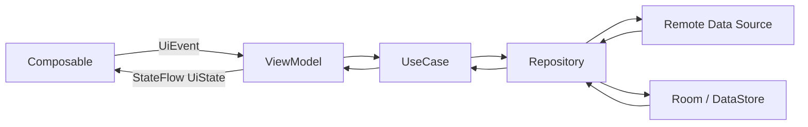
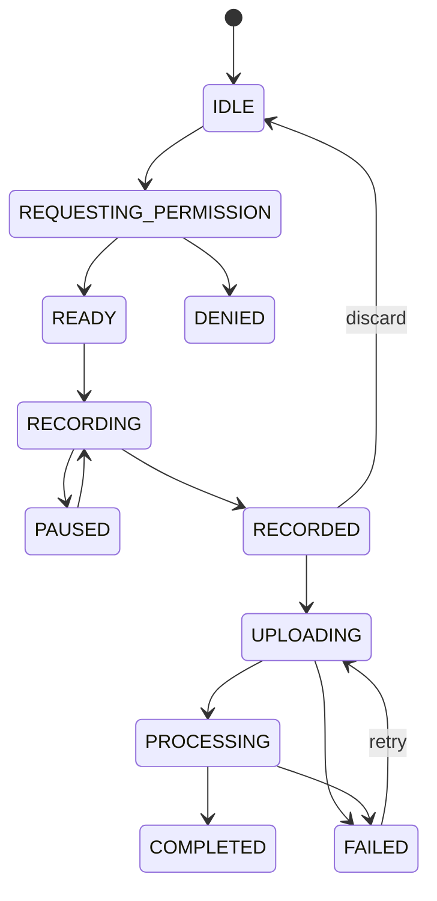

# English Tutor Agent Android 详细设计

> 客户端：Android  
> UI：Jetpack Compose + Material 3  
> 架构：UI / Domain / Data，单向数据流，离线优先缓存

---

# 1. 项目结构

```text
android-app/
├── app
├── core-common
├── core-model
├── core-network
├── core-database
├── core-datastore
├── core-audio
├── core-designsystem
├── core-testing
├── feature-onboarding
├── feature-assessment
├── feature-home
├── feature-training
├── feature-conversation
├── feature-ielts
├── feature-progress
├── feature-settings
└── sync
```

首个 MVP 也可以先合并部分 `feature` 模块，但包边界保持一致。

---

# 2. 分层与数据流



原则：

- Composable 不直接访问网络或数据库；
- ViewModel 产生不可变 `UiState`；
- UI 只发送事件，不直接修改领域对象；
- Repository 是数据单一入口；
- Room 保留计划、会话进度和待上传草稿；
- 服务端是长期画像和最终训练结果的事实来源。

---

# 3. 导航设计

## 3.1 顶层导航

```text
Launch
├── Authentication
├── OnboardingGraph
│   ├── Goal
│   ├── Preferences
│   ├── SelfAssessment
│   ├── InitialAssessment
│   └── InitialProfile
└── MainGraph
    ├── Today
    ├── Training
    ├── Progress
    └── Settings
```

IELTS 作为 `Training` 下的独立子图：

```text
IeltsGraph
├── Dashboard
├── Part1
├── Part2Preparation
├── Part2Speaking
├── Part3
├── FullSimulation
└── Result
```

## 3.2 深链

至少支持：

- 学习提醒打开今日计划；
- 未完成会话恢复；
- 阶段测验入口；
- IELTS 模拟结果；
- 隐私删除请求状态。

---

# 4. 通用页面状态模型

```kotlin
data class ScreenUiState<T>(
    val data: T? = null,
    val isInitialLoading: Boolean = false,
    val isSubmitting: Boolean = false,
    val recoverableError: UiError? = null,
    val blockingError: UiError? = null,
    val pendingEffect: UiEffect? = null
)
```

推荐每个页面定义独立状态：

```kotlin
data class TodayUiState(
    val date: LocalDate,
    val plan: TodayPlanUiModel?,
    val syncState: SyncState,
    val isRefreshing: Boolean,
    val adjustmentSheetVisible: Boolean,
    val message: String?
)
```

事件：

```kotlin
sealed interface TodayEvent {
    data object Refresh : TodayEvent
    data object StartPlan : TodayEvent
    data class AdjustDuration(val minutes: Int) : TodayEvent
    data class SubmitTemporaryNeed(val text: String) : TodayEvent
}
```

一次性导航、Toast、权限请求使用 `UiEffect`，不混入永久状态。

---

# 5. 首次引导与初评

## 5.1 保存策略

每个步骤完成后立即保存：

- 服务端成功：更新 Room 缓存；
- 服务端失败：保存本地草稿并显示待同步；
- 进入下一步前校验必填项；
- App 被杀后从最后成功/本地草稿步骤恢复。

## 5.2 初评题目容器

统一 `AssessmentQuestionScreen` 根据类型渲染：

```text
SINGLE_CHOICE
MULTI_CHOICE
LISTENING_CHOICE
READING_CHOICE
SHORT_TEXT
VOICE_SHORT_ANSWER
VOICE_RETELL
WRITING_SHORT
```

每题状态：

```kotlin
data class QuestionState(
    val questionId: String,
    val type: QuestionType,
    val answerDraft: AnswerDraft?,
    val startedAt: Instant?,
    val submittedAt: Instant?,
    val uploadState: UploadState,
    val canContinue: Boolean
)
```

## 5.3 非考试化体验

- 使用“快速了解你”而非“考试”；
- 不显示持续扣分；
- 进度以阶段而非 1/40 题显示；
- 允许暂停；
- 答错后不立即显示红色失败；
- 高自评用户可看到“接下来会增加开放表达”。

---

# 6. 今日首页

## 6.1 页面组成

1. 今日问候和当前主要目标；
2. 今日重点；
3. 一至两句安排原因；
4. 预计时长；
5. 任务卡列表；
6. 开始/继续按钮；
7. 快速调整入口；
8. 弱网/待同步状态。

## 6.2 本地展示

- 先展示 Room 中最近有效计划；
- 后台刷新最新计划；
- 新计划与旧计划不同，提示“根据最近表现已更新”；
- 不在用户训练过程中静默替换当前任务；
- 正在进行的会话继续使用创建时计划版本。

---

# 7. 通用训练容器

## 7.1 Screen 结构

```text
TrainingScaffold
├── TopBar（进度、暂停、退出）
├── TaskHeader（目标与说明）
├── TaskContent（按任务类型渲染）
├── AssistancePanel（关键词/文本/框架）
├── FeedbackArea
└── BottomAction（录音/提交/继续）
```

## 7.2 任务渲染器

```kotlin
interface TrainingTaskRenderer {
    fun supports(type: TaskType): Boolean
    @Composable fun Render(
        state: TrainingTaskUiState,
        onEvent: (TrainingEvent) -> Unit
    )
}
```

实际 Compose 中可通过 `when(type)` 结合独立 Composable，接口用于模块组织而非动态反射。

## 7.3 进度恢复

Room 保存：

- sessionId；
- planVersion；
- currentTaskIndex；
- 每题草稿；
- 本地录音路径；
- 已提交 attemptId；
- 最后同步时间；
- SSE 最后事件 ID。

恢复时先读取本地，再与服务端 session 状态合并。

---

# 8. 录音设计

## 8.1 状态机



## 8.2 AudioRecorderController

职责：

- 麦克风权限；
- 音频焦点；
- 录音生命周期；
- 文件命名与临时目录；
- 最大时长；
- 音量波形数据；
- 文件哈希与元数据；
- 后台切换处理。

接口：

```kotlin
interface AudioRecorderController {
    val state: StateFlow<RecorderState>
    suspend fun prepare(config: RecordingConfig)
    suspend fun start()
    suspend fun pause()
    suspend fun resume()
    suspend fun stop(): RecordedAudio
    suspend fun cancel()
}
```

## 8.3 权限策略

- 在用户首次点击录音时请求麦克风权限；
- 拒绝后提供文字输入路径；
- 永久拒绝时提供系统设置入口；
- 不在首次打开 App 时无上下文请求权限；
- 权限拒绝不阻塞非语音学习。

## 8.4 后台行为

- 短语音任务切后台时自动暂停并提示；
- 首版不允许无感后台持续录音；
- IELTS 长录音如需要后台能力，使用明确前台通知并单独评审；
- 录音文件先本地落盘，上传失败可重试。

---

# 9. 音频播放设计

使用 AndroidX Media3 ExoPlayer：

- 支持在线播放和本地缓存；
- 支持播放、暂停、拖动和语速；
- 处理音频焦点和耳机拔出；
- 听力材料和 TTS 统一播放器接口；
- 同一时刻仅一个 Player 发声；
- 录音开始前暂停播放；
- 记录重复播放次数、语速和文本辅助使用情况。

```kotlin
interface TutorAudioPlayer {
    val state: StateFlow<PlayerState>
    fun setMedia(source: AudioSource)
    fun play()
    fun pause()
    fun seekTo(positionMs: Long)
    fun setPlaybackSpeed(speed: Float)
    fun release()
}
```

---

# 10. 网络与同步

## 10.1 网络层

- REST：Retrofit + OkHttp；
- SSE：OkHttp EventSource 或可靠 SSE 实现；
- 超时分类：连接、读、写、AI 长响应分别配置；
- Access Token 自动刷新；
- 请求统一附带 traceId、appVersion、deviceId、timezone；
- 文件上传与普通 JSON 使用不同客户端配置。

## 10.2 离线优先策略

可离线查看：

- 最近今日计划；
- 已下载的听力内容；
- 最近训练总结；
- 能力画像摘要；
- 未同步录音和文字草稿。

必须在线：

- 新的 AI 对话；
- ASR/TTS（除非未来本地模型）；
- 生成新计划；
- IELTS AI 评分。

## 10.3 WorkManager

使用场景：

- 待上传音频重试；
- 任务尝试同步；
- 拉取提醒内容；
- 定期清理临时文件；
- 用户请求的数据删除状态刷新。

不使用 WorkManager 维持前台实时对话。

## 10.4 冲突合并

- 服务端已完成、客户端仍待提交：以服务端为准；
- 客户端草稿未提交：保留为草稿，不覆盖服务端答案；
- 同一 attempt 的幂等键保证不会生成两份证据；
- 计划更新不覆盖进行中 session 的 planVersion。

---

# 11. SSE 客户端

状态：

```text
CONNECTING
CONNECTED
RECONNECTING
COMPLETED
FAILED
CANCELLED
```

事件处理：

- `status`：更新进度文案；
- `text_delta`：增量拼接；
- `correction_ready`：展示轻量提示卡；
- `audio_ready`：添加播放器资源；
- `done`：落 Room 并结束连接；
- `error`：保留已接收文本，提供重试或使用完整结果查询。

SSE 增量只存在内存和草稿；收到 `done` 或通过结果查询确认后写为完整消息。

---

# 12. 通知设计

第一版以本地提醒为主：

- 用户主动开启；
- 用 DataStore 保存时间和开关；
- WorkManager/Alarm 负责安排；
- 时区变化后重新安排；
- 文案引用今日价值，不使用羞辱和惩罚；
- 点击通知深链至今日计划。

如果后续接 FCM，服务端推送仅作为增强，不替代本地提醒。

---

# 13. 隐私与本地数据

Room 中不长期保存完整敏感录音：

- 上传成功且服务端确认后，按偏好删除本地临时文件；
- 用户选择不保存原始录音时，上传处理完成后服务端删除；
- 本地数据库可选择 SQLCipher 或系统加密存储敏感 Token；
- Token 使用 Android Keystore 支持的安全存储；
- 日志不输出对话正文、录音路径和 Token。

设置页支持：

- 原始文字保存开关；
- 原始语音保存开关；
- 仅保留学习摘要；
- 导出/删除入口；
- 删除影响说明。

---

# 14. 无障碍与体验

- 触控目标不小于平台推荐尺寸；
- 录音状态同时使用文字、图标和动画；
- 错误不只通过红色表达；
- 所有音频提供可选文字辅助；
- 支持系统字体放大；
- 重要按钮适合单手触达；
- TalkBack 能读出题目、选项、录音和进度状态；
- 倒计时可通过语音和视觉同时提示。

---

# 15. Android 测试

## 15.1 单元测试

- ViewModel 状态转换；
- UseCase；
- Repository 合并；
- 上传重试；
- 音频状态机；
- SSE 事件拼接；
- 时间和提醒规则。

## 15.2 UI 测试

- 首次引导；
- 初评暂停恢复；
- 今日计划；
- 录音权限允许/拒绝；
- 弱网重试；
- 文字替代路径；
- IELTS 计时流程；
- 删除数据确认。

## 15.3 真机矩阵

至少覆盖：

- Android 最低支持版本；
- 当前主流版本；
- 一台低内存设备；
- 一台国产 ROM 设备；
- 蓝牙耳机、有线耳机和扬声器；
- Wi-Fi、4G/5G、弱网、断网切换；
- 前后台切换和进程重建。
