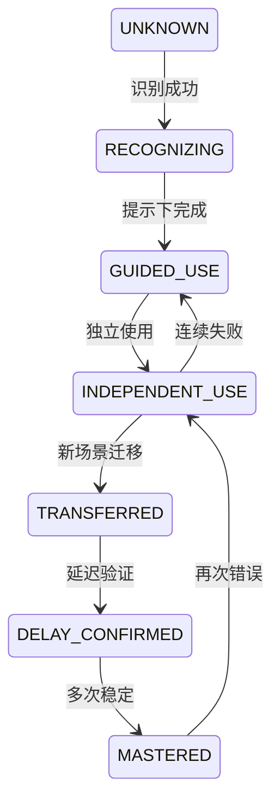
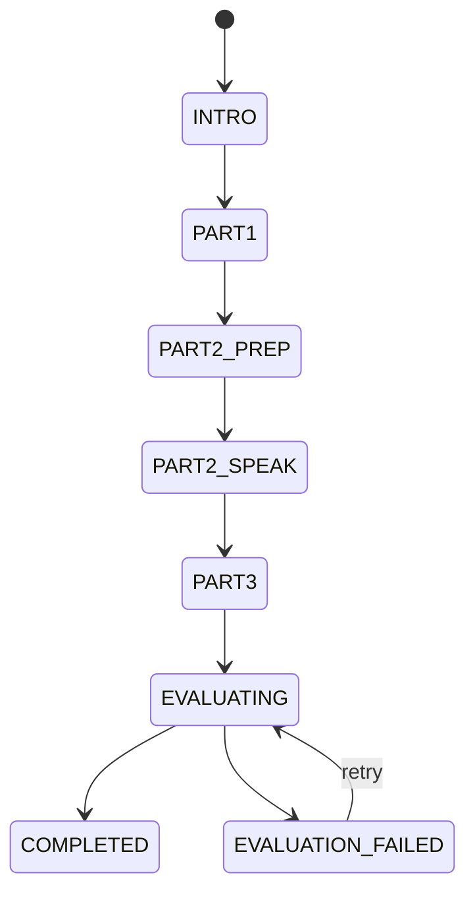

# English Tutor Agent：Agent 与自适应学习引擎详细设计

> 目标：把“AI 聊天”升级为可解释、可测试、可持续校准的个人英语教学系统。

---

# 1. 总体模式

系统采用：

```text
确定性 Orchestrator
+ 规则与评分引擎
+ 专项 LLM 能力
+ 结构化学习者模型
```

不采用：

- 多个 Agent 自由对话后决定结果；
- 让 LLM 直接更新数据库；
- 每天仅凭一个 Prompt 随机生成计划；
- 将完整历史记录无筛选注入上下文；
- 将模型自信表述当作真实能力结论。

---

# 2. 组件职责

| 组件 | 类型 | 职责 |
|---|---|---|
| Learning Orchestrator | 应用工作流 | 决定步骤、超时、重试和状态写入 |
| Assessment Blueprint Engine | 规则 | 根据目标和自评分配初评题型 |
| Open Response Evaluator | LLM/规则 | 评估开放口语和写作 |
| Learner Model Updater | 算法 | 将证据转为能力与掌握状态变化 |
| Priority Scorer | 算法 | 计算当前最值得训练的能力和知识点 |
| Plan Composer | 规则 | 在时长预算中组合任务 |
| Content Generator | LLM/模板 | 生成符合蓝图的原创训练内容 |
| Conversation Coach | LLM | 自然对话、提示和场景推进 |
| Correction Analyzer | LLM/规则 | 错误、严重度、自然表达和历史关联 |
| Review Scheduler | 算法 | 决定何时、用什么形式复习 |
| IELTS Evaluator | LLM + Rubric | 生成参考评分和可执行反馈 |
| Safety/Quality Validator | 规则/模型 | Schema、难度、答案、内容风险检查 |

---

# 3. 学习者模型

## 3.1 多层模型

```text
User Goal Layer
├── primaryGoal
├── scenarios
├── dailyMinutes
└── preferences

Skill Layer
├── listening
├── speakingFluency
├── speakingInteraction
├── pronunciationIntelligibility
├── reading
├── writing
├── grammar
├── vocabulary
└── naturalness

Knowledge Layer
├── grammar concepts
├── collocations
├── chunks
├── pronunciation patterns
└── recurring error patterns

Behavior Layer
├── completion rate
├── response latency
├── hint dependency
├── replay count
├── preferred task type
└── recent fatigue signals
```

## 3.2 能力状态

```json
{
  "dimension": "speaking_interaction",
  "estimate": 0.46,
  "confidence": 0.63,
  "trend": "IMPROVING",
  "evidenceCount": 18,
  "lastEvaluatedAt": "2026-07-21T01:00:00Z"
}
```

- `estimate` 范围 0–1，仅内部计算；
- `confidence` 反映证据数量、质量和多样性；
- 用户界面默认转为行为描述或区间；
- CEFR 只作为内容难度映射，不直接等同于精确官方等级。

## 3.3 知识状态机



状态不只由正确率决定，还考虑：

- 是否使用提示；
- 是否为主动输出；
- 是否换了场景；
- 距离上次学习的时间；
- ASR/评分置信度；
- 错误是否真正属于用户。

---

# 4. 学习证据模型

## 4.1 标准结构

```json
{
  "evidenceId": "ev_01",
  "userId": "u_01",
  "source": "TRAINING_TASK",
  "skillDimensions": ["listening", "speaking_interaction"],
  "knowledgeKeys": ["chunk:could_you_clarify"],
  "taskType": "LISTEN_AND_RESPOND",
  "result": "PARTIALLY_CORRECT",
  "rawScore": 0.68,
  "evidenceWeight": 0.74,
  "independence": 0.80,
  "transferLevel": 0.40,
  "delayDays": 0,
  "hintLevel": 1,
  "asrConfidence": 0.92,
  "evaluatorConfidence": 0.78,
  "occurredAt": "2026-07-21T01:20:00Z"
}
```

## 4.2 权重原则

高权重证据：

- 主动口语或写作；
- 无提示独立完成；
- 新场景迁移；
- 延迟后仍正确；
- 阶段测验；
- 多次一致表现。

低权重证据：

- 猜对选择题；
- 查看完整答案后复述；
- ASR 置信度低；
- 任务内容过于熟悉；
- 单次极端表现；
- 模型评分置信度低。

## 4.3 更新公式建议

首版使用可解释加权更新，而非训练复杂机器学习模型：

```text
adjustedScore = rawScore
              × evidenceWeight
              × independenceFactor
              × evaluatorConfidence

newEstimate = oldEstimate × (1 - alpha)
            + adjustedScore × alpha
```

其中 `alpha` 根据证据权重和当前置信度动态限制，单次变化设置上下限，例如不超过 ±0.08。

置信度增长考虑：

- 证据数量；
- 任务类型多样性；
- 时间跨度；
- 结果一致性；
- 是否存在相互冲突证据。

---

# 5. 初评引擎

## 5.1 输入

- 主要目标；
- 听说读写行为自评；
- 用户可用时间；
- 用户是否选择较高水平；
- 设备是否允许录音；
- 题目库存和内容版本。

## 5.2 初评时间预算

目标 8–10 分钟，建议蓝图：

| 能力 | 普通用户 | 高自评用户 |
|---|---:|---:|
| 听力 | 2 个短音频选择 + 1 个短回应 | 1 个选择 + 1 个复述/回应 |
| 口语 | 1–2 个短回答 | 2 个开放回答或复述 |
| 阅读 | 2–3 个短题 | 1 个短题 + 1 个推断题 |
| 写作 | 1 个短句/短段 | 1 个场景短写作 |
| 语法词汇 | 穿插式选择题 | 在开放输出中评估为主 |

实际题量由预估时长动态裁剪，不强制固定数量。

## 5.3 自适应规则

```text
连续两题明显低于预期
→ 降一个难度档，减少开放题压力

连续两题高置信度正确
→ 提高一档或切换到开放任务

自评高但开放表达明显困难
→ 不负面评价，结果显示输入能力可能高于输出能力

录音权限不可用
→ 允许文字替代，但口语置信度标记较低并在后续补评
```

## 5.4 完成条件

- 听说读写均有证据，或明确记录缺失原因；
- 总时长达到最小有效阈值或用户完成所有关键任务；
- 至少确认一个优势和一个优先提升方向；
- 产生初始 `LearnerProfileVersion=1`；
- 自动创建首个计划。

---

# 6. 优先级评分

## 6.1 候选训练目标

候选包括：

- 技能维度；
- 具体知识点；
- 历史错误模式；
- 到期复习项；
- 主要目标要求；
- 临时现实需求；
- 阶段测验薄弱项。

## 6.2 评分因子

```text
priority = goalRelevance        × 0.25
         + weaknessSeverity     × 0.20
         + reviewUrgency        × 0.18
         + transferValue        × 0.12
         + recentErrorFrequency × 0.10
         + userNeedUrgency      × 0.10
         + engagementFit        × 0.05
```

权重是首版建议值，应配置化并通过数据验证，不写死在 Prompt 中。

强制规则优先于分数：

- 明天有英文会议：加入会议任务；
- 到期的高价值知识项：至少安排一个复习任务；
- 最近连续失败：降低难度或换形式；
- 用户今天不方便说话：不安排必须录音的任务；
- IELTS 完整模拟前后：遵循模拟训练周期。

---

# 7. 计划组合算法

## 7.1 输入

```json
{
  "timeBudgetMinutes": 20,
  "primaryGoal": "WORKPLACE",
  "priorityTargets": [],
  "dueReviews": [],
  "recentCompletion": 0.82,
  "temporaryNeed": null,
  "availableModes": ["TEXT", "VOICE", "AUDIO"]
}
```

## 7.2 任务约束

- 20 分钟计划建议 3–5 个任务；
- 每个计划至少包含一个主动输出任务；
- 需要复习时至少包含一个到期复习；
- 避免连续多个相同交互形式；
- 音频任务考虑下载和环境；
- 5 分钟模式仅保留最高价值任务；
- 计划内容必须匹配目标和难度；
- 每个任务需声明其证据目标。

## 7.3 计划解释

解释由模板优先生成，必要时 LLM 润色：

```text
因为你最近能听懂工作对话的大意，但回答时仍依赖提示，
今天会先用短听力激活表达，再练习快速说明问题和请求澄清。
```

解释只能引用实际存在的证据，不允许生成不存在的学习历史。

---

# 8. 内容生成

## 8.1 先生成蓝图，再生成内容

```json
{
  "taskType": "LISTEN_AND_RESPOND",
  "targetSkills": ["listening", "speaking_interaction"],
  "knowledgeTargets": ["chunk:could_you_clarify"],
  "scenario": "WORK_MEETING",
  "difficultyBand": "B1_LOW",
  "durationMinutes": 5,
  "constraints": {
    "audioSeconds": 18,
    "maxNewChunks": 2,
    "mustRequireActiveOutput": true
  }
}
```

LLM 只根据蓝图生成题干、对话、答案、提示和解释。

## 8.2 内容校验

自动校验：

- JSON Schema；
- 题目与答案一致；
- 选项唯一正确；
- 长度和难度；
- 禁用主题；
- 版权来源标签；
- 目标词块是否出现；
- 是否真的要求主动输出；
- IELTS 是否错误标识为官方真题。

高风险内容进入人工或离线评测集，不直接在线发布。

## 8.3 内容缓存

可缓存：

- 通用听力模板；
- 场景开场白；
- 语法解释；
- 非个性化题目；
- TTS 音频。

不直接缓存：

- 带用户隐私的个性化对话；
- 依赖最新画像的计划解释；
- 用户专属纠错总结。

---

# 9. Conversation Coach

## 9.1 输入上下文

```text
System teaching policy
+ Session goal
+ Scenario
+ Difficulty profile
+ User correction preference
+ Relevant error summaries（最多 3 个）
+ Recent dialogue window
+ Current task requirement
```

## 9.2 输出结构

```json
{
  "reply": "That sounds frustrating. What did you find in the logs?",
  "shouldContinue": true,
  "nextIntent": "ASK_FOR_EVIDENCE",
  "scaffolding": null,
  "safetyFlags": []
}
```

纠错由独立分析器处理，避免回复 Prompt 同时承担过多职责。

## 9.3 卡住策略

提示等级：

```text
0 无提示
1 关键词
2 句首或结构
3 可替换表达框架
4 完整示例
```

完整示例后，用户必须有机会重新表达，证据的独立性相应降低。

---

# 10. Correction Analyzer

## 10.1 输出 Schema

```json
{
  "hasIssue": true,
  "communicationImpact": "LOW",
  "shouldInterrupt": false,
  "items": [
    {
      "span": "database connect",
      "original": "a bug about database connect",
      "corrected": "a bug related to the database connection",
      "type": "COLLOCATION",
      "severity": "MEDIUM",
      "explanationZh": "工作场景中 related to 和 database connection 更自然。",
      "naturalAlternatives": [
        {"text": "I fixed a database connection issue.", "style": "WORKPLACE"}
      ],
      "knowledgeKey": "collocation:database_connection_issue",
      "memoryWorthy": true
    }
  ]
}
```

## 10.2 规则后处理

- 最多立即展示 1–3 项；
- 低严重度可延后；
- 与 ASR 低置信度片段重叠的错误降权；
- 历史高频错误增加 `historicalRelation`；
- 同一根因合并；
- 纠错文本必须保持用户原意；
- 对话模式不展开长语法课。

---

# 11. 复习调度

## 11.1 调度输入

- 知识状态；
- 最近尝试；
- 独立性；
- 迁移与延迟证据；
- 错误频率；
- 用户时间预算；
- 当前目标相关性。

## 11.2 首版间隔建议

不是固定死的遗忘曲线，但提供初始默认：

| 状态 | 默认下次检查 |
|---|---|
| 新发现错误 | 当天或次日 |
| 提示下使用 | 1–2 天 |
| 独立使用 | 3–5 天 |
| 已迁移 | 7–14 天 |
| 延迟确认 | 21–35 天 |
| 已掌握 | 低频抽查 |

失败时缩短间隔并换任务形式；成功时延长间隔。

## 11.3 任务形式轮换

```text
ERROR_RECOGNITION
→ GUIDED_REWRITE
→ TRANSLATION
→ SPOKEN_RECALL
→ SCENARIO_TRANSFER
→ DELAYED_CHECK
```

连续失败不能重复同一道题，必须：降低语言复杂度、增加提示、换场景或拆分技能。

---

# 12. IELTS Speaking 评估

## 12.1 模拟状态机



## 12.2 评分维度

- Fluency and Coherence；
- Lexical Resource；
- Grammatical Range and Accuracy；
- Pronunciation。

输出必须包含：

- AI 练习参考分数；
- 每项分数的证据；
- 置信度；
- 1–3 个优先改进点；
- 后续计划变化；
- 明确非官方成绩说明。

## 12.3 稳定性

- 同一录音重复评估的分数波动需要受控；
- 使用固定 rubric、固定 Prompt 版本和低温度；
- 关键评测集每次版本发布回归；
- 低 ASR 质量时降低发音与语法判断置信度；
- 不根据单一词汇错误大幅拉低整体分数。

---

# 13. 结构化输出与失败处理

流程：

```text
模型调用
→ JSON Schema 校验
→ 枚举与业务规则校验
→ 自动修复一次
→ 备用 Provider 或简化 Prompt
→ 规则降级/人工可理解错误
```

所有失败记录：

- traceId；
- agentName；
- promptVersion；
- provider/model；
- schemaVersion；
- 输入摘要哈希；
- 错误类型；
- 重试次数；
- 最终降级路径。

---

# 14. AI 安全与 Prompt 注入

- 用户文本始终作为明确的 user content，不拼接为系统指令；
- 工具白名单由服务端固定；
- 模型无权直接删除数据、改变目标或修改画像；
- 对“忽略前面规则”等输入不改变系统教学策略；
- 内容生成和用户对话使用不同权限上下文；
- 不在 Prompt 中放密钥、数据库信息或内部运维信息；
- 对模型输出的 URL、命令和事实声明按任务风险校验。

---

# 15. 评测集

必须建立版本化 Golden Set：

| 集合 | 内容 |
|---|---|
| correction-basic | 常见语法、搭配、中式英语 |
| correction-no-error | 正确句子，防止过度纠错 |
| assessment-calibration | 不同水平标准答案 |
| plan-personalization | 不同画像应产生不同计划 |
| content-validity | 题目、选项和答案一致性 |
| ielts-stability | 固定录音/文本的评分稳定性 |
| safety-injection | Prompt 注入和越权输入 |
| asr-noise | 低置信度转写，避免误判 |

上线前 AI 版本必须通过离线评测和小流量灰度。
