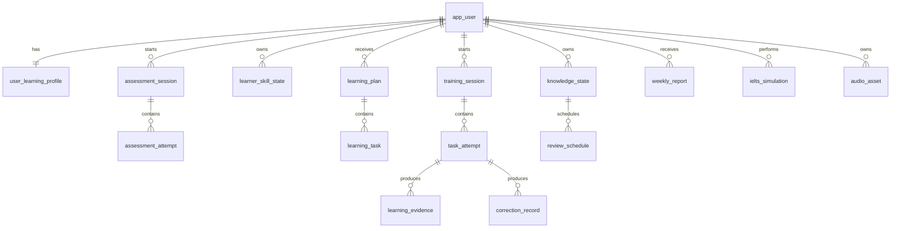

# English Tutor Agent 数据模型与 API 详细规范

> 数据库：MySQL 8.x  
> 缓存：Redis 7.x  
> 二进制：S3 兼容对象存储  
> API 版本：`/api/v1`

---

# 1. 数据建模原则

1. 核心业务状态结构化存储；
2. JSON 只用于灵活元数据，不把关键查询字段全部塞入 JSON；
3. 原始尝试、标准化证据和画像快照分开；
4. 数据表包含 `created_at`、`updated_at`、`version`；
5. 时间存 UTC；
6. 用户删除使用可追踪请求和物理清理流程；
7. 音频只保存对象键和元数据；
8. 每次 AI 调用可关联 trace、Prompt 和模型版本。

---

# 2. 核心 ER 图



---

# 3. 表设计

> 下列为逻辑字段。正式建库脚本在编码阶段通过 Flyway 生成，并根据 MySQL 版本调整长度和索引。

## 3.1 app_user

| 字段 | 类型 | 约束 | 说明 |
|---|---|---|---|
| id | BIGINT | PK | 内部 ID |
| user_key | VARCHAR(64) | UNIQUE | 对外不连续 ID |
| status | VARCHAR(32) | NOT NULL | ACTIVE/DELETING/DELETED |
| timezone | VARCHAR(64) | NOT NULL | 默认 Asia/Shanghai 或设备时区 |
| locale | VARCHAR(16) | NOT NULL | zh-CN |
| created_at | DATETIME(3) | NOT NULL | UTC |
| updated_at | DATETIME(3) | NOT NULL | UTC |
| version | BIGINT | NOT NULL | 乐观锁 |

## 3.2 user_learning_profile

| 字段 | 类型 | 说明 |
|---|---|---|
| user_id | BIGINT PK/FK | 用户 |
| primary_goal | VARCHAR(32) | WORKPLACE/GENERAL/IELTS |
| daily_minutes | INT | 默认 20 |
| main_scenarios | JSON | 场景偏好 |
| correction_preference | VARCHAR(32) | LIGHT/STANDARD/STRICT |
| reminder_enabled | TINYINT | 提醒 |
| raw_text_retention | VARCHAR(32) | STORE/PROCESS_ONLY |
| raw_audio_retention | VARCHAR(32) | STORE/PROCESS_ONLY |
| onboarding_status | VARCHAR(32) | 状态 |
| profile_version | BIGINT | 当前画像版本 |
| created_at/updated_at/version | - | 通用字段 |

## 3.3 self_assessment

| 字段 | 类型 | 说明 |
|---|---|---|
| id | BIGINT PK | ID |
| user_id | BIGINT | 用户 |
| listening_level | TINYINT | 行为自评档位 |
| speaking_level | TINYINT | - |
| reading_level | TINYINT | - |
| writing_level | TINYINT | - |
| answers_json | JSON | 原始选项 |
| completed_at | DATETIME(3) | 完成时间 |

## 3.4 assessment_session

| 字段 | 类型 | 说明 |
|---|---|---|
| id | BIGINT PK | ID |
| assessment_key | VARCHAR(64) UNIQUE | 对外 ID |
| user_id | BIGINT | 用户 |
| type | VARCHAR(32) | INITIAL/STAGE |
| status | VARCHAR(32) | CREATED/IN_PROGRESS/PAUSED/EVALUATING/COMPLETED |
| blueprint_version | VARCHAR(32) | 蓝图版本 |
| content_version | VARCHAR(32) | 内容版本 |
| started_at | DATETIME(3) | - |
| completed_at | DATETIME(3) | - |
| elapsed_seconds | INT | 有效时长 |
| result_summary_json | JSON | 展示摘要 |
| confidence | DECIMAL(5,4) | 整体置信度 |
| version | BIGINT | 乐观锁 |

## 3.5 assessment_attempt

| 字段 | 类型 | 说明 |
|---|---|---|
| id | BIGINT PK | ID |
| assessment_id | BIGINT | 会话 |
| question_key | VARCHAR(64) | 题目 |
| question_type | VARCHAR(32) | 类型 |
| answer_json | JSON | 答案 |
| audio_asset_id | BIGINT NULL | 录音 |
| correctness | VARCHAR(32) | CORRECT/PARTIAL/INCORRECT/UNSCORED |
| score | DECIMAL(5,4) | 0–1 |
| evaluator_confidence | DECIMAL(5,4) | 置信度 |
| hint_level | TINYINT | 提示级别 |
| duration_ms | INT | 作答时长 |
| created_at | DATETIME(3) | - |

唯一键：`assessment_id + question_key` 或支持多次尝试时增加 attempt_no。

## 3.6 learner_skill_state

| 字段 | 类型 | 说明 |
|---|---|---|
| id | BIGINT PK | ID |
| user_id | BIGINT | 用户 |
| dimension | VARCHAR(64) | 能力维度 |
| estimate | DECIMAL(6,5) | 内部估计 |
| confidence | DECIMAL(6,5) | 置信度 |
| trend | VARCHAR(16) | UP/STABLE/DOWN/UNKNOWN |
| evidence_count | INT | 证据数 |
| last_evidence_at | DATETIME(3) | - |
| updated_at/version | - | - |

唯一键：`user_id + dimension`。

## 3.7 knowledge_state

| 字段 | 类型 | 说明 |
|---|---|---|
| id | BIGINT PK | ID |
| user_id | BIGINT | 用户 |
| knowledge_key | VARCHAR(160) | 如 chunk:could_you_clarify |
| category | VARCHAR(32) | GRAMMAR/COLLOCATION/CHUNK/PRONUNCIATION |
| state | VARCHAR(32) | UNKNOWN...MASTERED |
| strength | DECIMAL(6,5) | 状态强度 |
| confidence | DECIMAL(6,5) | 置信度 |
| occurrence_count | INT | 出现次数 |
| success_count | INT | 成功次数 |
| last_error_at | DATETIME(3) | - |
| last_success_at | DATETIME(3) | - |
| next_review_at | DATETIME(3) | - |
| updated_at/version | - | - |

唯一键：`user_id + knowledge_key`。

## 3.8 learning_plan

| 字段 | 类型 | 说明 |
|---|---|---|
| id | BIGINT PK | ID |
| plan_key | VARCHAR(64) UNIQUE | 对外 ID |
| user_id | BIGINT | 用户 |
| plan_date | DATE | 用户本地日期 |
| plan_type | VARCHAR(32) | DAILY/TEMPORARY/IELTS |
| status | VARCHAR(32) | DRAFT/READY/ACCEPTED/IN_PROGRESS/COMPLETED/SUPERSEDED |
| profile_version | BIGINT | 生成时画像版本 |
| adjustment_version | BIGINT | 临时调整版本 |
| duration_minutes | INT | 预计时长 |
| focus_summary | VARCHAR(500) | 今日重点 |
| rationale | VARCHAR(1000) | 原因 |
| generation_source | VARCHAR(32) | RULE/RULE_LLM |
| created_at/updated_at/version | - | - |

唯一键建议：`user_id + plan_date + profile_version + adjustment_version`。

## 3.9 learning_task

| 字段 | 类型 | 说明 |
|---|---|---|
| id | BIGINT PK | ID |
| task_key | VARCHAR(64) UNIQUE | 对外 ID |
| plan_id | BIGINT | 计划 |
| sequence_no | INT | 顺序 |
| task_type | VARCHAR(64) | 类型 |
| target_skills | JSON | 能力 |
| knowledge_targets | JSON | 知识项 |
| scenario | VARCHAR(64) | 场景 |
| difficulty_band | VARCHAR(32) | 难度 |
| duration_minutes | INT | 时长 |
| content_ref | VARCHAR(128) | 内容版本/引用 |
| task_payload_json | JSON | 任务内容 |
| evidence_policy_json | JSON | 证据要求 |
| status | VARCHAR(32) | READY/STARTED/COMPLETED/SKIPPED |

## 3.10 training_session

| 字段 | 类型 | 说明 |
|---|---|---|
| id | BIGINT PK | ID |
| session_key | VARCHAR(64) UNIQUE | 对外 ID |
| user_id | BIGINT | 用户 |
| plan_id | BIGINT NULL | 计划 |
| type | VARCHAR(32) | DAILY/FREE_CONVERSATION/REVIEW/IELTS |
| mode | VARCHAR(32) | TEXT/VOICE/MIXED |
| status | VARCHAR(32) | 状态机 |
| current_task_key | VARCHAR(64) | 当前任务 |
| started_at/paused_at/completed_at | DATETIME(3) | - |
| effective_seconds | INT | 有效时长 |
| summary_json | JSON | 总结 |
| version | BIGINT | 乐观锁 |

## 3.11 task_attempt

| 字段 | 类型 | 说明 |
|---|---|---|
| id | BIGINT PK | ID |
| attempt_key | VARCHAR(64) UNIQUE | 对外 ID |
| session_id | BIGINT | 会话 |
| task_id | BIGINT | 任务 |
| user_id | BIGINT | 用户 |
| attempt_no | INT | 次数 |
| input_type | VARCHAR(16) | TEXT/AUDIO/CHOICE |
| input_text | TEXT NULL | 根据偏好保存 |
| audio_asset_id | BIGINT NULL | 录音 |
| answer_json | JSON | 结构化答案 |
| hint_level | TINYINT | 提示 |
| result | VARCHAR(32) | CORRECT/PARTIAL/INCORRECT/UNSCORED |
| score | DECIMAL(6,5) | - |
| submitted_at | DATETIME(3) | - |
| evaluator_version | VARCHAR(64) | - |

唯一键：`session_id + task_id + attempt_no`。

## 3.12 learning_evidence

| 字段 | 类型 | 说明 |
|---|---|---|
| id | BIGINT PK | ID |
| evidence_key | VARCHAR(64) UNIQUE | ID |
| user_id | BIGINT | 用户 |
| attempt_id | BIGINT NULL | 来源尝试 |
| source | VARCHAR(32) | 来源 |
| skill_dimension | VARCHAR(64) | 一行一个能力，便于查询 |
| knowledge_key | VARCHAR(160) NULL | 知识项 |
| result | VARCHAR(32) | - |
| raw_score | DECIMAL(6,5) | - |
| weight | DECIMAL(6,5) | - |
| independence | DECIMAL(6,5) | - |
| transfer_level | DECIMAL(6,5) | - |
| delay_days | INT | - |
| evaluator_confidence | DECIMAL(6,5) | - |
| metadata_json | JSON | - |
| occurred_at | DATETIME(3) | - |
| consumed_at | DATETIME(3) NULL | 画像处理时间 |

索引：`user_id + occurred_at`、`user_id + skill_dimension`、`user_id + knowledge_key`。

## 3.13 correction_record

| 字段 | 类型 | 说明 |
|---|---|---|
| id | BIGINT PK | - |
| correction_key | VARCHAR(64) UNIQUE | - |
| user_id | BIGINT | - |
| session_id | BIGINT | - |
| attempt_id | BIGINT NULL | - |
| original_text | TEXT | 根据保存偏好脱敏/为空 |
| corrected_text | TEXT | - |
| error_type | VARCHAR(64) | - |
| severity | VARCHAR(16) | LOW/MEDIUM/HIGH |
| explanation_zh | VARCHAR(1000) | - |
| knowledge_key | VARCHAR(160) NULL | - |
| should_interrupt | TINYINT | - |
| historical_occurrence | INT | - |
| prompt_version | VARCHAR(64) | - |
| created_at | DATETIME(3) | - |

## 3.14 review_schedule

| 字段 | 类型 | 说明 |
|---|---|---|
| id | BIGINT PK | - |
| user_id | BIGINT | - |
| knowledge_state_id | BIGINT | - |
| review_type | VARCHAR(32) | GUIDED/INDEPENDENT/TRANSFER/DELAYED |
| due_at | DATETIME(3) | - |
| priority | DECIMAL(6,5) | - |
| status | VARCHAR(16) | DUE/SCHEDULED/COMPLETED/SKIPPED/CANCELLED |
| generated_task_id | BIGINT NULL | - |
| completed_at | DATETIME(3) NULL | - |

## 3.15 conversation_message

| 字段 | 类型 | 说明 |
|---|---|---|
| id | BIGINT PK | - |
| message_key | VARCHAR(64) UNIQUE | - |
| session_id | BIGINT | - |
| user_id | BIGINT | - |
| role | VARCHAR(16) | USER/ASSISTANT/SYSTEM_SUMMARY |
| content | TEXT NULL | 根据偏好保存 |
| content_summary | VARCHAR(2000) NULL | 可保留摘要 |
| audio_asset_id | BIGINT NULL | - |
| sequence_no | INT | - |
| model_name | VARCHAR(128) NULL | - |
| prompt_version | VARCHAR(64) NULL | - |
| created_at | DATETIME(3) | - |

## 3.16 audio_asset

| 字段 | 类型 | 说明 |
|---|---|---|
| id | BIGINT PK | - |
| asset_key | VARCHAR(64) UNIQUE | - |
| user_id | BIGINT NULL | 系统素材可为空 |
| purpose | VARCHAR(32) | USER_RECORDING/TTS/LISTENING_CONTENT |
| object_key | VARCHAR(512) | 对象存储键 |
| mime_type | VARCHAR(64) | - |
| size_bytes | BIGINT | - |
| duration_ms | INT | - |
| sha256 | VARCHAR(64) | - |
| retention_mode | VARCHAR(32) | PERSIST/PROCESS_ONLY/TEMP |
| status | VARCHAR(16) | UPLOADING/READY/PROCESSING/DELETED |
| expires_at | DATETIME(3) NULL | - |
| created_at/updated_at | - | - |

## 3.17 ai_call_log

记录：trace、用户、Agent、Provider、Model、Prompt 版本、Schema、Token、延迟、成功、错误、成本、输入输出摘要哈希。默认不记录完整敏感正文。

## 3.18 privacy_deletion_request

记录删除范围、状态、确认时间、各存储清理结果、失败原因与完成时间。

---

# 4. API 通用规范

## 4.1 请求头

```http
Authorization: Bearer <token>
X-Request-Id: <uuid>
Idempotency-Key: <uuid>       # 写操作需要时
X-Client-Version: 1.0.0
X-Device-Id: <installation-id>
X-Timezone: Asia/Singapore
Accept-Language: zh-CN
```

## 4.2 成功响应

```json
{
  "requestId": "req_01",
  "data": {},
  "serverTime": "2026-07-21T01:00:00Z"
}
```

## 4.3 错误响应

```json
{
  "requestId": "req_01",
  "error": {
    "code": "STATE_CONFLICT",
    "message": "当前任务已经完成，请刷新后继续。",
    "retryable": false,
    "details": {}
  }
}
```

---

# 5. 核心 API

## 5.1 Onboarding

### 保存主要目标

```http
PUT /api/v1/profile/primary-goal
```

```json
{"goal":"WORKPLACE"}
```

### 保存偏好

```http
PUT /api/v1/profile/preferences
```

```json
{
  "dailyMinutes": 20,
  "mainScenarios": ["TECHNICAL_DISCUSSION", "WORK_MEETING"],
  "correctionPreference": "LIGHT",
  "reminderEnabled": true
}
```

### 获取首次流程状态

```http
GET /api/v1/onboarding/progress
```

---

## 5.2 初评

### 提交自评

```http
POST /api/v1/assessments/self
```

### 创建初评

```http
POST /api/v1/assessments
Idempotency-Key: ...
```

```json
{"type":"INITIAL"}
```

### 获取下一题/题组

```http
GET /api/v1/assessments/{assessmentId}/next
```

### 提交答案

```http
POST /api/v1/assessments/{assessmentId}/answers
```

```json
{
  "questionId": "q_01",
  "answer": {"optionIds":["B"]},
  "durationMs": 12000,
  "hintLevel": 0
}
```

语音答案使用 `audioAssetId`。

### 暂停/恢复/完成

```http
POST /api/v1/assessments/{id}/pause
POST /api/v1/assessments/{id}/resume
POST /api/v1/assessments/{id}/complete
GET  /api/v1/assessments/{id}/result
```

---

## 5.3 今日计划

```http
GET /api/v1/plans/today
POST /api/v1/plans/today/adjustments
POST /api/v1/plans/{planId}/accept
```

调整请求：

```json
{
  "availableMinutes": 5,
  "availableModes": ["TEXT", "AUDIO"],
  "temporaryNeed": "明天需要参加英文技术会议"
}
```

今日计划响应：

```json
{
  "planId": "plan_01",
  "date": "2026-07-21",
  "durationMinutes": 20,
  "focus": "听后快速回应与说明技术问题",
  "rationale": "你最近能理解大意，但口头回应仍依赖提示。",
  "profileVersion": 12,
  "tasks": [
    {
      "taskId": "task_01",
      "type": "LISTEN_AND_RESPOND",
      "title": "听懂并回应工作问题",
      "durationMinutes": 6,
      "status": "READY"
    }
  ]
}
```

---

## 5.4 训练会话

```http
POST /api/v1/training-sessions
GET  /api/v1/training-sessions/{id}
POST /api/v1/training-sessions/{id}/pause
POST /api/v1/training-sessions/{id}/resume
POST /api/v1/training-sessions/{id}/complete
```

创建：

```json
{
  "planId": "plan_01",
  "mode": "MIXED"
}
```

### 获取当前任务

```http
GET /api/v1/training-sessions/{id}/current-task
```

### 提交尝试

```http
POST /api/v1/training-sessions/{id}/tasks/{taskId}/attempts
Idempotency-Key: ...
```

```json
{
  "inputType": "TEXT",
  "text": "I think it may be caused by an unstable connection.",
  "hintLevel": 0,
  "clientDurationMs": 8100
}
```

响应：

```json
{
  "attemptId": "att_01",
  "resultStatus": "EVALUATING",
  "nextAction": "WAIT_FOR_FEEDBACK"
}
```

### 获取反馈

```http
GET /api/v1/task-attempts/{attemptId}/feedback
```

---

## 5.5 对话流

```http
POST /api/v1/conversations/{sessionId}/messages/stream
Accept: text/event-stream
```

请求：

```json
{
  "messageType": "TEXT",
  "text": "Today I solved a bug about database connect.",
  "taskId": "task_03"
}
```

SSE：

```text
id: 1
event: status
data: {"stage":"THINKING","message":"正在理解你的表达…"}

id: 2
event: text_delta
data: {"delta":"Nice work. "}

id: 3
event: text_delta
data: {"delta":"What caused the issue?"}

id: 4
event: correction_ready
data: {"items":[...]}

id: 5
event: audio_ready
data: {"audioUrl":"https://...","durationMs":2300}

id: 6
event: done
data: {"messageId":"msg_02","usage":{"totalTokens":230}}
```

---

## 5.6 音频

### 申请上传

```http
POST /api/v1/audio/uploads
```

```json
{
  "purpose":"USER_RECORDING",
  "mimeType":"audio/mp4",
  "sizeBytes":120000,
  "durationMs":13000,
  "sha256":"..."
}
```

响应可返回 `DIRECT_MULTIPART` 或 `PRESIGNED`。

### 完成上传

```http
POST /api/v1/audio/uploads/{uploadId}/complete
```

### 获取处理状态

```http
GET /api/v1/audio/assets/{audioAssetId}
```

---

## 5.7 画像和进步

```http
GET /api/v1/profile/learner-summary
GET /api/v1/profile/skills
GET /api/v1/profile/knowledge-states
GET /api/v1/reports/weekly/latest
GET /api/v1/assessments/stage/latest
```

---

## 5.8 IELTS

```http
POST /api/v1/ielts/simulations
GET  /api/v1/ielts/simulations/{id}/current-step
POST /api/v1/ielts/simulations/{id}/answers
POST /api/v1/ielts/simulations/{id}/complete
GET  /api/v1/ielts/simulations/{id}/result
```

结果示例：

```json
{
  "label": "AI_PRACTICE_ESTIMATE",
  "overallBandEstimate": 5.5,
  "confidence": 0.68,
  "dimensions": {
    "fluencyCoherence": 5.5,
    "lexicalResource": 5.0,
    "grammar": 5.5,
    "pronunciation": 6.0
  },
  "evidence": [],
  "nextFocus": ["延长回答并增加原因", "减少时态不稳定"],
  "disclaimer": "该结果仅用于练习参考，不是官方 IELTS 成绩。"
}
```

---

## 5.9 数据隐私

```http
GET  /api/v1/settings/privacy
PUT  /api/v1/settings/privacy
POST /api/v1/data-privacy/deletion-requests
GET  /api/v1/data-privacy/deletion-requests/{id}
```

修改保存偏好不会追溯删除已有数据，界面需要让用户选择是否同时清理历史原始内容。

---

# 6. Redis Key 设计

```text
tutor:idem:{userId}:{idempotencyKey}
tutor:plan-lock:{userId}:{date}
tutor:sse:{streamId}
tutor:provider-health:{provider}
tutor:rate:{userId}:{operation}
tutor:profile-summary:{userId}:{profileVersion}
tutor:today-plan:{userId}:{date}:{profileVersion}:{adjustmentVersion}
```

Key 必须设置 TTL；不能把长期画像只存在 Redis。

---

# 7. 对象存储 Key

```text
user-recordings/{userKey}/{yyyy}/{MM}/{assetKey}.m4a
tts/{voice}/{hash-prefix}/{sha256}.mp3
listening-content/{contentVersion}/{contentKey}.mp3
temp/{date}/{uploadId}.part
```

对象元数据不包含用户真实姓名。

---

# 8. 数据保留与删除

建议初始策略，最终在隐私专项评审确认：

- `PROCESS_ONLY` 用户录音：处理成功后 24 小时内删除；
- 临时上传：24 小时清理；
- TTS 公共缓存：按内容版本和使用率清理；
- 学习摘要、证据和掌握状态：保留至用户删除；
- AI 调用日志：保存脱敏元数据，不保存完整正文；
- 删除请求完成后，画像和报告不得继续引用已删除证据。

---

# 9. 版本兼容

- API 使用 URI 大版本 `/v1`；
- DTO 增加字段保持向后兼容；
- 枚举新增客户端使用 UNKNOWN 回退；
- 任务 `payloadSchemaVersion` 明确版本；
- Android 端至少支持当前版本和上一个服务端兼容窗口；
- 数据库变更仅通过 Flyway 前向迁移，回滚采用应用版本兼容或补偿迁移。
