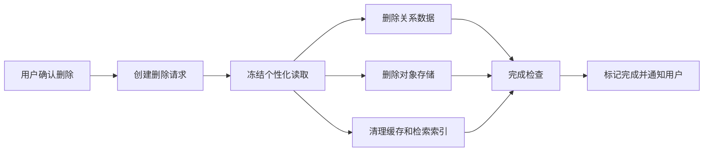

# English Tutor Agent 安全、可观测性与测试设计

> 2026-08-10 修订：V1.0 当前以 Web 表达教练为主客户端。
> 测试优先级调整为后端契约/集成测试 + Web Playwright 主路径；
> Android 真机、音频弱网、ASR/TTS 相关验证后移到 M4。

---

# 1. 安全设计

## 1.1 身份与授权

第一版可采用：

- 邮箱/手机号验证码或第三方登录；
- 后端签发短期 Access Token 和可撤销 Refresh Token；
- 所有资源基于认证用户 ID 查询；
- 禁止客户端传入任意 userId 后直接访问；
- 管理端与用户端使用不同角色和入口。

对象级授权规则：

```text
当前用户只能访问自己的：
评估、计划、训练、录音、报告、画像、IELTS 模拟和删除请求。
```

## 1.2 密钥

- AI Provider 密钥仅服务端持有；
- Android 不嵌入长期 Provider 密钥；
- 对象存储使用短期预签名 URL；
- 生产密钥进入 Secret Manager 或环境注入；
- 禁止写入 Git、日志、崩溃报告和客户端资源。

## 1.3 数据分级

| 级别 | 数据 | 控制 |
|---|---|---|
| 高敏感 | 原始录音、完整对话 | 保存开关、最小化、加密、严格访问 |
| 中敏感 | 错误记录、能力画像、IELTS 结果 | 用户可见可删、权限控制 |
| 一般 | 计划、任务状态、内容版本 | 常规保护 |
| 运维 | Token、调用日志、成本 | 脱敏、内部权限 |

## 1.4 Prompt 安全

- 系统指令和用户文本使用模型角色隔离；
- 用户文本不作为模板表达式执行；
- Tool Calling 采用服务端白名单；
- 工具输入通过 Bean Validation；
- 高风险数据操作不提供给 LLM 工具；
- 输出进行 Schema 和业务枚举校验；
- 对注入测试集持续回归。

## 1.5 内容安全

- 过滤明显违法、仇恨、色情和自伤风险内容；
- 对成年学习者仍避免不必要的敏感训练材料；
- 用户发起敏感话题时保持学习辅助边界；
- 内容生成保存风险标签和生成版本；
- IELTS 内容不得伪称官方真题。

---

# 2. 隐私设计

## 2.1 默认告知

首次语音使用前说明：

- 为什么需要录音；
- 录音将发送到服务端/语音 Provider；
- 是否保存原始录音；
- 可以在哪里关闭和删除；
- 关闭原始保存对个性化的影响。

## 2.2 保存模式

```text
STORE
- 保存原始内容以支持回顾和更深个性化

PROCESS_ONLY
- 仅处理，完成后删除原始内容
- 保留结构化学习摘要、证据和掌握状态
```

文字和语音可以分别设置。

## 2.3 删除流程



删除任务：

- 可重试；
- 有审计但不保留被删除正文；
- 部分失败时展示处理中而非虚假完成；
- 删除后重建空画像。

---

# 3. 可观测性

## 3.1 Trace

每个入口生成 `traceId`，传播至：

- REST/SSE；
- AI Provider；
- ASR/TTS；
- 对象存储；
- Outbox；
- 画像更新；
- Android 请求日志。

核心 Span：

```text
http.request
assessment.next
plan.generate
training.submit
ai.chat
ai.structured
asr.transcribe
tts.synthesize
profile.update
review.schedule
audio.upload
```

## 3.2 Metrics

### 系统指标

- API P50/P95/P99；
- SSE 首 Token；
- ASR/TTS 延迟与失败；
- 数据库连接、慢 SQL；
- Redis 命中率；
- 对象上传失败；
- Outbox 堆积；
- JVM、GC、CPU、内存。

### AI 指标

- Provider/Model 调用次数；
- Token 与估算成本；
- JSON 有效率；
- 自动修复率；
- 降级率；
- Prompt 版本成功率；
- 纠错过度率；
- IELTS 评分波动。

### 产品与学习指标

- 初评完成率；
- 今日计划接受率；
- 有效训练次数；
- 主动输出比例；
- 提示依赖；
- 复习完成率；
- 用户难度反馈；
- 计划个性化差异；
- 错误下降与迁移成功。

## 3.3 日志

结构化日志字段：

```json
{
  "timestamp":"...",
  "level":"INFO",
  "traceId":"...",
  "requestId":"...",
  "userKeyHash":"...",
  "module":"planning",
  "operation":"generateTodayPlan",
  "durationMs":342,
  "result":"SUCCESS"
}
```

禁止默认记录：

- Access Token；
- Provider Key；
- 完整录音 URL；
- 用户完整对话正文；
- 未脱敏邮箱/手机号；
- Prompt 中的敏感内容。

## 3.4 告警

| 告警 | 示例阈值 |
|---|---|
| API 错误率 | 5 分钟 > 5% |
| SSE 首 Token | P95 > 5s |
| ASR 失败 | 10 分钟 > 10% |
| JSON 无效率 | 某 Prompt 版本 > 3% |
| Outbox 堆积 | oldest > 5 分钟 |
| 删除任务失败 | 任意 DEAD 任务 |
| IELTS 评分漂移 | Golden Set 超阈值 |
| 计划重复率 | 个性化差异显著下降 |

---

# 4. 测试策略

## 4.1 测试金字塔

```text
大量领域与应用单元测试
→ Repository/Provider 集成测试
→ API 合约测试
→ AI 离线评测
→ Android UI 与端到端测试
→ 小规模真人灰度验证
```

## 4.2 后端单元测试

必须覆盖：

- 初评蓝图选择；
- 计划优先级；
- 时间预算裁剪；
- 证据权重；
- 能力单次变化上限；
- 掌握状态机；
- 复习间隔；
- 纠错数量和时机；
- 幂等；
- 会话状态机；
- 隐私保存策略。

## 4.3 集成测试

使用 Testcontainers：

- MySQL；
- Redis；
- S3 兼容存储（如 MinIO）；
- WireMock/Fake AI Provider。

测试：

- 事务与 Outbox；
- 乐观锁；
- 重复请求；
- 音频元数据；
- 删除补偿；
- SSE 事件顺序；
- Flyway 迁移。

## 4.4 Provider 合约测试

为每个 Provider 实现统一测试：

- 文本同步；
- 文本流式；
- 结构化输出；
- 超时；
- 限流；
- 非 JSON；
- ASR 低置信度；
- TTS 空音频；
- Provider 元数据映射。

真实 Provider 测试需要成本开关，不在每次本地单元测试执行。

## 4.5 AI 离线评测

### 纠错

- Precision：不要纠正正确句子；
- Recall：识别明显错误；
- Meaning Preservation：不改变原意；
- Actionability：解释简洁可用；
- Interruption Policy：时机符合规则。

### 计划

- Goal Relevance；
- Profile Relevance；
- Due Review Coverage；
- Task Diversity；
- Time Budget；
- Active Output Requirement；
- Explanation Groundedness。

### 内容

- 语言准确；
- 答案唯一；
- 难度匹配；
- 场景相关；
- 无版权复制；
- 无不当内容。

### IELTS

- 固定样本评分稳定；
- 分维度证据合理；
- 免责声明存在；
- 不过度精确；
- 改进点可执行。

## 4.6 E2E 场景

### E2E-01 新用户

```text
目标=职场
→ 自评中等
→ 完成轻量初评
→ 生成画像
→ 生成工作场景首个计划
→ 完成文字任务
→ 产生证据
→ 第二天计划变化
```

### E2E-02 语音弱网

```text
录音完成
→ 上传中断
→ 本地保留
→ WorkManager 重试
→ ASR
→ 用户确认转写
→ 反馈
→ 不重复生成证据
```

### E2E-03 高频错误

```text
首次出现错误
→ 保存知识状态
→ 次日复习
→ 提示下成功
→ 新场景独立使用
→ 延迟验证
→ 标记基本掌握
```

### E2E-04 IELTS

```text
完整 Part 1/2/3
→ 中途不教学式纠错
→ 统一评分
→ 标识 AI 参考
→ 生成下一阶段任务
```

### E2E-05 隐私

```text
关闭原始录音保存
→ 完成语音任务
→ 保留摘要
→ 原始对象在时限内删除
→ 用户发起全部删除
→ 所有结果不可再访问
```

---

# 5. 性能测试

## 5.1 场景

- 今日计划并发读取；
- 文字 SSE 并发；
- 短音频上传；
- 初评集中提交；
- 批量画像更新；
- 周报定时任务；
- 对象删除任务。

## 5.2 结果要求

- 达到概要设计 P95 目标；
- SSE 不因一个慢客户端占满线程；
- 音频上传不耗尽 JVM 堆；
- 数据库索引命中；
- Outbox 在峰值后可恢复；
- Provider 限流时系统可控退避。

---

# 6. 发布质量门禁

## 6.1 每个 Pull Request

- 编译通过；
- 单元测试通过；
- 静态检查通过；
- 新业务规则有测试；
- API 变更更新文档；
- 数据库变更含 Flyway；
- 不含密钥；
- Review Checklist 完成。

## 6.2 每个里程碑

- 对应 E2E 可运行；
- PRD 验收项有证据；
- 关键异常路径已测试；
- Android 真机验证；
- AI Golden Set 回归；
- 性能与成本基线记录；
- 需求追踪矩阵更新。

## 6.3 发布候选

- P0 无阻塞缺陷；
- 隐私删除全链路通过；
- 弱网与恢复通过；
- 崩溃率、ANR、API 错误率达标；
- Provider 降级演练通过；
- 回滚方案验证；
- 小规模灰度用户反馈通过。

---

# 7. Code Review 清单

## 7.1 业务

- 是否引用 PRD/任务编号；
- 是否改变已确认业务规则；
- 是否形成可追踪证据；
- 是否错误地让 LLM 决定关键业务状态；
- 是否处理幂等和状态冲突。

## 7.2 AI

- Prompt 是否版本化；
- 输出是否 Schema 校验；
- 是否有失败和降级；
- 是否记录 Provider/Model/Token；
- 是否泄露隐私；
- 是否有 Golden Set。

## 7.3 Android

- Compose 是否保持 UDF；
- 是否支持进程重建；
- 录音/上传失败是否保留草稿；
- 权限拒绝是否有替代路径；
- 是否只依赖颜色；
- 是否误用后台任务。

## 7.4 数据

- 索引是否合理；
- 是否有唯一键防重复；
- 删除和保留策略是否符合偏好；
- JSON 字段是否掩盖关键查询；
- 迁移是否可前向兼容。
