# English Tutor Agent 概要设计与详细设计（合并版）

> 版本：`1.0.0`  
> 上游：`ENGLISH_TUTOR_AGENT_PRD_v1.0.0.md`


<!-- BEGIN 00_README.md -->

# English Tutor Agent 概要设计与详细设计文档包

> 版本：`1.0.0`  
> 状态：`设计基线初版`  
> 基准日期：`2026-07-21`  
> 上游输入：`ENGLISH_TUTOR_AGENT_PRD_v1.0.0.md`  
> 主要客户端：Android  
> 后端形态：模块化单体  
> 文档用途：开发计划、任务拆解、编码、测试、Review 与发布设计的直接输入。

---

## 1. 文档目标

本设计文档将 PRD 中的产品需求转换为可实施的系统方案，回答以下问题：

1. 系统由哪些模块构成，职责如何划分；
2. Android、后端、AI、语音、数据与内容服务如何协作；
3. 首次评估、学习计划、训练、纠错、复习和阶段测验如何运行；
4. 学习者画像如何根据证据更新；
5. API、数据模型、状态机、异常和幂等如何设计；
6. 如何测试模型输出、学习算法和端到端流程；
7. 如何按照 Vibe Coding 流程分阶段交付并 Review。

## 2. 设计边界

### 2.1 本版本包含

- 系统上下文与总体架构；
- Android 客户端架构；
- 后端模块与领域模型；
- Agent 与学习引擎设计；
- 语音、听力与流式响应链路；
- 数据库与对象存储设计；
- API 与事件协议；
- 安全、隐私、可观测性；
- 测试与发布质量门禁；
- PRD 需求追踪矩阵；
- Vibe Coding 执行规范。

### 2.2 本版本暂不锁定

以下属于实施期可替换配置，不改变业务设计：

- 具体 LLM、ASR、TTS 厂商；
- 云厂商和对象存储品牌；
- 生产数据库托管方式；
- 最终视觉稿中的颜色、字体、动效；
- 商业订阅与支付能力；
- 全双工实时语音通信协议。

## 3. 核心架构结论

1. 第一版后端采用**模块化单体**，不拆微服务；
2. 业务规则与模型调用解耦，LLM 只承担擅长的理解和内容生成；
3. 学习计划优先由规则、画像和证据计算决定，再由模型生成具体内容；
4. Android 使用 Compose、单向数据流和本地缓存，保证弱网恢复；
5. 语音第一版采用**半双工 Push-to-Talk**，支持录音、上传、识别、回复和播放；
6. 对话文字使用 SSE 流式返回；实时全双工语音作为后续演进；
7. 原始录音进入对象存储，结构化学习数据进入关系数据库；
8. 所有 AI 输出必须结构化校验、可降级、可追踪；
9. 学习者画像的变化必须来自可回溯的学习证据；
10. 每个开发里程碑都必须形成可运行的端到端纵向闭环。

## 4. 技术基线

### 4.1 后端

- Java 21 LTS；
- Spring Boot 4.1.0；
- Spring AI 2.0.0；
- Maven 多模块；
- Spring MVC + SSE；
- MySQL 8.x；
- Redis 7.x；
- S3 兼容对象存储；
- Flyway；
- Micrometer / OpenTelemetry；
- Testcontainers。

### 4.2 Android

- Kotlin；
- Jetpack Compose + Material 3；
- ViewModel + StateFlow + 单向数据流；
- Navigation Compose；
- Room；
- DataStore；
- WorkManager；
- MediaRecorder / AudioRecord；
- AndroidX Media3 ExoPlayer；
- Retrofit/OkHttp 或同等 HTTP 客户端；
- Hilt 依赖注入。

> 依赖的小版本在初始化项目时统一锁定到版本目录中，不在业务代码分散声明。

## 5. 文档目录

| 文件 | 作用 |
|---|---|
| `01_HIGH_LEVEL_DESIGN.md` | 概要设计：系统边界、架构、模块、部署与核心流程 |
| `02_DETAILED_DESIGN_BACKEND.md` | 后端详细设计：领域、应用服务、事务、任务和工程结构 |
| `03_DETAILED_DESIGN_ANDROID.md` | Android 详细设计：模块、状态、导航、音频和弱网恢复 |
| `04_DETAILED_DESIGN_AGENT_LEARNING_ENGINE.md` | Agent、初评、自适应计划、纠错、复习与能力更新 |
| `05_DATA_MODEL_AND_API_SPEC.md` | 数据模型、表结构、API、SSE 事件、错误码和幂等 |
| `06_SECURITY_OBSERVABILITY_TESTING.md` | 安全、隐私、可观测性、测试策略与发布门禁 |
| `07_REQUIREMENTS_TRACEABILITY.md` | PRD 需求到模块、接口、数据与测试的映射 |
| `08_ARCHITECTURE_DECISIONS_AND_RISKS.md` | 已确认架构决策、实施期选择与风险控制 |
| `09_VIBE_CODING_EXECUTION_GUIDE.md` | 后续开发、Review、测试和发布协作流程 |
| `ENGLISH_TUTOR_AGENT_DESIGN_v1.0.0.md` | 合并版完整文档 |

## 6. 阅读顺序

建议依次阅读：

```text
PRD
→ 01 概要设计
→ 04 Agent 与学习引擎
→ 05 数据与 API
→ 02 后端详细设计
→ 03 Android 详细设计
→ 06 测试与安全
→ 07 需求追踪
→ 09 开发执行指南
```

## 7. 分阶段开发门禁

### 7.1 M0 工程初始化门禁

- [x] 用户确认概要设计主要架构；
- [x] 用户确认半双工语音作为首版交互；
- [x] PRD、概要设计、详细设计已进入项目 `docs/`；
- [x] 已生成实施计划、任务 Backlog 和任务编号规则；
- [x] M0/M1 默认使用 Fake Provider，不要求真实模型密钥；
- [ ] 当前任务计划经过 Review；
- [ ] Git 基线提交完成。

### 7.2 真实 Provider 接入门禁

在接入具体 LLM、ASR、TTS 前完成：

- [ ] 选择 Provider 与模型；
- [ ] 记录成本、隐私、延迟、结构化输出和降级评估；
- [ ] 建立对应回归样本和 Provider 集成测试。

### 7.3 发布门禁

生产部署环境、监控、密钥管理、数据保留和回滚方案在 M6 发布前确认，
不阻塞 M0 工程初始化。

<!-- END 00_README.md -->


<!-- BEGIN 01_HIGH_LEVEL_DESIGN.md -->

# English Tutor Agent 概要设计

> 文档版本：`1.0.0`  
> 设计输入：`ENGLISH_TUTOR_AGENT_PRD_v1.0.0.md`  
> 状态：概要设计基线初版

---

# 1. 设计目标

## 1.1 业务目标

系统需要实现以下核心闭环：

```text
轻量评估
→ 建立学习者画像
→ 自动生成计划
→ 执行听说读写训练
→ 纠错与反馈
→ 记录学习证据
→ 更新能力和掌握状态
→ 安排复习及测验
→ 生成下一次计划
```

用户只决定学习目标、可用时间和临时需求，系统负责日常教学决策。

## 1.2 技术目标

- 首版完整支持 Android 文字、语音和听力；
- 普通文字回复快速流式开始；
- 语音链路可显示录音、上传、识别、生成、播放状态；
- 模型或网络失败不丢失用户已完成的学习内容；
- 学习计划和能力变化可解释、可追踪；
- AI 供应商可替换；
- 支持逐步演进，不为第一版引入不必要的微服务复杂度。

## 1.3 设计原则

1. **业务决策确定性优先**：学习优先级、复习到期和掌握状态由规则引擎负责；
2. **模型生成受约束**：模型输出必须匹配 Schema，失败可重试和降级；
3. **证据驱动**：画像变化只能由学习证据触发；
4. **模块化单体**：边界清晰，但首版统一部署；
5. **客户端可恢复**：关键进度先本地保存，再与服务端同步；
6. **隐私默认可控**：用户可关闭原文/录音保存和执行删除；
7. **纵向闭环交付**：按 M1–M6 逐段实现，不按技术层横向堆代码。

---

# 2. 系统上下文

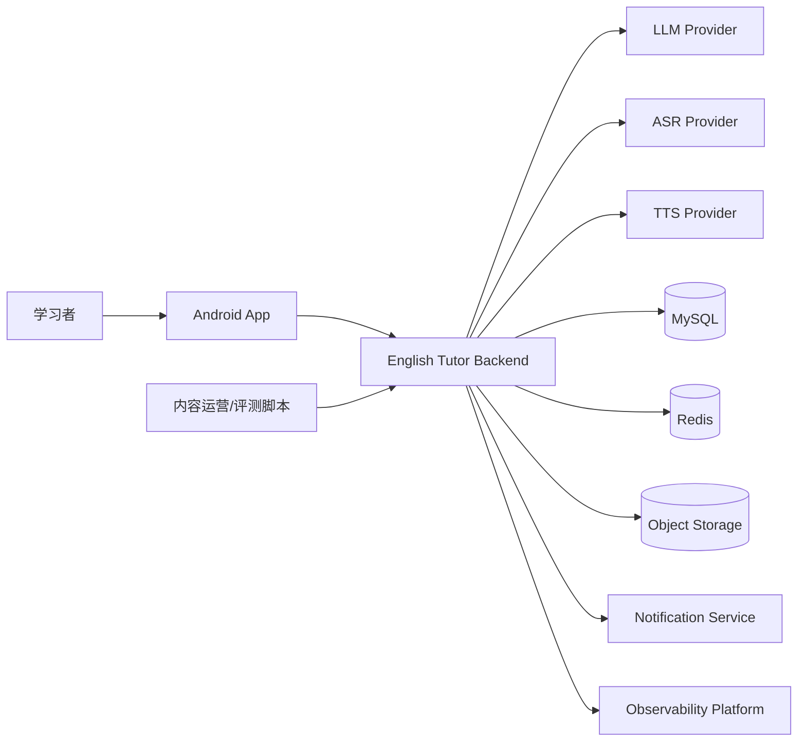

## 2.1 外部角色

| 角色 | 与系统关系 |
|---|---|
| 学习者 | 完成评估、训练、对话、复习和数据管理 |
| AI Provider | 提供 LLM、ASR、TTS 能力，可由一个或多个厂商组成 |
| 对象存储 | 保存音频、生成的听力资源和可选原始录音 |
| 通知服务 | Android 本地提醒为主，后续可接推送 |
| 内容运营 | 管理场景模板、评测集、禁用内容和版本 |

---

# 3. 总体架构

## 3.1 逻辑架构

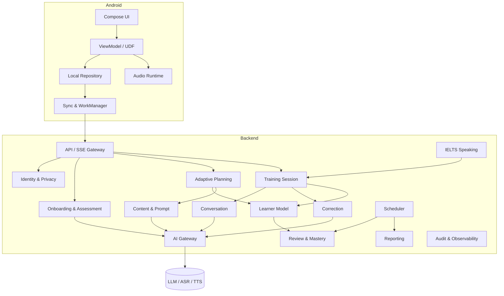

## 3.2 物理部署架构

第一版建议部署为：

```text
Android App
    │ HTTPS / SSE
Nginx / API Gateway
    │
English Tutor Backend（单实例起步，可水平扩容）
    ├── MySQL
    ├── Redis
    ├── Object Storage
    └── 外部 AI Provider
```

部署约束：

- 后端保持无状态请求处理，学习状态落库；
- SSE 连接通过粘性会话或共享状态支持扩容；
- 语音二进制不进入数据库；
- 异步任务使用数据库 Outbox + Worker 或 Redis 队列；
- 首版无需 Kafka，除非日后并发或异步链路明显增长。

---

# 4. 模块划分

## 4.1 后端业务模块

| 模块 | 主要职责 | 对应 PRD |
|---|---|---|
| Identity & Preference | 用户、目标、时间、纠错、提醒和隐私偏好 | FR-ONB、FR-REM、FR-DAT |
| Assessment | 自评、题目编排、初评会话、结果归一化 | FR-ASM |
| Learner Model | 多维能力、知识状态、学习行为和证据聚合 | FR-PRO |
| Adaptive Planning | 决定今日任务、时长、难度和计划解释 | FR-PLN |
| Training Session | 统一管理训练会话、任务进度和恢复 | FR-TRN |
| Conversation | 文字/语音场景对话和上下文管理 | FR-CON |
| Correction | 错误检测、自然表达、反馈时机和纠错数量控制 | FR-COR |
| Review & Mastery | 复习调度、迁移、延迟验证和掌握状态 | FR-REV |
| IELTS Speaking | Part 1/2/3、完整模拟和参考评分 | FR-IEL |
| Reporting | 每日总结、周报、阶段测验和趋势 | FR-RPT |
| Content & Prompt | 题目模板、场景素材、Prompt、版本和质量标签 | FR-TRN-006 |
| AI Gateway | Provider 抽象、路由、重试、结构化输出和成本 | 全部 AI 功能 |
| Audit & Observability | Trace、调用日志、指标、审计和问题追踪 | NFR |

## 4.2 Android 模块

| 模块 | 主要职责 |
|---|---|
| app | Application、导航、全局依赖和启动流程 |
| core:model | 客户端领域模型与 DTO |
| core:network | REST、SSE、上传、认证和错误转换 |
| core:database | Room 缓存、草稿、上传任务和同步状态 |
| core:audio | 录音、音量、播放、音频焦点和权限 |
| core:designsystem | 组件、主题、状态和无障碍规范 |
| feature:onboarding | 目标、自评和初评 |
| feature:home | 今日计划、原因和快速调整 |
| feature:training | 听力、对话、跟读、复述和通用任务容器 |
| feature:ielts | Part 1/2/3 与完整模拟 |
| feature:progress | 画像、趋势、周报和阶段测验 |
| feature:settings | 提醒、隐私、数据删除和偏好 |
| sync | WorkManager 同步、失败重传和提醒安排 |

---

# 5. 核心领域对象

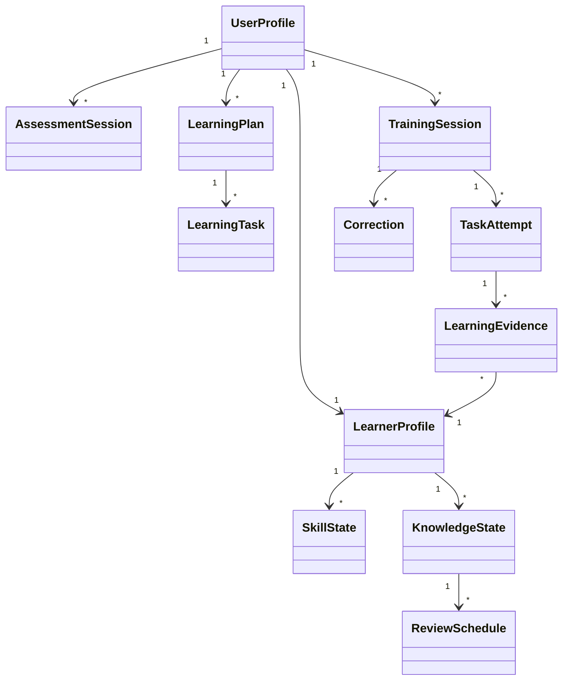

核心对象说明：

- `UserProfile`：用户目标和偏好；
- `LearnerProfile`：当前多维能力画像；
- `SkillState`：听说读写、语法、词汇、自然度等能力状态；
- `KnowledgeState`：具体知识点、词块、错误模式的掌握状态；
- `AssessmentSession`：初评或阶段测验；
- `LearningPlan`：某日或某阶段的任务计划；
- `LearningTask`：计划中的具体任务；
- `TrainingSession`：一次连续训练；
- `TaskAttempt`：用户对一个任务的作答；
- `LearningEvidence`：用于画像更新的标准化证据；
- `Correction`：纠错与自然表达建议；
- `ReviewSchedule`：某知识状态的下一次复习安排。

---

# 6. 核心流程概要

## 6.1 初评流程

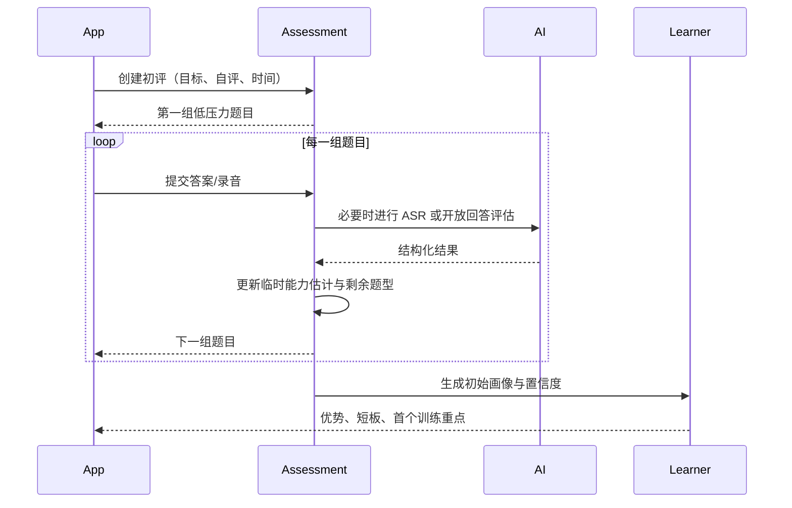

## 6.2 每日计划流程

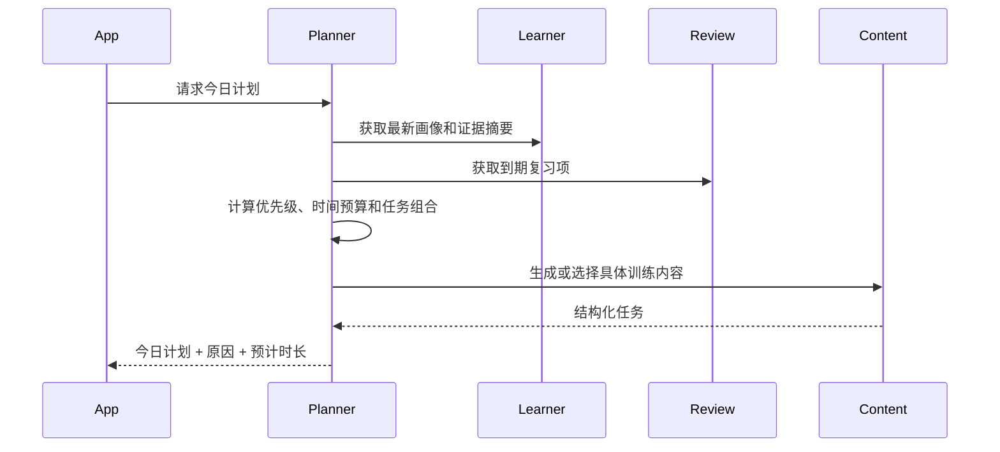

## 6.3 语音训练流程

第一版采用半双工：

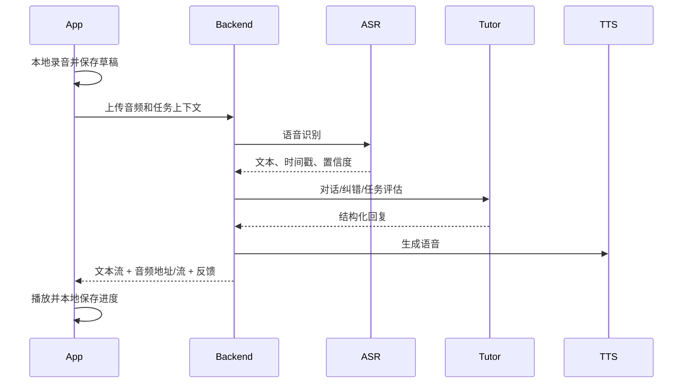

## 6.4 学习证据更新流程

```text
TaskAttempt
→ Evidence Normalizer
→ 去噪与置信度计算
→ 更新 SkillState
→ 更新 KnowledgeState
→ 更新 ReviewSchedule
→ 记录 ProfileChangeLog
→ 使后续计划缓存失效
```

---

# 7. Agent 架构概要

第一版不设计为多个完全自治 Agent 相互自由协商，而采用**确定性工作流 + 专项智能组件**：

```text
Learning Orchestrator
├── Assessment Engine
├── Planning Engine
├── Conversation Coach
├── Correction Coach
├── Review Engine
├── IELTS Evaluator
├── Content Generator
└── Learner Model Updater
```

原则：

- Orchestrator 决定调用顺序；
- 规则引擎决定是否需要调用某个组件；
- LLM 负责语言理解、内容生成、开放回答评估；
- 数据写入由应用服务验证后完成，模型不能直接修改数据库；
- 首版不引入 MCP 动态工具发现，内部工具使用白名单注册。

---

# 8. 数据架构概要

## 8.1 数据分类

| 分类 | 存储 | 示例 |
|---|---|---|
| 核心业务数据 | MySQL | 用户、计划、任务、画像、证据、纠错 |
| 短期状态 | Redis | SSE 会话、幂等键、临时锁、限流、缓存 |
| 二进制内容 | 对象存储 | 录音、TTS 音频、听力素材 |
| 客户端缓存 | Room | 今日计划、任务进度、上传草稿、最近报告 |
| 配置与 Prompt | Git + 数据库发布表 | Prompt 文本、场景模板、版本 |
| 可观测数据 | Metrics/Logs/Traces | latency、token、ASR 失败、trace |

## 8.2 一致性原则

- 关系数据库是学习状态的最终事实来源；
- Android Room 是客户端缓存，不独立决定长期画像；
- 音频上传使用临时上传凭证或后端中转；
- 任务提交使用幂等键；
- 画像更新与证据写入在同一事务或可靠异步事件中完成；
- 对象存储删除失败进入补偿任务。

---

# 9. 接口架构概要

## 9.1 协议选择

- 普通业务：HTTPS REST JSON；
- 文字流式回复：SSE；
- 音频上传：multipart 或预签名 URL；
- 音频播放：HTTPS Range；
- 实时全双工：后续版本考虑 WebRTC/WebSocket；
- 通知：Android 本地 WorkManager，后续可接 FCM。

## 9.2 API 分组

```text
/api/v1/auth/*
/api/v1/profile/*
/api/v1/onboarding/*
/api/v1/assessments/*
/api/v1/plans/*
/api/v1/training-sessions/*
/api/v1/conversations/*
/api/v1/audio/*
/api/v1/reviews/*
/api/v1/ielts/*
/api/v1/reports/*
/api/v1/settings/*
/api/v1/data-privacy/*
```

---

# 10. 非功能架构

## 10.1 性能目标

| 场景 | 目标 |
|---|---|
| 今日计划读取（命中缓存） | P95 < 500ms |
| 普通 REST 查询 | P95 < 800ms |
| 文字对话首个 SSE Token | P95 < 2.5s，弱网除外 |
| ASR 短录音完成 | 10 秒录音 P95 < 4s，依 Provider 调整 |
| TTS 首段可播放 | P95 < 3s |
| 初评提交 | P95 < 2s，不含开放语音分析 |
| 错误恢复 | 任务提交重试不产生重复证据 |

## 10.2 可用性

- 核心 API 月可用性目标 99.5%；
- 单一 AI Provider 故障时可切换备用或降级文字；
- 初评和训练支持断点恢复；
- 不因报告生成失败阻塞训练结果保存。

## 10.3 安全与隐私

- 全链路 HTTPS；
- Token 身份认证；
- 服务端对象级授权；
- 录音、原始文本与摘要分级控制；
- 删除请求可追踪并具备补偿；
- 日志默认不记录完整原始对话和音频内容；
- Prompt 输入进行角色隔离和注入防护。

---

# 11. 技术选型说明

## 11.1 后端基线

选择 Java 21 + Spring Boot 4.1.0 + Spring AI 2.0.0：

- 新项目可以使用当前稳定技术栈；
- Spring AI 支持 ChatClient、流式调用、结构化输出、Memory 和 Tool Calling；
- 保留自有 Provider、Agent 和学习领域接口，避免业务绑定框架细节。

## 11.2 Android 基线

采用 Compose + UDF + Repository：

- 页面状态由 ViewModel 管理；
- UI 使用不可变 `UiState`；
- 用户事件向上发送；
- 本地 Room 作为弱网缓存；
- WorkManager 处理持久化同步和提醒；
- Media3 处理听力与 TTS 播放。

## 11.3 为什么不拆微服务

- 第一版业务仍在快速验证；
- Agent、计划、画像和训练存在较强事务关联；
- 当前团队规模和预期流量不足以抵消分布式复杂度；
- 模块化边界可在未来按真实瓶颈拆分。

---

# 12. 里程碑映射

| 里程碑 | 设计交付范围 |
|---|---|
| M1 | Onboarding、Assessment、Learner Profile、首个 Plan |
| M2 | Training、Conversation、Correction、Evidence 更新 |
| M3 | Audio、ASR、TTS、Listening、上传恢复 |
| M4 | Review、Mastery、Weekly Report、Stage Assessment |
| M5 | IELTS Part 1/2/3、完整模拟与参考评分 |
| M6 | 隐私、观测、弱网、性能、灰度与发布门禁 |

---

# 13. 概要设计验收

- [ ] 所有 P0 需求均有归属模块；
- [ ] Android 和后端边界清晰；
- [ ] 初评、计划、训练、证据、复习形成闭环；
- [ ] 文字和语音链路均有可实施方案；
- [ ] AI Provider 可替换；
- [ ] 数据保存、关闭和删除具备架构支持；
- [ ] 首版范围未依赖全双工实时语音；
- [ ] 能按 M1–M6 分阶段运行验证。

<!-- END 01_HIGH_LEVEL_DESIGN.md -->


<!-- BEGIN 02_DETAILED_DESIGN_BACKEND.md -->

# English Tutor Agent 后端详细设计

> 架构形态：模块化单体  
> 技术基线：Java 21、Spring Boot 4.1.0、Spring AI 2.0.0、MySQL、Redis

---

# 1. 工程结构

## 1.1 Maven 模块

```text
english-tutor-agent-server/
├── tutor-bootstrap              # 启动、配置、装配
├── tutor-api                    # Controller、DTO、SSE、异常转换
├── tutor-application            # 用例服务、命令查询、事务边界
├── tutor-domain                 # 聚合、值对象、领域服务、事件
├── tutor-agent                  # Agent、Prompt、结构化输出、AI 策略
├── tutor-infrastructure         # DB、Redis、对象存储、Provider 实现
├── tutor-observability          # Trace、Metrics、审计和 AI 调用记录
└── tutor-test-support           # Fixture、Fake Provider、测试容器支持
```

依赖方向：

```text
bootstrap → api → application → domain
bootstrap → infrastructure → application/domain
bootstrap → agent → application/domain
observability 被外层适配器引用，不反向依赖业务
```

## 1.2 包结构

按业务模块优先，不使用按 Controller/Service/Mapper 的全局分层：

```text
cn.forever24.tutor
├── identity
├── onboarding
├── assessment
├── learner
├── planning
├── training
├── conversation
├── correction
├── review
├── ielts
├── reporting
├── content
├── ai
├── privacy
└── shared
```

每个模块内部可采用：

```text
<module>/
├── api
├── application
├── domain
└── infrastructure
```

---

# 2. 架构模式

## 2.1 命令与查询

不引入完整 CQRS 基础设施，但在代码层区分：

- Command：改变状态，要求幂等和事务；
- Query：读取投影，允许缓存；
- Domain Event：模块间异步协作；
- Integration Event：未来跨进程扩展使用。

示例：

```java
public record SubmitTaskAttemptCommand(
        String userId,
        String sessionId,
        String taskId,
        String idempotencyKey,
        AttemptPayload payload
) {}
```

## 2.2 聚合边界

| 聚合 | 聚合根 | 一致性边界 |
|---|---|---|
| 用户偏好 | UserProfile | 主要目标、时间、纠错与隐私偏好 |
| 初评 | AssessmentSession | 当前题目、答案、进度和完成状态 |
| 学习计划 | LearningPlan | 当日计划及任务顺序 |
| 训练会话 | TrainingSession | 任务进度、尝试和结束状态 |
| 学习者画像 | LearnerProfile | 能力摘要、画像版本 |
| 知识掌握 | KnowledgeState | 某知识项状态和复习时间 |
| IELTS 模拟 | IeltsSimulation | Part 状态、录音、评分与报告 |

学习证据可高频追加，不要求每次加载完整 LearnerProfile 聚合。画像更新由专门应用服务在事务中执行。

---

# 3. 应用服务设计

## 3.1 OnboardingApplicationService

职责：

- 创建用户产品档案；
- 保存主要目标与偏好；
- 校验只能有一个主要目标；
- 判断是否可以进入初评；
- 目标修改后发出 `PrimaryGoalChangedEvent`。

核心方法：

```java
OnboardingProgress getProgress(UserId userId);
void savePrimaryGoal(UserId userId, PrimaryGoal goal);
void savePreferences(UserId userId, LearningPreferences preferences);
AssessmentSessionId startInitialAssessment(UserId userId);
```

## 3.2 AssessmentApplicationService

职责：

- 根据自评创建题目蓝图；
- 获取下一批题；
- 处理选择、文字和语音答案；
- 维护评估时间与题量预算；
- 生成标准化证据；
- 完成后创建初始画像和首个计划。

关键约束：

- 目标 8–10 分钟；
- 每个能力至少产生一条有效证据；
- 高自评用户开放题比例提高；
- 题目不够时允许动态生成；
- 初评评分失败时保留答案，可异步重算。

## 3.3 LearningPlanApplicationService

职责：

- 获取或生成今日计划；
- 合并临时需求；
- 根据时间预算进行任务选择；
- 对生成计划进行业务校验；
- 计划变更保留原因与版本。

```java
LearningPlanView getTodayPlan(UserId userId, LocalDate date);
LearningPlanView regenerate(UserId userId, PlanAdjustment adjustment);
void acceptPlan(UserId userId, PlanId planId);
```

计划生成幂等键：`userId + localDate + profileVersion + adjustmentVersion`。

## 3.4 TrainingSessionApplicationService

职责：

- 开始、恢复和结束训练；
- 控制任务顺序；
- 保存草稿和尝试；
- 调用对应任务执行器；
- 聚合本次总结；
- 发布学习证据。

任务执行器接口：

```java
public interface TaskExecutor<P extends TaskPayload, R extends TaskResult> {
    TaskType supports();
    R evaluate(TaskContext context, P payload);
}
```

任务类型通过注册表路由，不使用长 `if/else`。

## 3.5 LearnerModelApplicationService

职责：

- 接收标准化证据；
- 去重、校准置信度；
- 更新能力和知识状态；
- 写入画像变化日志；
- 使计划缓存失效。

```java
ProfileUpdateResult applyEvidenceBatch(
    UserId userId,
    List<LearningEvidence> evidences,
    EvidenceSource source
);
```

## 3.6 ReviewApplicationService

职责：

- 查询到期复习；
- 根据掌握状态选择任务形式；
- 创建迁移和延迟验证任务；
- 根据结果调整下次复习时间；
- 避免机械重复。

## 3.7 ConversationApplicationService

职责：

- 管理对话会话上下文；
- 读取当前任务、用户目标和相关历史问题；
- 流式生成自然回复；
- 后置或并行执行纠错；
- 保存最小必要上下文和证据。

## 3.8 IeltsApplicationService

职责：

- Part 1/2/3 训练；
- 完整模拟状态机；
- 计时与不打断策略；
- 结束后统一评分；
- 生成“AI 练习参考”报告和后续任务。

---

# 4. 事务与一致性

## 4.1 事务边界

| 操作 | 事务内容 |
|---|---|
| 提交任务答案 | Attempt + EvidenceOutbox + SessionProgress |
| 完成初评 | Assessment + InitialProfile + InitialPlan |
| 更新画像 | EvidenceConsumed + SkillState + KnowledgeState + ChangeLog |
| 完成训练 | SessionFinish + SummaryDraft + ReportOutbox |
| 删除用户数据 | DeletionRequest + 状态冻结；异步删除外部对象 |

## 4.2 Outbox

使用 `domain_outbox` 表保存可靠异步事件：

```text
业务事务提交
→ OutboxPoller 获取待处理事件
→ 调用画像更新/报告/对象删除
→ 成功标记 DONE
→ 失败指数退避
→ 超过阈值进入 DEAD 并告警
```

首版无需 Kafka。后续如果拆服务，可将 Outbox 发布至消息队列而不改变领域事件。

## 4.3 幂等

以下操作必须携带 `Idempotency-Key`：

- 创建评估；
- 提交评估答案；
- 开始训练会话；
- 提交任务尝试；
- 完成会话；
- 上传完成确认；
- 删除数据请求。

服务端保存请求指纹、状态码和响应摘要。相同键、不同请求体返回冲突错误。

## 4.4 并发控制

- 聚合表使用 `version` 乐观锁；
- 同一天计划生成使用 Redis 短锁 + 数据库唯一键；
- 同一训练任务只允许一个最终提交；
- 画像更新按 `userId` 串行化批次处理，避免更新丢失；
- SSE 断线重连使用事件序号，不重复写业务数据。

---

# 5. 训练会话状态机

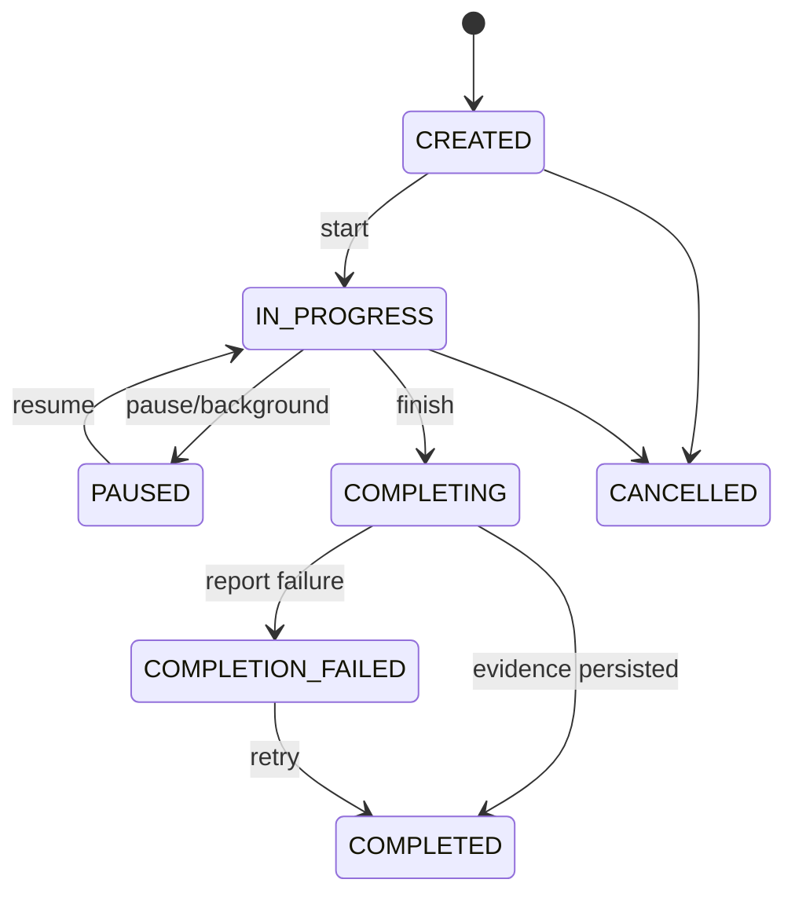

关键规则：

- `PAUSED` 不视为失败；
- 任务答案保存后即形成 Attempt，但证据可异步评估；
- `COMPLETED` 以核心答案和证据持久化为准，报告失败不回滚训练；
- 会话超时自动暂停，不自动提交未完成任务。

---

# 6. 对话与流式输出

## 6.1 SSE 流程

```text
POST /conversations/{id}/messages
→ 保存用户消息
→ 返回 streamId
→ GET /streams/{streamId} 或直接 SSE 响应
→ event: status
→ event: text_delta
→ event: correction_ready
→ event: audio_ready
→ event: done
```

首选单请求 SSE：提交消息后保持连接。客户端断线时以 `Last-Event-ID` 恢复；如果 Provider 不支持续流，则服务端返回已缓存完整回复。

## 6.2 上下文构建

只注入必要上下文：

1. 当前系统教学规则；
2. 当前目标与场景；
3. 当前任务说明；
4. 最近有限轮对话；
5. 与当前表达相关的高频错误；
6. 用户当前难度与纠错偏好。

不把完整长期历史直接塞入 Prompt，避免成本、隐私和上下文污染。

## 6.3 纠错时序

- 严重影响理解：对话生成前或同时触发重述；
- 中等错误：回复后发送 `correction_ready`；
- 轻微自然度：会话总结时处理；
- 纠错失败不阻塞对话回复。

---

# 7. 音频链路

## 7.1 上传设计

推荐两种模式：

### 小音频直接上传

- 适用于 60 秒以内回答；
- Android multipart 上传后端；
- 后端计算 SHA-256、校验 MIME 和时长；
- 保存对象存储后提交 ASR。

### 大音频预签名上传

- 用于 IELTS Part 2 或完整模拟；
- 客户端申请上传凭证；
- 直接上传对象存储；
- 调用 complete 接口确认；
- 服务端异步校验并处理。

## 7.2 音频格式

首版建议：

- 录音：AAC-LC in M4A，单声道，16kHz 或 24kHz；
- 若 ASR Provider 偏好 PCM，可由客户端或服务端转码；
- 最大单段时长按任务限制；
- 上传前记录本地时长和文件大小；
- 禁止把 Base64 音频放入 JSON。

## 7.3 ASR 结果

标准结构：

```json
{
  "text": "Today I fixed a database issue.",
  "language": "en",
  "durationMs": 4210,
  "confidence": 0.91,
  "segments": [
    {"startMs": 0, "endMs": 1200, "text": "Today I fixed"}
  ],
  "providerMetadata": {}
}
```

低置信度时：

- 展示识别文本供用户确认；
- 允许修改文字再提交；
- 不把明显 ASR 错误直接作为用户语言错误；
- 发音分析必须区分识别置信度和发音证据。

## 7.4 TTS

- 文本回复先于完整 TTS 返回；
- TTS 可按句生成，首句完成即可播放；
- 音频结果缓存按文本哈希、语音角色和语速复用；
- 用户可取消播放但不取消已生成的文字回复。

---

# 8. 内容与 Prompt 管理

## 8.1 资源结构

```text
resources/
├── prompts/
│   ├── conversation/
│   ├── correction/
│   ├── assessment/
│   ├── content-generation/
│   └── ielts-evaluation/
├── schemas/
├── rubrics/
└── seed-content/
```

Prompt 头信息：

```yaml
name: correction_analyzer
version: 1.0.0
schema: correction-result-v1
locale: zh-CN
enabled: true
```

## 8.2 发布模型

- Git 中保存源文件；
- CI 校验 YAML、Schema 和测试样例；
- 发布后写入 `prompt_release`；
- AI 调用日志记录 Prompt 版本；
- 支持按百分比灰度；
- 不允许在线直接覆盖生产 Prompt 而无版本记录。

---

# 9. Provider 抽象

```java
public interface ChatProvider {
    ChatStream stream(ChatProviderRequest request);
    StructuredResponse completeStructured(ChatProviderRequest request, JsonSchema schema);
    ProviderCapabilities capabilities();
}

public interface SpeechToTextProvider {
    AsrResult transcribe(AudioInput input, AsrOptions options);
}

public interface TextToSpeechProvider {
    TtsResult synthesize(String text, VoiceOptions options);
}
```

路由输入：

- 任务类型；
- 延迟要求；
- 是否需要结构化输出；
- 语音/语言支持；
- 当前 Provider 健康；
- 成本预算；
- 数据保存约束。

降级策略：

```text
主 Provider
→ 同能力备用 Provider
→ 降低高级功能（如发音评分）
→ 文字模式
→ 保存草稿并提示稍后重试
```

---

# 10. 定时任务

| 任务 | 周期 | 说明 |
|---|---|---|
| OutboxPoller | 秒级 | 可靠异步事件 |
| ReviewDueCalculator | 每小时/按需 | 生成到期复习候选 |
| WeeklyReportJob | 每日扫描 | 按用户时区生成周报 |
| StageAssessmentJob | 每日扫描 | 默认四周，可调整 |
| AudioRetentionCleanup | 每日 | 删除到期录音和临时文件 |
| ProviderHealthCheck | 分钟级 | 更新路由健康状态 |
| DeadLetterAlert | 分钟级 | 失败任务告警 |

所有任务必须支持：唯一任务键、重复执行安全、分片、重试、手动补偿。

---

# 11. 异常设计

统一异常分类：

- `VALIDATION_ERROR`：用户输入或状态不合法；
- `AUTHENTICATION_REQUIRED`；
- `FORBIDDEN`；
- `RESOURCE_NOT_FOUND`；
- `STATE_CONFLICT`；
- `IDEMPOTENCY_CONFLICT`；
- `AUDIO_INVALID`；
- `AI_PROVIDER_TIMEOUT`；
- `AI_OUTPUT_INVALID`；
- `CONTENT_UNAVAILABLE`；
- `RATE_LIMITED`；
- `INTERNAL_ERROR`。

错误响应不暴露模型密钥、SQL、Prompt 或内部堆栈。

---

# 12. 编码规范

- 使用不可变 DTO 和值对象；
- `Optional` 不作为实体字段；
- 领域枚举不使用魔法字符串；
- 时间统一存 UTC，展示按用户时区；
- 金丝雀功能使用 Feature Flag；
- Controller 不包含业务逻辑；
- Repository 接口位于领域/应用层，实现在基础设施层；
- AI 输出经过 Mapper 转为领域对象，领域层不依赖 Spring AI 类型；
- 每个公共应用服务方法记录 traceId 和需求编号标签。

<!-- END 02_DETAILED_DESIGN_BACKEND.md -->


<!-- BEGIN 03_DETAILED_DESIGN_ANDROID.md -->

# English Tutor Agent Android 详细设计

> 客户端：Android  
> UI：Jetpack Compose + Material 3  
> 架构：UI / Domain / Data，单向数据流，离线优先缓存

---

# 1. 项目结构

```text
android-app/
├── app
├── core-common
├── core-model
├── core-network
├── core-database
├── core-datastore
├── core-audio
├── core-designsystem
├── core-testing
├── feature-onboarding
├── feature-assessment
├── feature-home
├── feature-training
├── feature-conversation
├── feature-ielts
├── feature-progress
├── feature-settings
└── sync
```

首个 MVP 也可以先合并部分 `feature` 模块，但包边界保持一致。

---

# 2. 分层与数据流

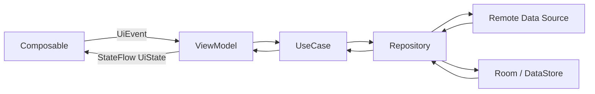

原则：

- Composable 不直接访问网络或数据库；
- ViewModel 产生不可变 `UiState`；
- UI 只发送事件，不直接修改领域对象；
- Repository 是数据单一入口；
- Room 保留计划、会话进度和待上传草稿；
- 服务端是长期画像和最终训练结果的事实来源。

---

# 3. 导航设计

## 3.1 顶层导航

```text
Launch
├── Authentication
├── OnboardingGraph
│   ├── Goal
│   ├── Preferences
│   ├── SelfAssessment
│   ├── InitialAssessment
│   └── InitialProfile
└── MainGraph
    ├── Today
    ├── Training
    ├── Progress
    └── Settings
```

IELTS 作为 `Training` 下的独立子图：

```text
IeltsGraph
├── Dashboard
├── Part1
├── Part2Preparation
├── Part2Speaking
├── Part3
├── FullSimulation
└── Result
```

## 3.2 深链

至少支持：

- 学习提醒打开今日计划；
- 未完成会话恢复；
- 阶段测验入口；
- IELTS 模拟结果；
- 隐私删除请求状态。

---

# 4. 通用页面状态模型

```kotlin
data class ScreenUiState<T>(
    val data: T? = null,
    val isInitialLoading: Boolean = false,
    val isSubmitting: Boolean = false,
    val recoverableError: UiError? = null,
    val blockingError: UiError? = null,
    val pendingEffect: UiEffect? = null
)
```

推荐每个页面定义独立状态：

```kotlin
data class TodayUiState(
    val date: LocalDate,
    val plan: TodayPlanUiModel?,
    val syncState: SyncState,
    val isRefreshing: Boolean,
    val adjustmentSheetVisible: Boolean,
    val message: String?
)
```

事件：

```kotlin
sealed interface TodayEvent {
    data object Refresh : TodayEvent
    data object StartPlan : TodayEvent
    data class AdjustDuration(val minutes: Int) : TodayEvent
    data class SubmitTemporaryNeed(val text: String) : TodayEvent
}
```

一次性导航、Toast、权限请求使用 `UiEffect`，不混入永久状态。

---

# 5. 首次引导与初评

## 5.1 保存策略

每个步骤完成后立即保存：

- 服务端成功：更新 Room 缓存；
- 服务端失败：保存本地草稿并显示待同步；
- 进入下一步前校验必填项；
- App 被杀后从最后成功/本地草稿步骤恢复。

## 5.2 初评题目容器

统一 `AssessmentQuestionScreen` 根据类型渲染：

```text
SINGLE_CHOICE
MULTI_CHOICE
LISTENING_CHOICE
READING_CHOICE
SHORT_TEXT
VOICE_SHORT_ANSWER
VOICE_RETELL
WRITING_SHORT
```

每题状态：

```kotlin
data class QuestionState(
    val questionId: String,
    val type: QuestionType,
    val answerDraft: AnswerDraft?,
    val startedAt: Instant?,
    val submittedAt: Instant?,
    val uploadState: UploadState,
    val canContinue: Boolean
)
```

## 5.3 非考试化体验

- 使用“快速了解你”而非“考试”；
- 不显示持续扣分；
- 进度以阶段而非 1/40 题显示；
- 允许暂停；
- 答错后不立即显示红色失败；
- 高自评用户可看到“接下来会增加开放表达”。

---

# 6. 今日首页

## 6.1 页面组成

1. 今日问候和当前主要目标；
2. 今日重点；
3. 一至两句安排原因；
4. 预计时长；
5. 任务卡列表；
6. 开始/继续按钮；
7. 快速调整入口；
8. 弱网/待同步状态。

## 6.2 本地展示

- 先展示 Room 中最近有效计划；
- 后台刷新最新计划；
- 新计划与旧计划不同，提示“根据最近表现已更新”；
- 不在用户训练过程中静默替换当前任务；
- 正在进行的会话继续使用创建时计划版本。

---

# 7. 通用训练容器

## 7.1 Screen 结构

```text
TrainingScaffold
├── TopBar（进度、暂停、退出）
├── TaskHeader（目标与说明）
├── TaskContent（按任务类型渲染）
├── AssistancePanel（关键词/文本/框架）
├── FeedbackArea
└── BottomAction（录音/提交/继续）
```

## 7.2 任务渲染器

```kotlin
interface TrainingTaskRenderer {
    fun supports(type: TaskType): Boolean
    @Composable fun Render(
        state: TrainingTaskUiState,
        onEvent: (TrainingEvent) -> Unit
    )
}
```

实际 Compose 中可通过 `when(type)` 结合独立 Composable，接口用于模块组织而非动态反射。

## 7.3 进度恢复

Room 保存：

- sessionId；
- planVersion；
- currentTaskIndex；
- 每题草稿；
- 本地录音路径；
- 已提交 attemptId；
- 最后同步时间；
- SSE 最后事件 ID。

恢复时先读取本地，再与服务端 session 状态合并。

---

# 8. 录音设计

## 8.1 状态机

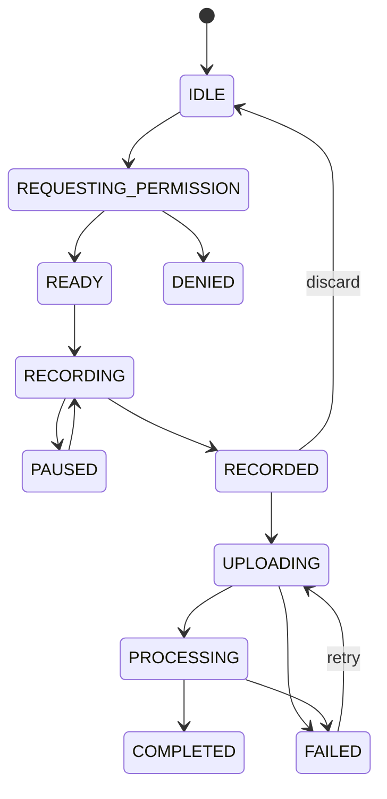

## 8.2 AudioRecorderController

职责：

- 麦克风权限；
- 音频焦点；
- 录音生命周期；
- 文件命名与临时目录；
- 最大时长；
- 音量波形数据；
- 文件哈希与元数据；
- 后台切换处理。

接口：

```kotlin
interface AudioRecorderController {
    val state: StateFlow<RecorderState>
    suspend fun prepare(config: RecordingConfig)
    suspend fun start()
    suspend fun pause()
    suspend fun resume()
    suspend fun stop(): RecordedAudio
    suspend fun cancel()
}
```

## 8.3 权限策略

- 在用户首次点击录音时请求麦克风权限；
- 拒绝后提供文字输入路径；
- 永久拒绝时提供系统设置入口；
- 不在首次打开 App 时无上下文请求权限；
- 权限拒绝不阻塞非语音学习。

## 8.4 后台行为

- 短语音任务切后台时自动暂停并提示；
- 首版不允许无感后台持续录音；
- IELTS 长录音如需要后台能力，使用明确前台通知并单独评审；
- 录音文件先本地落盘，上传失败可重试。

---

# 9. 音频播放设计

使用 AndroidX Media3 ExoPlayer：

- 支持在线播放和本地缓存；
- 支持播放、暂停、拖动和语速；
- 处理音频焦点和耳机拔出；
- 听力材料和 TTS 统一播放器接口；
- 同一时刻仅一个 Player 发声；
- 录音开始前暂停播放；
- 记录重复播放次数、语速和文本辅助使用情况。

```kotlin
interface TutorAudioPlayer {
    val state: StateFlow<PlayerState>
    fun setMedia(source: AudioSource)
    fun play()
    fun pause()
    fun seekTo(positionMs: Long)
    fun setPlaybackSpeed(speed: Float)
    fun release()
}
```

---

# 10. 网络与同步

## 10.1 网络层

- REST：Retrofit + OkHttp；
- SSE：OkHttp EventSource 或可靠 SSE 实现；
- 超时分类：连接、读、写、AI 长响应分别配置；
- Access Token 自动刷新；
- 请求统一附带 traceId、appVersion、deviceId、timezone；
- 文件上传与普通 JSON 使用不同客户端配置。

## 10.2 离线优先策略

可离线查看：

- 最近今日计划；
- 已下载的听力内容；
- 最近训练总结；
- 能力画像摘要；
- 未同步录音和文字草稿。

必须在线：

- 新的 AI 对话；
- ASR/TTS（除非未来本地模型）；
- 生成新计划；
- IELTS AI 评分。

## 10.3 WorkManager

使用场景：

- 待上传音频重试；
- 任务尝试同步；
- 拉取提醒内容；
- 定期清理临时文件；
- 用户请求的数据删除状态刷新。

不使用 WorkManager 维持前台实时对话。

## 10.4 冲突合并

- 服务端已完成、客户端仍待提交：以服务端为准；
- 客户端草稿未提交：保留为草稿，不覆盖服务端答案；
- 同一 attempt 的幂等键保证不会生成两份证据；
- 计划更新不覆盖进行中 session 的 planVersion。

---

# 11. SSE 客户端

状态：

```text
CONNECTING
CONNECTED
RECONNECTING
COMPLETED
FAILED
CANCELLED
```

事件处理：

- `status`：更新进度文案；
- `text_delta`：增量拼接；
- `correction_ready`：展示轻量提示卡；
- `audio_ready`：添加播放器资源；
- `done`：落 Room 并结束连接；
- `error`：保留已接收文本，提供重试或使用完整结果查询。

SSE 增量只存在内存和草稿；收到 `done` 或通过结果查询确认后写为完整消息。

---

# 12. 通知设计

第一版以本地提醒为主：

- 用户主动开启；
- 用 DataStore 保存时间和开关；
- WorkManager/Alarm 负责安排；
- 时区变化后重新安排；
- 文案引用今日价值，不使用羞辱和惩罚；
- 点击通知深链至今日计划。

如果后续接 FCM，服务端推送仅作为增强，不替代本地提醒。

---

# 13. 隐私与本地数据

Room 中不长期保存完整敏感录音：

- 上传成功且服务端确认后，按偏好删除本地临时文件；
- 用户选择不保存原始录音时，上传处理完成后服务端删除；
- 本地数据库可选择 SQLCipher 或系统加密存储敏感 Token；
- Token 使用 Android Keystore 支持的安全存储；
- 日志不输出对话正文、录音路径和 Token。

设置页支持：

- 原始文字保存开关；
- 原始语音保存开关；
- 仅保留学习摘要；
- 导出/删除入口；
- 删除影响说明。

---

# 14. 无障碍与体验

- 触控目标不小于平台推荐尺寸；
- 录音状态同时使用文字、图标和动画；
- 错误不只通过红色表达；
- 所有音频提供可选文字辅助；
- 支持系统字体放大；
- 重要按钮适合单手触达；
- TalkBack 能读出题目、选项、录音和进度状态；
- 倒计时可通过语音和视觉同时提示。

---

# 15. Android 测试

## 15.1 单元测试

- ViewModel 状态转换；
- UseCase；
- Repository 合并；
- 上传重试；
- 音频状态机；
- SSE 事件拼接；
- 时间和提醒规则。

## 15.2 UI 测试

- 首次引导；
- 初评暂停恢复；
- 今日计划；
- 录音权限允许/拒绝；
- 弱网重试；
- 文字替代路径；
- IELTS 计时流程；
- 删除数据确认。

## 15.3 真机矩阵

至少覆盖：

- Android 最低支持版本；
- 当前主流版本；
- 一台低内存设备；
- 一台国产 ROM 设备；
- 蓝牙耳机、有线耳机和扬声器；
- Wi-Fi、4G/5G、弱网、断网切换；
- 前后台切换和进程重建。

<!-- END 03_DETAILED_DESIGN_ANDROID.md -->


<!-- BEGIN 04_DETAILED_DESIGN_AGENT_LEARNING_ENGINE.md -->

# English Tutor Agent：Agent 与自适应学习引擎详细设计

> 目标：把“AI 聊天”升级为可解释、可测试、可持续校准的个人英语教学系统。

---

# 1. 总体模式

系统采用：

```text
确定性 Orchestrator
+ 规则与评分引擎
+ 专项 LLM 能力
+ 结构化学习者模型
```

不采用：

- 多个 Agent 自由对话后决定结果；
- 让 LLM 直接更新数据库；
- 每天仅凭一个 Prompt 随机生成计划；
- 将完整历史记录无筛选注入上下文；
- 将模型自信表述当作真实能力结论。

---

# 2. 组件职责

| 组件 | 类型 | 职责 |
|---|---|---|
| Learning Orchestrator | 应用工作流 | 决定步骤、超时、重试和状态写入 |
| Assessment Blueprint Engine | 规则 | 根据目标和自评分配初评题型 |
| Open Response Evaluator | LLM/规则 | 评估开放口语和写作 |
| Learner Model Updater | 算法 | 将证据转为能力与掌握状态变化 |
| Priority Scorer | 算法 | 计算当前最值得训练的能力和知识点 |
| Plan Composer | 规则 | 在时长预算中组合任务 |
| Content Generator | LLM/模板 | 生成符合蓝图的原创训练内容 |
| Conversation Coach | LLM | 自然对话、提示和场景推进 |
| Correction Analyzer | LLM/规则 | 错误、严重度、自然表达和历史关联 |
| Review Scheduler | 算法 | 决定何时、用什么形式复习 |
| IELTS Evaluator | LLM + Rubric | 生成参考评分和可执行反馈 |
| Safety/Quality Validator | 规则/模型 | Schema、难度、答案、内容风险检查 |

---

# 3. 学习者模型

## 3.1 多层模型

```text
User Goal Layer
├── primaryGoal
├── scenarios
├── dailyMinutes
└── preferences

Skill Layer
├── listening
├── speakingFluency
├── speakingInteraction
├── pronunciationIntelligibility
├── reading
├── writing
├── grammar
├── vocabulary
└── naturalness

Knowledge Layer
├── grammar concepts
├── collocations
├── chunks
├── pronunciation patterns
└── recurring error patterns

Behavior Layer
├── completion rate
├── response latency
├── hint dependency
├── replay count
├── preferred task type
└── recent fatigue signals
```

## 3.2 能力状态

```json
{
  "dimension": "speaking_interaction",
  "estimate": 0.46,
  "confidence": 0.63,
  "trend": "IMPROVING",
  "evidenceCount": 18,
  "lastEvaluatedAt": "2026-07-21T01:00:00Z"
}
```

- `estimate` 范围 0–1，仅内部计算；
- `confidence` 反映证据数量、质量和多样性；
- 用户界面默认转为行为描述或区间；
- CEFR 只作为内容难度映射，不直接等同于精确官方等级。

## 3.3 知识状态机

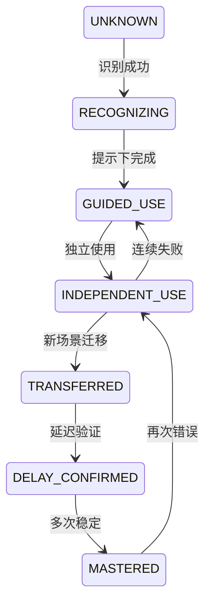

状态不只由正确率决定，还考虑：

- 是否使用提示；
- 是否为主动输出；
- 是否换了场景；
- 距离上次学习的时间；
- ASR/评分置信度；
- 错误是否真正属于用户。

---

# 4. 学习证据模型

## 4.1 标准结构

```json
{
  "evidenceId": "ev_01",
  "userId": "u_01",
  "source": "TRAINING_TASK",
  "skillDimensions": ["listening", "speaking_interaction"],
  "knowledgeKeys": ["chunk:could_you_clarify"],
  "taskType": "LISTEN_AND_RESPOND",
  "result": "PARTIALLY_CORRECT",
  "rawScore": 0.68,
  "evidenceWeight": 0.74,
  "independence": 0.80,
  "transferLevel": 0.40,
  "delayDays": 0,
  "hintLevel": 1,
  "asrConfidence": 0.92,
  "evaluatorConfidence": 0.78,
  "occurredAt": "2026-07-21T01:20:00Z"
}
```

## 4.2 权重原则

高权重证据：

- 主动口语或写作；
- 无提示独立完成；
- 新场景迁移；
- 延迟后仍正确；
- 阶段测验；
- 多次一致表现。

低权重证据：

- 猜对选择题；
- 查看完整答案后复述；
- ASR 置信度低；
- 任务内容过于熟悉；
- 单次极端表现；
- 模型评分置信度低。

## 4.3 更新公式建议

首版使用可解释加权更新，而非训练复杂机器学习模型：

```text
adjustedScore = rawScore
              × evidenceWeight
              × independenceFactor
              × evaluatorConfidence

newEstimate = oldEstimate × (1 - alpha)
            + adjustedScore × alpha
```

其中 `alpha` 根据证据权重和当前置信度动态限制，单次变化设置上下限，例如不超过 ±0.08。

置信度增长考虑：

- 证据数量；
- 任务类型多样性；
- 时间跨度；
- 结果一致性；
- 是否存在相互冲突证据。

---

# 5. 初评引擎

## 5.1 输入

- 主要目标；
- 听说读写行为自评；
- 用户可用时间；
- 用户是否选择较高水平；
- 设备是否允许录音；
- 题目库存和内容版本。

## 5.2 初评时间预算

目标 8–10 分钟，建议蓝图：

| 能力 | 普通用户 | 高自评用户 |
|---|---:|---:|
| 听力 | 2 个短音频选择 + 1 个短回应 | 1 个选择 + 1 个复述/回应 |
| 口语 | 1–2 个短回答 | 2 个开放回答或复述 |
| 阅读 | 2–3 个短题 | 1 个短题 + 1 个推断题 |
| 写作 | 1 个短句/短段 | 1 个场景短写作 |
| 语法词汇 | 穿插式选择题 | 在开放输出中评估为主 |

实际题量由预估时长动态裁剪，不强制固定数量。

## 5.3 自适应规则

```text
连续两题明显低于预期
→ 降一个难度档，减少开放题压力

连续两题高置信度正确
→ 提高一档或切换到开放任务

自评高但开放表达明显困难
→ 不负面评价，结果显示输入能力可能高于输出能力

录音权限不可用
→ 允许文字替代，但口语置信度标记较低并在后续补评
```

## 5.4 完成条件

- 听说读写均有证据，或明确记录缺失原因；
- 总时长达到最小有效阈值或用户完成所有关键任务；
- 至少确认一个优势和一个优先提升方向；
- 产生初始 `LearnerProfileVersion=1`；
- 自动创建首个计划。

---

# 6. 优先级评分

## 6.1 候选训练目标

候选包括：

- 技能维度；
- 具体知识点；
- 历史错误模式；
- 到期复习项；
- 主要目标要求；
- 临时现实需求；
- 阶段测验薄弱项。

## 6.2 评分因子

```text
priority = goalRelevance        × 0.25
         + weaknessSeverity     × 0.20
         + reviewUrgency        × 0.18
         + transferValue        × 0.12
         + recentErrorFrequency × 0.10
         + userNeedUrgency      × 0.10
         + engagementFit        × 0.05
```

权重是首版建议值，应配置化并通过数据验证，不写死在 Prompt 中。

强制规则优先于分数：

- 明天有英文会议：加入会议任务；
- 到期的高价值知识项：至少安排一个复习任务；
- 最近连续失败：降低难度或换形式；
- 用户今天不方便说话：不安排必须录音的任务；
- IELTS 完整模拟前后：遵循模拟训练周期。

---

# 7. 计划组合算法

## 7.1 输入

```json
{
  "timeBudgetMinutes": 20,
  "primaryGoal": "WORKPLACE",
  "priorityTargets": [],
  "dueReviews": [],
  "recentCompletion": 0.82,
  "temporaryNeed": null,
  "availableModes": ["TEXT", "VOICE", "AUDIO"]
}
```

## 7.2 任务约束

- 20 分钟计划建议 3–5 个任务；
- 每个计划至少包含一个主动输出任务；
- 需要复习时至少包含一个到期复习；
- 避免连续多个相同交互形式；
- 音频任务考虑下载和环境；
- 5 分钟模式仅保留最高价值任务；
- 计划内容必须匹配目标和难度；
- 每个任务需声明其证据目标。

## 7.3 计划解释

解释由模板优先生成，必要时 LLM 润色：

```text
因为你最近能听懂工作对话的大意，但回答时仍依赖提示，
今天会先用短听力激活表达，再练习快速说明问题和请求澄清。
```

解释只能引用实际存在的证据，不允许生成不存在的学习历史。

---

# 8. 内容生成

## 8.1 先生成蓝图，再生成内容

```json
{
  "taskType": "LISTEN_AND_RESPOND",
  "targetSkills": ["listening", "speaking_interaction"],
  "knowledgeTargets": ["chunk:could_you_clarify"],
  "scenario": "WORK_MEETING",
  "difficultyBand": "B1_LOW",
  "durationMinutes": 5,
  "constraints": {
    "audioSeconds": 18,
    "maxNewChunks": 2,
    "mustRequireActiveOutput": true
  }
}
```

LLM 只根据蓝图生成题干、对话、答案、提示和解释。

## 8.2 内容校验

自动校验：

- JSON Schema；
- 题目与答案一致；
- 选项唯一正确；
- 长度和难度；
- 禁用主题；
- 版权来源标签；
- 目标词块是否出现；
- 是否真的要求主动输出；
- IELTS 是否错误标识为官方真题。

高风险内容进入人工或离线评测集，不直接在线发布。

## 8.3 内容缓存

可缓存：

- 通用听力模板；
- 场景开场白；
- 语法解释；
- 非个性化题目；
- TTS 音频。

不直接缓存：

- 带用户隐私的个性化对话；
- 依赖最新画像的计划解释；
- 用户专属纠错总结。

---

# 9. Conversation Coach

## 9.1 输入上下文

```text
System teaching policy
+ Session goal
+ Scenario
+ Difficulty profile
+ User correction preference
+ Relevant error summaries（最多 3 个）
+ Recent dialogue window
+ Current task requirement
```

## 9.2 输出结构

```json
{
  "reply": "That sounds frustrating. What did you find in the logs?",
  "shouldContinue": true,
  "nextIntent": "ASK_FOR_EVIDENCE",
  "scaffolding": null,
  "safetyFlags": []
}
```

纠错由独立分析器处理，避免回复 Prompt 同时承担过多职责。

## 9.3 卡住策略

提示等级：

```text
0 无提示
1 关键词
2 句首或结构
3 可替换表达框架
4 完整示例
```

完整示例后，用户必须有机会重新表达，证据的独立性相应降低。

---

# 10. Correction Analyzer

## 10.1 输出 Schema

```json
{
  "hasIssue": true,
  "communicationImpact": "LOW",
  "shouldInterrupt": false,
  "items": [
    {
      "span": "database connect",
      "original": "a bug about database connect",
      "corrected": "a bug related to the database connection",
      "type": "COLLOCATION",
      "severity": "MEDIUM",
      "explanationZh": "工作场景中 related to 和 database connection 更自然。",
      "naturalAlternatives": [
        {"text": "I fixed a database connection issue.", "style": "WORKPLACE"}
      ],
      "knowledgeKey": "collocation:database_connection_issue",
      "memoryWorthy": true
    }
  ]
}
```

## 10.2 规则后处理

- 最多立即展示 1–3 项；
- 低严重度可延后；
- 与 ASR 低置信度片段重叠的错误降权；
- 历史高频错误增加 `historicalRelation`；
- 同一根因合并；
- 纠错文本必须保持用户原意；
- 对话模式不展开长语法课。

---

# 11. 复习调度

## 11.1 调度输入

- 知识状态；
- 最近尝试；
- 独立性；
- 迁移与延迟证据；
- 错误频率；
- 用户时间预算；
- 当前目标相关性。

## 11.2 首版间隔建议

不是固定死的遗忘曲线，但提供初始默认：

| 状态 | 默认下次检查 |
|---|---|
| 新发现错误 | 当天或次日 |
| 提示下使用 | 1–2 天 |
| 独立使用 | 3–5 天 |
| 已迁移 | 7–14 天 |
| 延迟确认 | 21–35 天 |
| 已掌握 | 低频抽查 |

失败时缩短间隔并换任务形式；成功时延长间隔。

## 11.3 任务形式轮换

```text
ERROR_RECOGNITION
→ GUIDED_REWRITE
→ TRANSLATION
→ SPOKEN_RECALL
→ SCENARIO_TRANSFER
→ DELAYED_CHECK
```

连续失败不能重复同一道题，必须：降低语言复杂度、增加提示、换场景或拆分技能。

---

# 12. IELTS Speaking 评估

## 12.1 模拟状态机

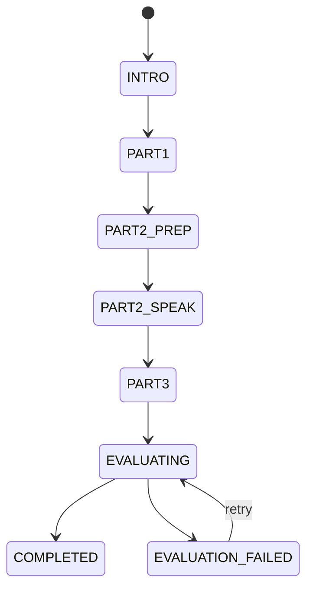

## 12.2 评分维度

- Fluency and Coherence；
- Lexical Resource；
- Grammatical Range and Accuracy；
- Pronunciation。

输出必须包含：

- AI 练习参考分数；
- 每项分数的证据；
- 置信度；
- 1–3 个优先改进点；
- 后续计划变化；
- 明确非官方成绩说明。

## 12.3 稳定性

- 同一录音重复评估的分数波动需要受控；
- 使用固定 rubric、固定 Prompt 版本和低温度；
- 关键评测集每次版本发布回归；
- 低 ASR 质量时降低发音与语法判断置信度；
- 不根据单一词汇错误大幅拉低整体分数。

---

# 13. 结构化输出与失败处理

流程：

```text
模型调用
→ JSON Schema 校验
→ 枚举与业务规则校验
→ 自动修复一次
→ 备用 Provider 或简化 Prompt
→ 规则降级/人工可理解错误
```

所有失败记录：

- traceId；
- agentName；
- promptVersion；
- provider/model；
- schemaVersion；
- 输入摘要哈希；
- 错误类型；
- 重试次数；
- 最终降级路径。

---

# 14. AI 安全与 Prompt 注入

- 用户文本始终作为明确的 user content，不拼接为系统指令；
- 工具白名单由服务端固定；
- 模型无权直接删除数据、改变目标或修改画像；
- 对“忽略前面规则”等输入不改变系统教学策略；
- 内容生成和用户对话使用不同权限上下文；
- 不在 Prompt 中放密钥、数据库信息或内部运维信息；
- 对模型输出的 URL、命令和事实声明按任务风险校验。

---

# 15. 评测集

必须建立版本化 Golden Set：

| 集合 | 内容 |
|---|---|
| correction-basic | 常见语法、搭配、中式英语 |
| correction-no-error | 正确句子，防止过度纠错 |
| assessment-calibration | 不同水平标准答案 |
| plan-personalization | 不同画像应产生不同计划 |
| content-validity | 题目、选项和答案一致性 |
| ielts-stability | 固定录音/文本的评分稳定性 |
| safety-injection | Prompt 注入和越权输入 |
| asr-noise | 低置信度转写，避免误判 |

上线前 AI 版本必须通过离线评测和小流量灰度。

<!-- END 04_DETAILED_DESIGN_AGENT_LEARNING_ENGINE.md -->


<!-- BEGIN 05_DATA_MODEL_AND_API_SPEC.md -->

# English Tutor Agent 数据模型与 API 详细规范

> 数据库：MySQL 8.x  
> 缓存：Redis 7.x  
> 二进制：S3 兼容对象存储  
> API 版本：`/api/v1`

---

# 1. 数据建模原则

1. 核心业务状态结构化存储；
2. JSON 只用于灵活元数据，不把关键查询字段全部塞入 JSON；
3. 原始尝试、标准化证据和画像快照分开；
4. 数据表包含 `created_at`、`updated_at`、`version`；
5. 时间存 UTC；
6. 用户删除使用可追踪请求和物理清理流程；
7. 音频只保存对象键和元数据；
8. 每次 AI 调用可关联 trace、Prompt 和模型版本。

---

# 2. 核心 ER 图

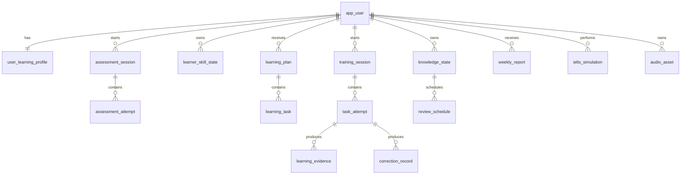

---

# 3. 表设计

> 下列为逻辑字段。正式建库脚本在编码阶段通过 Flyway 生成，并根据 MySQL 版本调整长度和索引。

## 3.1 app_user

| 字段 | 类型 | 约束 | 说明 |
|---|---|---|---|
| id | BIGINT | PK | 内部 ID |
| user_key | VARCHAR(64) | UNIQUE | 对外不连续 ID |
| status | VARCHAR(32) | NOT NULL | ACTIVE/DELETING/DELETED |
| timezone | VARCHAR(64) | NOT NULL | 默认 Asia/Shanghai 或设备时区 |
| locale | VARCHAR(16) | NOT NULL | zh-CN |
| created_at | DATETIME(3) | NOT NULL | UTC |
| updated_at | DATETIME(3) | NOT NULL | UTC |
| version | BIGINT | NOT NULL | 乐观锁 |

## 3.2 user_learning_profile

| 字段 | 类型 | 说明 |
|---|---|---|
| user_id | BIGINT PK/FK | 用户 |
| primary_goal | VARCHAR(32) | WORKPLACE/GENERAL/IELTS |
| daily_minutes | INT | 默认 20 |
| main_scenarios | JSON | 场景偏好 |
| correction_preference | VARCHAR(32) | LIGHT/STANDARD/STRICT |
| reminder_enabled | TINYINT | 提醒 |
| raw_text_retention | VARCHAR(32) | STORE/PROCESS_ONLY |
| raw_audio_retention | VARCHAR(32) | STORE/PROCESS_ONLY |
| onboarding_status | VARCHAR(32) | 状态 |
| profile_version | BIGINT | 当前画像版本 |
| created_at/updated_at/version | - | 通用字段 |

## 3.3 self_assessment

| 字段 | 类型 | 说明 |
|---|---|---|
| id | BIGINT PK | ID |
| user_id | BIGINT | 用户 |
| listening_level | TINYINT | 行为自评档位 |
| speaking_level | TINYINT | - |
| reading_level | TINYINT | - |
| writing_level | TINYINT | - |
| answers_json | JSON | 原始选项 |
| completed_at | DATETIME(3) | 完成时间 |

## 3.4 assessment_session

| 字段 | 类型 | 说明 |
|---|---|---|
| id | BIGINT PK | ID |
| assessment_key | VARCHAR(64) UNIQUE | 对外 ID |
| user_id | BIGINT | 用户 |
| type | VARCHAR(32) | INITIAL/STAGE |
| status | VARCHAR(32) | CREATED/IN_PROGRESS/PAUSED/EVALUATING/COMPLETED |
| blueprint_version | VARCHAR(32) | 蓝图版本 |
| content_version | VARCHAR(32) | 内容版本 |
| started_at | DATETIME(3) | - |
| completed_at | DATETIME(3) | - |
| elapsed_seconds | INT | 有效时长 |
| result_summary_json | JSON | 展示摘要 |
| confidence | DECIMAL(5,4) | 整体置信度 |
| version | BIGINT | 乐观锁 |

## 3.5 assessment_attempt

| 字段 | 类型 | 说明 |
|---|---|---|
| id | BIGINT PK | ID |
| assessment_id | BIGINT | 会话 |
| question_key | VARCHAR(64) | 题目 |
| question_type | VARCHAR(32) | 类型 |
| answer_json | JSON | 答案 |
| audio_asset_id | BIGINT NULL | 录音 |
| correctness | VARCHAR(32) | CORRECT/PARTIAL/INCORRECT/UNSCORED |
| score | DECIMAL(5,4) | 0–1 |
| evaluator_confidence | DECIMAL(5,4) | 置信度 |
| hint_level | TINYINT | 提示级别 |
| duration_ms | INT | 作答时长 |
| created_at | DATETIME(3) | - |

唯一键：`assessment_id + question_key` 或支持多次尝试时增加 attempt_no。

## 3.6 learner_skill_state

| 字段 | 类型 | 说明 |
|---|---|---|
| id | BIGINT PK | ID |
| user_id | BIGINT | 用户 |
| dimension | VARCHAR(64) | 能力维度 |
| estimate | DECIMAL(6,5) | 内部估计 |
| confidence | DECIMAL(6,5) | 置信度 |
| trend | VARCHAR(16) | UP/STABLE/DOWN/UNKNOWN |
| evidence_count | INT | 证据数 |
| last_evidence_at | DATETIME(3) | - |
| updated_at/version | - | - |

唯一键：`user_id + dimension`。

## 3.7 knowledge_state

| 字段 | 类型 | 说明 |
|---|---|---|
| id | BIGINT PK | ID |
| user_id | BIGINT | 用户 |
| knowledge_key | VARCHAR(160) | 如 chunk:could_you_clarify |
| category | VARCHAR(32) | GRAMMAR/COLLOCATION/CHUNK/PRONUNCIATION |
| state | VARCHAR(32) | UNKNOWN...MASTERED |
| strength | DECIMAL(6,5) | 状态强度 |
| confidence | DECIMAL(6,5) | 置信度 |
| occurrence_count | INT | 出现次数 |
| success_count | INT | 成功次数 |
| last_error_at | DATETIME(3) | - |
| last_success_at | DATETIME(3) | - |
| next_review_at | DATETIME(3) | - |
| updated_at/version | - | - |

唯一键：`user_id + knowledge_key`。

## 3.8 learning_plan

| 字段 | 类型 | 说明 |
|---|---|---|
| id | BIGINT PK | ID |
| plan_key | VARCHAR(64) UNIQUE | 对外 ID |
| user_id | BIGINT | 用户 |
| plan_date | DATE | 用户本地日期 |
| plan_type | VARCHAR(32) | DAILY/TEMPORARY/IELTS |
| status | VARCHAR(32) | DRAFT/READY/ACCEPTED/IN_PROGRESS/COMPLETED/SUPERSEDED |
| profile_version | BIGINT | 生成时画像版本 |
| adjustment_version | BIGINT | 临时调整版本 |
| duration_minutes | INT | 预计时长 |
| focus_summary | VARCHAR(500) | 今日重点 |
| rationale | VARCHAR(1000) | 原因 |
| generation_source | VARCHAR(32) | RULE/RULE_LLM |
| created_at/updated_at/version | - | - |

唯一键建议：`user_id + plan_date + profile_version + adjustment_version`。

## 3.9 learning_task

| 字段 | 类型 | 说明 |
|---|---|---|
| id | BIGINT PK | ID |
| task_key | VARCHAR(64) UNIQUE | 对外 ID |
| plan_id | BIGINT | 计划 |
| sequence_no | INT | 顺序 |
| task_type | VARCHAR(64) | 类型 |
| target_skills | JSON | 能力 |
| knowledge_targets | JSON | 知识项 |
| scenario | VARCHAR(64) | 场景 |
| difficulty_band | VARCHAR(32) | 难度 |
| duration_minutes | INT | 时长 |
| content_ref | VARCHAR(128) | 内容版本/引用 |
| task_payload_json | JSON | 任务内容 |
| evidence_policy_json | JSON | 证据要求 |
| status | VARCHAR(32) | READY/STARTED/COMPLETED/SKIPPED |

## 3.10 training_session

| 字段 | 类型 | 说明 |
|---|---|---|
| id | BIGINT PK | ID |
| session_key | VARCHAR(64) UNIQUE | 对外 ID |
| user_id | BIGINT | 用户 |
| plan_id | BIGINT NULL | 计划 |
| type | VARCHAR(32) | DAILY/FREE_CONVERSATION/REVIEW/IELTS |
| mode | VARCHAR(32) | TEXT/VOICE/MIXED |
| status | VARCHAR(32) | 状态机 |
| current_task_key | VARCHAR(64) | 当前任务 |
| started_at/paused_at/completed_at | DATETIME(3) | - |
| effective_seconds | INT | 有效时长 |
| summary_json | JSON | 总结 |
| version | BIGINT | 乐观锁 |

## 3.11 task_attempt

| 字段 | 类型 | 说明 |
|---|---|---|
| id | BIGINT PK | ID |
| attempt_key | VARCHAR(64) UNIQUE | 对外 ID |
| session_id | BIGINT | 会话 |
| task_id | BIGINT | 任务 |
| user_id | BIGINT | 用户 |
| attempt_no | INT | 次数 |
| input_type | VARCHAR(16) | TEXT/AUDIO/CHOICE |
| input_text | TEXT NULL | 根据偏好保存 |
| audio_asset_id | BIGINT NULL | 录音 |
| answer_json | JSON | 结构化答案 |
| hint_level | TINYINT | 提示 |
| result | VARCHAR(32) | CORRECT/PARTIAL/INCORRECT/UNSCORED |
| score | DECIMAL(6,5) | - |
| submitted_at | DATETIME(3) | - |
| evaluator_version | VARCHAR(64) | - |

唯一键：`session_id + task_id + attempt_no`。

## 3.12 learning_evidence

| 字段 | 类型 | 说明 |
|---|---|---|
| id | BIGINT PK | ID |
| evidence_key | VARCHAR(64) UNIQUE | ID |
| user_id | BIGINT | 用户 |
| attempt_id | BIGINT NULL | 来源尝试 |
| source | VARCHAR(32) | 来源 |
| skill_dimension | VARCHAR(64) | 一行一个能力，便于查询 |
| knowledge_key | VARCHAR(160) NULL | 知识项 |
| result | VARCHAR(32) | - |
| raw_score | DECIMAL(6,5) | - |
| weight | DECIMAL(6,5) | - |
| independence | DECIMAL(6,5) | - |
| transfer_level | DECIMAL(6,5) | - |
| delay_days | INT | - |
| evaluator_confidence | DECIMAL(6,5) | - |
| metadata_json | JSON | - |
| occurred_at | DATETIME(3) | - |
| consumed_at | DATETIME(3) NULL | 画像处理时间 |

索引：`user_id + occurred_at`、`user_id + skill_dimension`、`user_id + knowledge_key`。

## 3.13 correction_record

| 字段 | 类型 | 说明 |
|---|---|---|
| id | BIGINT PK | - |
| correction_key | VARCHAR(64) UNIQUE | - |
| user_id | BIGINT | - |
| session_id | BIGINT | - |
| attempt_id | BIGINT NULL | - |
| original_text | TEXT | 根据保存偏好脱敏/为空 |
| corrected_text | TEXT | - |
| error_type | VARCHAR(64) | - |
| severity | VARCHAR(16) | LOW/MEDIUM/HIGH |
| explanation_zh | VARCHAR(1000) | - |
| knowledge_key | VARCHAR(160) NULL | - |
| should_interrupt | TINYINT | - |
| historical_occurrence | INT | - |
| prompt_version | VARCHAR(64) | - |
| created_at | DATETIME(3) | - |

## 3.14 review_schedule

| 字段 | 类型 | 说明 |
|---|---|---|
| id | BIGINT PK | - |
| user_id | BIGINT | - |
| knowledge_state_id | BIGINT | - |
| review_type | VARCHAR(32) | GUIDED/INDEPENDENT/TRANSFER/DELAYED |
| due_at | DATETIME(3) | - |
| priority | DECIMAL(6,5) | - |
| status | VARCHAR(16) | DUE/SCHEDULED/COMPLETED/SKIPPED/CANCELLED |
| generated_task_id | BIGINT NULL | - |
| completed_at | DATETIME(3) NULL | - |

## 3.15 conversation_message

| 字段 | 类型 | 说明 |
|---|---|---|
| id | BIGINT PK | - |
| message_key | VARCHAR(64) UNIQUE | - |
| session_id | BIGINT | - |
| user_id | BIGINT | - |
| role | VARCHAR(16) | USER/ASSISTANT/SYSTEM_SUMMARY |
| content | TEXT NULL | 根据偏好保存 |
| content_summary | VARCHAR(2000) NULL | 可保留摘要 |
| audio_asset_id | BIGINT NULL | - |
| sequence_no | INT | - |
| model_name | VARCHAR(128) NULL | - |
| prompt_version | VARCHAR(64) NULL | - |
| created_at | DATETIME(3) | - |

## 3.16 audio_asset

| 字段 | 类型 | 说明 |
|---|---|---|
| id | BIGINT PK | - |
| asset_key | VARCHAR(64) UNIQUE | - |
| user_id | BIGINT NULL | 系统素材可为空 |
| purpose | VARCHAR(32) | USER_RECORDING/TTS/LISTENING_CONTENT |
| object_key | VARCHAR(512) | 对象存储键 |
| mime_type | VARCHAR(64) | - |
| size_bytes | BIGINT | - |
| duration_ms | INT | - |
| sha256 | VARCHAR(64) | - |
| retention_mode | VARCHAR(32) | PERSIST/PROCESS_ONLY/TEMP |
| status | VARCHAR(16) | UPLOADING/READY/PROCESSING/DELETED |
| expires_at | DATETIME(3) NULL | - |
| created_at/updated_at | - | - |

## 3.17 ai_call_log

记录：trace、用户、Agent、Provider、Model、Prompt 版本、Schema、Token、延迟、成功、错误、成本、输入输出摘要哈希。默认不记录完整敏感正文。

## 3.18 privacy_deletion_request

记录删除范围、状态、确认时间、各存储清理结果、失败原因与完成时间。

---

# 4. API 通用规范

## 4.1 请求头

```http
Authorization: Bearer <token>
X-Request-Id: <uuid>
Idempotency-Key: <uuid>       # 写操作需要时
X-Client-Version: 1.0.0
X-Device-Id: <installation-id>
X-Timezone: Asia/Singapore
Accept-Language: zh-CN
```

## 4.2 成功响应

```json
{
  "requestId": "req_01",
  "data": {},
  "serverTime": "2026-07-21T01:00:00Z"
}
```

## 4.3 错误响应

```json
{
  "requestId": "req_01",
  "error": {
    "code": "STATE_CONFLICT",
    "message": "当前任务已经完成，请刷新后继续。",
    "retryable": false,
    "details": {}
  }
}
```

---

# 5. 核心 API

## 5.1 Onboarding

### 保存主要目标

```http
PUT /api/v1/profile/primary-goal
```

```json
{"goal":"WORKPLACE"}
```

### 保存偏好

```http
PUT /api/v1/profile/preferences
```

```json
{
  "dailyMinutes": 20,
  "mainScenarios": ["TECHNICAL_DISCUSSION", "WORK_MEETING"],
  "correctionPreference": "LIGHT",
  "reminderEnabled": true
}
```

### 获取首次流程状态

```http
GET /api/v1/onboarding/progress
```

---

## 5.2 初评

### 提交自评

```http
POST /api/v1/assessments/self
```

### 创建初评

```http
POST /api/v1/assessments
Idempotency-Key: ...
```

```json
{"type":"INITIAL"}
```

### 获取下一题/题组

```http
GET /api/v1/assessments/{assessmentId}/next
```

### 提交答案

```http
POST /api/v1/assessments/{assessmentId}/answers
```

```json
{
  "questionId": "q_01",
  "answer": {"optionIds":["B"]},
  "durationMs": 12000,
  "hintLevel": 0
}
```

语音答案使用 `audioAssetId`。

### 暂停/恢复/完成

```http
POST /api/v1/assessments/{id}/pause
POST /api/v1/assessments/{id}/resume
POST /api/v1/assessments/{id}/complete
GET  /api/v1/assessments/{id}/result
```

---

## 5.3 今日计划

```http
GET /api/v1/plans/today
POST /api/v1/plans/today/adjustments
POST /api/v1/plans/{planId}/accept
```

调整请求：

```json
{
  "availableMinutes": 5,
  "availableModes": ["TEXT", "AUDIO"],
  "temporaryNeed": "明天需要参加英文技术会议"
}
```

今日计划响应：

```json
{
  "planId": "plan_01",
  "date": "2026-07-21",
  "durationMinutes": 20,
  "focus": "听后快速回应与说明技术问题",
  "rationale": "你最近能理解大意，但口头回应仍依赖提示。",
  "profileVersion": 12,
  "tasks": [
    {
      "taskId": "task_01",
      "type": "LISTEN_AND_RESPOND",
      "title": "听懂并回应工作问题",
      "durationMinutes": 6,
      "status": "READY"
    }
  ]
}
```

---

## 5.4 训练会话

```http
POST /api/v1/training-sessions
GET  /api/v1/training-sessions/{id}
POST /api/v1/training-sessions/{id}/pause
POST /api/v1/training-sessions/{id}/resume
POST /api/v1/training-sessions/{id}/complete
```

创建：

```json
{
  "planId": "plan_01",
  "mode": "MIXED"
}
```

### 获取当前任务

```http
GET /api/v1/training-sessions/{id}/current-task
```

### 提交尝试

```http
POST /api/v1/training-sessions/{id}/tasks/{taskId}/attempts
Idempotency-Key: ...
```

```json
{
  "inputType": "TEXT",
  "text": "I think it may be caused by an unstable connection.",
  "hintLevel": 0,
  "clientDurationMs": 8100
}
```

响应：

```json
{
  "attemptId": "att_01",
  "resultStatus": "EVALUATING",
  "nextAction": "WAIT_FOR_FEEDBACK"
}
```

### 获取反馈

```http
GET /api/v1/task-attempts/{attemptId}/feedback
```

---

## 5.5 对话流

```http
POST /api/v1/conversations/{sessionId}/messages/stream
Accept: text/event-stream
```

请求：

```json
{
  "messageType": "TEXT",
  "text": "Today I solved a bug about database connect.",
  "taskId": "task_03"
}
```

SSE：

```text
id: 1
event: status
data: {"stage":"THINKING","message":"正在理解你的表达…"}

id: 2
event: text_delta
data: {"delta":"Nice work. "}

id: 3
event: text_delta
data: {"delta":"What caused the issue?"}

id: 4
event: correction_ready
data: {"items":[...]}

id: 5
event: audio_ready
data: {"audioUrl":"https://...","durationMs":2300}

id: 6
event: done
data: {"messageId":"msg_02","usage":{"totalTokens":230}}
```

---

## 5.6 音频

### 申请上传

```http
POST /api/v1/audio/uploads
```

```json
{
  "purpose":"USER_RECORDING",
  "mimeType":"audio/mp4",
  "sizeBytes":120000,
  "durationMs":13000,
  "sha256":"..."
}
```

响应可返回 `DIRECT_MULTIPART` 或 `PRESIGNED`。

### 完成上传

```http
POST /api/v1/audio/uploads/{uploadId}/complete
```

### 获取处理状态

```http
GET /api/v1/audio/assets/{audioAssetId}
```

---

## 5.7 画像和进步

```http
GET /api/v1/profile/learner-summary
GET /api/v1/profile/skills
GET /api/v1/profile/knowledge-states
GET /api/v1/reports/weekly/latest
GET /api/v1/assessments/stage/latest
```

---

## 5.8 IELTS

```http
POST /api/v1/ielts/simulations
GET  /api/v1/ielts/simulations/{id}/current-step
POST /api/v1/ielts/simulations/{id}/answers
POST /api/v1/ielts/simulations/{id}/complete
GET  /api/v1/ielts/simulations/{id}/result
```

结果示例：

```json
{
  "label": "AI_PRACTICE_ESTIMATE",
  "overallBandEstimate": 5.5,
  "confidence": 0.68,
  "dimensions": {
    "fluencyCoherence": 5.5,
    "lexicalResource": 5.0,
    "grammar": 5.5,
    "pronunciation": 6.0
  },
  "evidence": [],
  "nextFocus": ["延长回答并增加原因", "减少时态不稳定"],
  "disclaimer": "该结果仅用于练习参考，不是官方 IELTS 成绩。"
}
```

---

## 5.9 数据隐私

```http
GET  /api/v1/settings/privacy
PUT  /api/v1/settings/privacy
POST /api/v1/data-privacy/deletion-requests
GET  /api/v1/data-privacy/deletion-requests/{id}
```

修改保存偏好不会追溯删除已有数据，界面需要让用户选择是否同时清理历史原始内容。

---

# 6. Redis Key 设计

```text
tutor:idem:{userId}:{idempotencyKey}
tutor:plan-lock:{userId}:{date}
tutor:sse:{streamId}
tutor:provider-health:{provider}
tutor:rate:{userId}:{operation}
tutor:profile-summary:{userId}:{profileVersion}
tutor:today-plan:{userId}:{date}:{profileVersion}:{adjustmentVersion}
```

Key 必须设置 TTL；不能把长期画像只存在 Redis。

---

# 7. 对象存储 Key

```text
user-recordings/{userKey}/{yyyy}/{MM}/{assetKey}.m4a
tts/{voice}/{hash-prefix}/{sha256}.mp3
listening-content/{contentVersion}/{contentKey}.mp3
temp/{date}/{uploadId}.part
```

对象元数据不包含用户真实姓名。

---

# 8. 数据保留与删除

建议初始策略，最终在隐私专项评审确认：

- `PROCESS_ONLY` 用户录音：处理成功后 24 小时内删除；
- 临时上传：24 小时清理；
- TTS 公共缓存：按内容版本和使用率清理；
- 学习摘要、证据和掌握状态：保留至用户删除；
- AI 调用日志：保存脱敏元数据，不保存完整正文；
- 删除请求完成后，画像和报告不得继续引用已删除证据。

---

# 9. 版本兼容

- API 使用 URI 大版本 `/v1`；
- DTO 增加字段保持向后兼容；
- 枚举新增客户端使用 UNKNOWN 回退；
- 任务 `payloadSchemaVersion` 明确版本；
- Android 端至少支持当前版本和上一个服务端兼容窗口；
- 数据库变更仅通过 Flyway 前向迁移，回滚采用应用版本兼容或补偿迁移。

<!-- END 05_DATA_MODEL_AND_API_SPEC.md -->


<!-- BEGIN 06_SECURITY_OBSERVABILITY_TESTING.md -->

# English Tutor Agent 安全、可观测性与测试设计

---

# 1. 安全设计

## 1.1 身份与授权

第一版可采用：

- 邮箱/手机号验证码或第三方登录；
- 后端签发短期 Access Token 和可撤销 Refresh Token；
- 所有资源基于认证用户 ID 查询；
- 禁止客户端传入任意 userId 后直接访问；
- 管理端与用户端使用不同角色和入口。

对象级授权规则：

```text
当前用户只能访问自己的：
评估、计划、训练、录音、报告、画像、IELTS 模拟和删除请求。
```

## 1.2 密钥

- AI Provider 密钥仅服务端持有；
- Android 不嵌入长期 Provider 密钥；
- 对象存储使用短期预签名 URL；
- 生产密钥进入 Secret Manager 或环境注入；
- 禁止写入 Git、日志、崩溃报告和客户端资源。

## 1.3 数据分级

| 级别 | 数据 | 控制 |
|---|---|---|
| 高敏感 | 原始录音、完整对话 | 保存开关、最小化、加密、严格访问 |
| 中敏感 | 错误记录、能力画像、IELTS 结果 | 用户可见可删、权限控制 |
| 一般 | 计划、任务状态、内容版本 | 常规保护 |
| 运维 | Token、调用日志、成本 | 脱敏、内部权限 |

## 1.4 Prompt 安全

- 系统指令和用户文本使用模型角色隔离；
- 用户文本不作为模板表达式执行；
- Tool Calling 采用服务端白名单；
- 工具输入通过 Bean Validation；
- 高风险数据操作不提供给 LLM 工具；
- 输出进行 Schema 和业务枚举校验；
- 对注入测试集持续回归。

## 1.5 内容安全

- 过滤明显违法、仇恨、色情和自伤风险内容；
- 对成年学习者仍避免不必要的敏感训练材料；
- 用户发起敏感话题时保持学习辅助边界；
- 内容生成保存风险标签和生成版本；
- IELTS 内容不得伪称官方真题。

---

# 2. 隐私设计

## 2.1 默认告知

首次语音使用前说明：

- 为什么需要录音；
- 录音将发送到服务端/语音 Provider；
- 是否保存原始录音；
- 可以在哪里关闭和删除；
- 关闭原始保存对个性化的影响。

## 2.2 保存模式

```text
STORE
- 保存原始内容以支持回顾和更深个性化

PROCESS_ONLY
- 仅处理，完成后删除原始内容
- 保留结构化学习摘要、证据和掌握状态
```

文字和语音可以分别设置。

## 2.3 删除流程

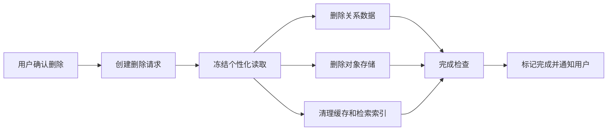

删除任务：

- 可重试；
- 有审计但不保留被删除正文；
- 部分失败时展示处理中而非虚假完成；
- 删除后重建空画像。

---

# 3. 可观测性

## 3.1 Trace

每个入口生成 `traceId`，传播至：

- REST/SSE；
- AI Provider；
- ASR/TTS；
- 对象存储；
- Outbox；
- 画像更新；
- Android 请求日志。

核心 Span：

```text
http.request
assessment.next
plan.generate
training.submit
ai.chat
ai.structured
asr.transcribe
tts.synthesize
profile.update
review.schedule
audio.upload
```

## 3.2 Metrics

### 系统指标

- API P50/P95/P99；
- SSE 首 Token；
- ASR/TTS 延迟与失败；
- 数据库连接、慢 SQL；
- Redis 命中率；
- 对象上传失败；
- Outbox 堆积；
- JVM、GC、CPU、内存。

### AI 指标

- Provider/Model 调用次数；
- Token 与估算成本；
- JSON 有效率；
- 自动修复率；
- 降级率；
- Prompt 版本成功率；
- 纠错过度率；
- IELTS 评分波动。

### 产品与学习指标

- 初评完成率；
- 今日计划接受率；
- 有效训练次数；
- 主动输出比例；
- 提示依赖；
- 复习完成率；
- 用户难度反馈；
- 计划个性化差异；
- 错误下降与迁移成功。

## 3.3 日志

结构化日志字段：

```json
{
  "timestamp":"...",
  "level":"INFO",
  "traceId":"...",
  "requestId":"...",
  "userKeyHash":"...",
  "module":"planning",
  "operation":"generateTodayPlan",
  "durationMs":342,
  "result":"SUCCESS"
}
```

禁止默认记录：

- Access Token；
- Provider Key；
- 完整录音 URL；
- 用户完整对话正文；
- 未脱敏邮箱/手机号；
- Prompt 中的敏感内容。

## 3.4 告警

| 告警 | 示例阈值 |
|---|---|
| API 错误率 | 5 分钟 > 5% |
| SSE 首 Token | P95 > 5s |
| ASR 失败 | 10 分钟 > 10% |
| JSON 无效率 | 某 Prompt 版本 > 3% |
| Outbox 堆积 | oldest > 5 分钟 |
| 删除任务失败 | 任意 DEAD 任务 |
| IELTS 评分漂移 | Golden Set 超阈值 |
| 计划重复率 | 个性化差异显著下降 |

---

# 4. 测试策略

## 4.1 测试金字塔

```text
大量领域与应用单元测试
→ Repository/Provider 集成测试
→ API 合约测试
→ AI 离线评测
→ Android UI 与端到端测试
→ 小规模真人灰度验证
```

## 4.2 后端单元测试

必须覆盖：

- 初评蓝图选择；
- 计划优先级；
- 时间预算裁剪；
- 证据权重；
- 能力单次变化上限；
- 掌握状态机；
- 复习间隔；
- 纠错数量和时机；
- 幂等；
- 会话状态机；
- 隐私保存策略。

## 4.3 集成测试

使用 Testcontainers：

- MySQL；
- Redis；
- S3 兼容存储（如 MinIO）；
- WireMock/Fake AI Provider。

测试：

- 事务与 Outbox；
- 乐观锁；
- 重复请求；
- 音频元数据；
- 删除补偿；
- SSE 事件顺序；
- Flyway 迁移。

## 4.4 Provider 合约测试

为每个 Provider 实现统一测试：

- 文本同步；
- 文本流式；
- 结构化输出；
- 超时；
- 限流；
- 非 JSON；
- ASR 低置信度；
- TTS 空音频；
- Provider 元数据映射。

真实 Provider 测试需要成本开关，不在每次本地单元测试执行。

## 4.5 AI 离线评测

### 纠错

- Precision：不要纠正正确句子；
- Recall：识别明显错误；
- Meaning Preservation：不改变原意；
- Actionability：解释简洁可用；
- Interruption Policy：时机符合规则。

### 计划

- Goal Relevance；
- Profile Relevance；
- Due Review Coverage；
- Task Diversity；
- Time Budget；
- Active Output Requirement；
- Explanation Groundedness。

### 内容

- 语言准确；
- 答案唯一；
- 难度匹配；
- 场景相关；
- 无版权复制；
- 无不当内容。

### IELTS

- 固定样本评分稳定；
- 分维度证据合理；
- 免责声明存在；
- 不过度精确；
- 改进点可执行。

## 4.6 E2E 场景

### E2E-01 新用户

```text
目标=职场
→ 自评中等
→ 完成轻量初评
→ 生成画像
→ 生成工作场景首个计划
→ 完成文字任务
→ 产生证据
→ 第二天计划变化
```

### E2E-02 语音弱网

```text
录音完成
→ 上传中断
→ 本地保留
→ WorkManager 重试
→ ASR
→ 用户确认转写
→ 反馈
→ 不重复生成证据
```

### E2E-03 高频错误

```text
首次出现错误
→ 保存知识状态
→ 次日复习
→ 提示下成功
→ 新场景独立使用
→ 延迟验证
→ 标记基本掌握
```

### E2E-04 IELTS

```text
完整 Part 1/2/3
→ 中途不教学式纠错
→ 统一评分
→ 标识 AI 参考
→ 生成下一阶段任务
```

### E2E-05 隐私

```text
关闭原始录音保存
→ 完成语音任务
→ 保留摘要
→ 原始对象在时限内删除
→ 用户发起全部删除
→ 所有结果不可再访问
```

---

# 5. 性能测试

## 5.1 场景

- 今日计划并发读取；
- 文字 SSE 并发；
- 短音频上传；
- 初评集中提交；
- 批量画像更新；
- 周报定时任务；
- 对象删除任务。

## 5.2 结果要求

- 达到概要设计 P95 目标；
- SSE 不因一个慢客户端占满线程；
- 音频上传不耗尽 JVM 堆；
- 数据库索引命中；
- Outbox 在峰值后可恢复；
- Provider 限流时系统可控退避。

---

# 6. 发布质量门禁

## 6.1 每个 Pull Request

- 编译通过；
- 单元测试通过；
- 静态检查通过；
- 新业务规则有测试；
- API 变更更新文档；
- 数据库变更含 Flyway；
- 不含密钥；
- Review Checklist 完成。

## 6.2 每个里程碑

- 对应 E2E 可运行；
- PRD 验收项有证据；
- 关键异常路径已测试；
- Android 真机验证；
- AI Golden Set 回归；
- 性能与成本基线记录；
- 需求追踪矩阵更新。

## 6.3 发布候选

- P0 无阻塞缺陷；
- 隐私删除全链路通过；
- 弱网与恢复通过；
- 崩溃率、ANR、API 错误率达标；
- Provider 降级演练通过；
- 回滚方案验证；
- 小规模灰度用户反馈通过。

---

# 7. Code Review 清单

## 7.1 业务

- 是否引用 PRD/任务编号；
- 是否改变已确认业务规则；
- 是否形成可追踪证据；
- 是否错误地让 LLM 决定关键业务状态；
- 是否处理幂等和状态冲突。

## 7.2 AI

- Prompt 是否版本化；
- 输出是否 Schema 校验；
- 是否有失败和降级；
- 是否记录 Provider/Model/Token；
- 是否泄露隐私；
- 是否有 Golden Set。

## 7.3 Android

- Compose 是否保持 UDF；
- 是否支持进程重建；
- 录音/上传失败是否保留草稿；
- 权限拒绝是否有替代路径；
- 是否只依赖颜色；
- 是否误用后台任务。

## 7.4 数据

- 索引是否合理；
- 是否有唯一键防重复；
- 删除和保留策略是否符合偏好；
- JSON 字段是否掩盖关键查询；
- 迁移是否可前向兼容。

<!-- END 06_SECURITY_OBSERVABILITY_TESTING.md -->


<!-- BEGIN 07_REQUIREMENTS_TRACEABILITY.md -->

# English Tutor Agent 需求追踪矩阵

> 目的：确保 PRD P0 需求在设计、数据、接口和测试中都有落点。

---

## 1. 模块追踪

| PRD 需求 | 主要实现模块 | 核心数据 | 主要 API/流程 | 核心测试 |
|---|---|---|---|---|
| FR-ONB-001 | Identity/Onboarding | user_learning_profile | PUT primary-goal | 目标唯一、目标修改校准 |
| FR-ONB-002 | Identity/Preference | user_learning_profile | PUT preferences | 默认 20 分钟、偏好保存 |
| FR-ONB-003 | Android Onboarding | onboarding progress | GET onboarding/progress | 首次流程 E2E |
| FR-ASM-001 | Assessment | self_assessment | POST assessments/self | 行为描述、自评起点 |
| FR-ASM-002 | Assessment | assessment_session/attempt | assessment APIs | 8–10 分钟、暂停恢复 |
| FR-ASM-003 | Blueprint Engine | blueprint version | next question | 高低自评不同题型 |
| FR-ASM-004 | Learner/Reporting | skill state/result | GET assessment result | 优势、短板、置信说明 |
| FR-PRO-001 | Learner Model | learner_skill_state | GET profile/skills | 多维画像更新 |
| FR-PRO-002 | Mastery | knowledge_state | GET knowledge-states | 掌握状态机 |
| FR-PRO-003 | Learner Updater | learning_evidence | evidence pipeline | 单次变化上限、可追溯 |
| FR-PRO-004 | Android Progress | profile summary | GET learner-summary | 简化/展开显示 |
| FR-PLN-001 | Planning | learning_plan | GET plans/today | 自动计划、无需选课 |
| FR-PLN-002 | Plan Composer | learning_task | plan generation | 不同用户计划差异 |
| FR-PLN-003 | Planning | rationale | plan response | 解释有真实证据 |
| FR-PLN-004 | Planning/Android | duration | plan adjustment | 5 分钟保留高价值任务 |
| FR-PLN-005 | Planning | adjustment version | POST adjustments | 临时需求不覆盖画像 |
| FR-TRN-001 | Training/Audio/Android | session/audio asset | training/audio APIs | 文字语音听力 E2E |
| FR-TRN-002 | Task Registry | learning_task | current-task | 所有 P0 任务类型可渲染 |
| FR-TRN-003 | Content/Training | task payload/evidence | listening chain | 输入到输出链路 |
| FR-TRN-004 | Training | hint level/evidence | submit attempt | 辅助依赖入证据 |
| FR-TRN-005 | Planning/Content | scenario | plan/task | 场景与目标能力相关 |
| FR-TRN-006 | Content | content source/version | content pipeline | 版权和内容校验 |
| FR-CON-001 | Conversation Coach | message/session | SSE message | 交流优先、不逐句打断 |
| FR-CON-002 | Android/Training | mode | session mode | 文字语音切换不丢进度 |
| FR-CON-003 | Planner/Task | active output flag | task blueprint | 每计划主动输出 |
| FR-CON-004 | Scaffolding | hint level | task feedback | 提示从轻到重 |
| FR-COR-001 | Correction | correction_record | SSE correction | 分层纠错时机 |
| FR-COR-002 | Correction policy | correction_record | feedback | 1–3 个重点 |
| FR-COR-003 | Expression Coach | correction_record | feedback/retry | 自然表达与重答 |
| FR-COR-004 | Learner/Review | knowledge_state | evidence/review | 历史问题关联 |
| FR-REV-001 | Review Scheduler | review_schedule | today plan | 自动安排复习 |
| FR-REV-002 | Review/Content | task type | review tasks | 多形式迁移 |
| FR-REV-003 | Mastery | knowledge_state/evidence | evidence pipeline | 非一次正确掌握 |
| FR-REV-004 | Review | failure history | plan generation | 失败后换形式 |
| FR-IEL-001 | IELTS | simulation/task | IELTS APIs | Part 1 流程 |
| FR-IEL-002 | IELTS/Audio | simulation/audio | IELTS APIs | Part 2 计时录音 |
| FR-IEL-003 | IELTS | simulation/task | IELTS APIs | Part 3 难度与反馈 |
| FR-IEL-004 | IELTS | ielts_simulation | complete/result | 完整模拟不打断 |
| FR-IEL-005 | IELTS Evaluator | result/rubric | GET result | AI 参考标签和免责声明 |
| FR-RPT-001 | Reporting | session summary | complete session | 每日总结 |
| FR-RPT-002 | Reporting Job | weekly_report | GET weekly | 周报内容 |
| FR-RPT-003 | Assessment/Job | stage assessment | stage APIs | 四周动态测验 |
| FR-RPT-004 | Progress | evidence/skill state | profile APIs | 具体进步证据 |
| FR-REM-001 | Android Settings | DataStore/profile | PUT preference | 提醒开关 |
| FR-REM-002 | Android Sync | reminder config | local schedule | 建议时间、可忽略 |
| FR-DAT-001 | Privacy | retention settings | privacy APIs | 用途说明 |
| FR-DAT-002 | Privacy/Audio | retention mode | PUT privacy | 原始保存开关 |
| FR-DAT-003 | Privacy Deletion | deletion request | deletion APIs | 关系库/对象/缓存删除 |

---

## 2. 里程碑追踪

### M1：首次使用闭环

覆盖：FR-ONB、FR-ASM、FR-PRO 初始画像、FR-PLN 首个计划。

完成证据：

- Android 真机可完成目标和初评；
- 数据库形成初始画像；
- 初评后自动产生计划；
- 高自评与普通自评流程不同。

### M2：每日文字闭环

覆盖：FR-PLN、FR-TRN 文字任务、FR-CON、FR-COR、FR-RPT-001。

完成证据：

- 文字任务可流式回复；
- 纠错按层级出现；
- Attempt 生成 Evidence；
- 第二次计划发生合理变化。

### M3：语音与听力闭环

覆盖：FR-TRN-001/003/004、FR-CON-002、音频 NFR。

完成证据：

- 真机录音、上传、ASR、回复和 TTS；
- 弱网重试不重复提交；
- ASR 低置信度不误判；
- 不方便说话可切文字。

### M4：长期学习闭环

覆盖：FR-REV、FR-RPT-002/003/004、掌握状态。

完成证据：

- 历史错误按时复习；
- 独立、迁移和延迟证据可改变状态；
- 周报和阶段测验改变计划。

### M5：IELTS 闭环

覆盖：FR-IEL。

完成证据：

- Part 1/2/3 和完整模拟；
- 分数标识 AI 参考；
- 评测稳定性回归；
- 结果生成针对性计划。

### M6：发布候选

覆盖：FR-REM、FR-DAT、全部 NFR 与质量护栏。

---

## 3. 变更规则

后续若设计无法实现某个 P0：

```text
创建 Design Issue
→ 引用 FR 编号
→ 说明技术原因和用户影响
→ 提供至少两个备选方案
→ 更新 PRD 或设计决策
→ 用户确认后才能改变实现范围
```

<!-- END 07_REQUIREMENTS_TRACEABILITY.md -->


<!-- BEGIN 08_ARCHITECTURE_DECISIONS_AND_RISKS.md -->

# English Tutor Agent 架构决策与风险记录

---

# 1. 已确认架构决策

## ADR-001：后端采用模块化单体

**状态：接受**

原因：

- 首版重点是验证业务闭环；
- 学习计划、画像和训练有强一致性；
- 单人或小团队开发效率更高；
- 后续可按模块和性能数据拆分。

后果：

- 必须严格控制模块依赖；
- 禁止跨模块直接访问对方表；
- 通过应用接口或领域事件交互。

## ADR-002：首版语音采用半双工 Push-to-Talk

**状态：接受**

原因：

- 已满足语音、听力和口语训练；
- 比全双工实时语音更容易保证录音、纠错和证据质量；
- Android 弱网和后台恢复更可控。

后果：

- 对话不是完全自然打断式；
- UI 必须清晰显示录音、处理和播放；
- 后续通过独立 ADR 评估 WebRTC 实时语音。

## ADR-003：规则决定计划重点，LLM 生成具体内容

**状态：接受**

原因：避免随机、不可解释和难测试的计划。

后果：需要维护证据模型、优先级规则和内容蓝图。

## ADR-004：服务端维护长期事实，Android 离线优先缓存

**状态：接受**

后果：需设计同步状态、幂等和冲突合并。

## ADR-005：结构化 AI 输出强校验

**状态：接受**

后果：所有 Agent 输出有 Schema、版本、重试和降级。

## ADR-006：MySQL + Redis + 对象存储

**状态：接受**

原因：

- 关系数据强；
- 用户熟悉 MySQL；
- Redis 处理临时状态；
- 音频由对象存储承担。

首版不需要向量库。相关记忆通过结构化错误、知识状态和有限摘要检索。

## ADR-007：Spring Boot 4.1.0 / Spring AI 2.0.0 / Java 21

**状态：接受**

这是新项目的锁定技术基线。项目统一使用 **Java 21 LTS**；不得因环境便利回退到 Java 17 或其他更低版本，也不得擅自降级 Spring Boot 或 Spring AI 主版本。若企业镜像暂时无法解析这些版本，应标记为 `BLOCKED_BY_DECISION` 并先解决制品源问题。

## ADR-008：Android Compose + UDF

**状态：接受**

原因：符合当前 Android 推荐架构，适合复杂状态和动态任务页面。

## ADR-009：AI Provider 抽象

**状态：接受**

LLM、ASR、TTS 通过项目自有接口接入。业务层不得依赖供应商专用请求/响应类。统一接口至少表达 Provider 与模型标识、能力、超时和错误分类、使用量与成本、ASR/评估置信度、trace 信息和结构化输出结果。

## ADR-010：M0/M1 优先使用 Fake Provider

**状态：接受**

在真实 LLM、ASR、TTS 接入前，先使用固定、可重复的 Fake Provider 跑通初始评估、能力画像、今日计划、文字/语音状态流程、JSON Schema/重试/降级和 Android 端到端路径。真实 Provider 选择不阻塞 M0，也不阻塞 M1 的确定性业务闭环。

## ADR-011：Java 根包名 `cn.forever24.tutor`

**状态：接受**

后端 Java 根包名固定为 `cn.forever24.tutor`，与组织域名 `forever24.cn` 反向命名一致。所有后端模块在该根包下组织，不再使用 `com.forever24`。

## ADR-012：Android 使用 Hilt 依赖注入

**状态：接受**

Android 客户端统一使用 **Hilt** 管理 Application、ViewModel、Repository 和基础设施依赖。首版不采用 Koin 或其他 DI 框架，以避免双轨依赖装配和测试替身分裂。

---

# 2. 实施前需选择但不阻塞设计的项目

| 编号 | 选择项 | 默认建议 | 决策时点 |
|---|---|---|---|
| T-001 | 首个 LLM Provider | 支持流式和结构化输出的主流 Provider | M1 初始化前 |
| T-002 | ASR Provider | 对中国用户英语口音表现好、支持时间戳 | M3 前 |
| T-003 | TTS Provider | 低延迟、自然英语、多语速 | M3 前 |
| T-004 | 对象存储 | S3 兼容，优先现有 OSS/云存储 | M3 前 |
| T-005 | 登录方式 | 测试期匿名设备账号，发布前升级账号体系 | M1 |
| T-006 | 部署位置 | 先单区域 VPS/云主机 | M1 |
| T-007 | Android 最低版本 | 建议 minSdk 26 | 项目初始化 |
| T-008 | 监控平台 | Prometheus/Grafana + 日志平台或托管方案 | M2 |

---

# 3. 主要风险

## R-001：首版范围过大

**风险：高**

PRD 同时要求初评、动态计划、文字、语音、听力、复习和完整 IELTS。

控制：

- 按 M1–M6 纵向闭环开发；
- 每个里程碑独立可运行；
- 未完成 M1 验收不得同时大规模开发 M3/M5；
- P0 不删除，但可以通过里程碑分期进入同一首版发布候选。

## R-002：模型输出不稳定

**风险：高**

控制：Schema、低温度、Prompt 版本、Golden Set、规则后处理、备用 Provider。

## R-003：语音延迟影响体验

**风险：高**

控制：半双工、状态反馈、文本先出、分句 TTS、取消、备用文字模式。

## R-004：ASR 错误被当作英语错误

**风险：高**

控制：保存 ASR 置信度、允许用户确认转写、低置信度片段不生成高权重纠错。

## R-005：个性化流于表面

**风险：高**

控制：计划解释必须引用证据；建立不同画像差异测试；计划蓝图由算法决定。

## R-006：能力分数造成误导

**风险：中高**

控制：默认显示行为描述与趋势；内部数值不包装成官方等级；IELTS 明确 AI 参考。

## R-007：内容版权和质量

**风险：高**

控制：原创、开放授权或采购；保存来源标签；自动校验；禁复制 ESLPod 完整内容。

## R-008：隐私删除不完整

**风险：高**

控制：删除请求状态机、对象存储补偿、缓存清理、E2E 隐私测试。

## R-009：Android ROM 和后台限制

**风险：中**

控制：本地即时保存、WorkManager、真机矩阵、避免依赖后台持续录音。

## R-010：成本失控

**风险：中高**

控制：模型路由、Prompt 压缩、缓存 TTS、限制上下文、调用成本日志、每用户预算。

---

# 4. 演进路线

## 4.1 可拆分服务候选

只有出现真实瓶颈时再拆：

- Audio Processing Service；
- AI Gateway Service；
- Content Generation Service；
- Reporting Worker；
- Notification Service。

## 4.2 后续能力

- WebRTC 全双工实时对话；
- 本地小模型或系统 ASR/TTS 降级；
- 向量检索用于更大规模学习内容，不用于替代结构化画像；
- 多端同步；
- 内容运营后台；
- 真人教师协作。

<!-- END 08_ARCHITECTURE_DECISIONS_AND_RISKS.md -->


<!-- BEGIN 09_VIBE_CODING_EXECUTION_GUIDE.md -->

# English Tutor Agent Vibe Coding 执行指南

> 任务编号说明：合并版中的执行示例仅作参考；当前实际任务编号和边界以 `docs/plans/TASK_BACKLOG.md` 与 `CURRENT_TASK.md` 为准。

> 目标：让 AI 辅助编码保持需求可追踪、代码可运行、变更可 Review，而不是一次性生成大量不可控代码。

---

# 1. 项目资料结构

建议仓库：

```text
english-tutor-agent/
├── docs/
│   ├── prd/
│   ├── design/
│   ├── decisions/
│   ├── plans/
│   ├── test/
│   └── release/
├── server/
├── android/
├── scripts/
└── README.md
```

必须保留：

- PRD 正式版本；
- 本设计文档；
- ADR；
- 每个里程碑计划；
- 测试结果；
- 发布记录。

---

# 2. 标准流程

```text
需求编号
→ 设计定位
→ 任务拆解
→ 编码计划 Review
→ 小步编码
→ 自动测试
→ 实际运行
→ Code Review
→ 修复与重构
→ 用户验收
→ 合并与记录
```

禁止流程：

```text
一句“把整个项目做完”
→ AI 生成几万行代码
→ 不能运行
→ 再通过聊天猜问题
```

---

# 3. 任务卡模板

```markdown
# TASK-M0-T02 初始化后端工程

## 关联需求
- FR-ONB-001
- ADR-001
- ADR-007

## 用户价值
为首次目标设置提供可运行的后端基础。

## 范围
- Maven 模块
- Spring Boot 启动
- 健康检查
- MySQL/Redis 本地环境

## 非范围
- 初评业务
- AI Provider

## 验收
- mvn test 通过
- Docker Compose 启动依赖
- /actuator/health 返回 UP
- README 含启动命令

## 测试
- ContextLoad
- Testcontainers smoke test

## Review 重点
- 模块依赖
- 配置和密钥
```

---

# 4. 给编码 Agent 的提示词规则

每次提示词应包含：

1. 当前任务编号；
2. 必须读取的文档；
3. 允许修改的目录；
4. 禁止修改的范围；
5. 验收标准；
6. 测试命令；
7. 输出变更摘要和风险。

示例：

```text
请实现 TASK-M1-T01：保存主要学习目标。

开始前必须读取：
- docs/prd/ENGLISH_TUTOR_AGENT_PRD_v1.0.0.md 中 FR-ONB-001
- docs/design/02_DETAILED_DESIGN_BACKEND.md
- docs/design/05_DATA_MODEL_AND_API_SPEC.md

只允许修改：
- server/tutor-identity/**
- server/tutor-api/**
- 对应 Flyway 和测试

要求：
1. 用户同时只能有一个主要目标；
2. 写接口支持 Idempotency-Key；
3. Controller 无业务逻辑；
4. 添加单元测试和集成测试；
5. 实际执行 mvn test；
6. 不实现初评。

完成后输出：
- 修改文件
- 关键设计
- 测试结果
- 未解决风险
```

---

# 5. 里程碑开发顺序

## M0：工程与开发基线

```text
M0-T01 建立仓库与目录基线
M0-T02 初始化后端工程
M0-T03 初始化 Android 工程
M0-T04 本地 MySQL / Redis / MinIO
M0-T05 Flyway、Testcontainers 与健康检查
M0-T06 CI 与契约校验
M0-T07 Fake LLM / ASR / TTS Provider
M0-T08 冷启动验证
```

## M1：首次使用闭环

```text
M1-T01 主要学习目标
M1-T02 学习、纠错、提醒和隐私偏好
M1-T03 Onboarding 进度恢复
M1-T04 听说读写自评
M1-T05 自适应初评会话
M1-T06 客观题评分
M1-T07 开放答案评估
M1-T08 初始能力画像
M1-T09 首个规则型今日计划
M1-T10 Android 首次使用端到端验收
```

先用 Fake AI 完成确定性流程，再接真实 Provider。

## M2：文字学习闭环

```text
M2-001 通用训练容器
M2-002 文字任务提交
M2-003 SSE 对话
M2-004 纠错 Analyzer
M2-005 Evidence 更新
M2-006 今日总结
M2-007 第二天计划调整 E2E
```

## M3：语音与听力

```text
M3-001 Android 录音状态机
M3-002 音频上传
M3-003 ASR Provider
M3-004 听力播放器
M3-005 TTS
M3-006 低置信度确认
M3-007 弱网重试 E2E
```

## M4：复习与长期画像

```text
M4-001 KnowledgeState
M4-002 ReviewScheduler
M4-003 迁移任务
M4-004 延迟验证
M4-005 周报
M4-006 阶段测验
```

## M5：IELTS

```text
M5-001 Part 1
M5-002 Part 2 计时与录音
M5-003 Part 3
M5-004 完整模拟状态机
M5-005 评分 Rubric
M5-006 稳定性评测
```

## M6：发布

```text
M6-001 隐私设置
M6-002 删除流程
M6-003 可观测性
M6-004 性能和成本
M6-005 Android 真机矩阵
M6-006 灰度与回滚
```

---

# 6. 每个任务的完成定义

- [ ] 需求编号明确；
- [ ] 代码编译；
- [ ] 单元测试；
- [ ] 需要时有集成/UI/E2E 测试；
- [ ] 实际运行验证；
- [ ] 日志和错误可理解；
- [ ] 文档/API/迁移同步更新；
- [ ] 无密钥和敏感内容；
- [ ] AI 输出有 Schema 和降级；
- [ ] Code Review 完成；
- [ ] 用户可看到可验证结果。

---

# 7. Review 分工

## AI 自检

- 构建和测试；
- 静态分析；
- 需求矩阵；
- 边界和异常；
- 变更摘要。

## 第二轮 AI Review

使用独立上下文或不同模型，重点：

- 是否偏离 PRD；
- 是否存在安全、并发、事务问题；
- 是否过度设计；
- 测试是否真的覆盖业务规则；
- Android 生命周期是否正确；
- Prompt 和 Schema 是否稳定。

## 用户 Review

用户重点确认：

- 产品体验是否符合预期；
- 开发结果是否真实运行；
- 设计决策是否需要变更；
- 是否进入下一任务或里程碑。

---

# 8. Git 规范

分支建议：

```text
main
├── milestone/m1-onboarding
└── feature/TASK-M1-004-primary-goal
```

提交：

```text
feat(onboarding): implement primary goal [TASK-M1-004]
test(assessment): add adaptive blueprint cases [TASK-M1-006]
fix(audio): preserve recording after upload failure [TASK-M3-007]
```

Pull Request 必须包含：

- 任务和需求链接；
- 变更说明；
- 截图/录屏或 API 示例；
- 测试命令和结果；
- 数据库变更；
- 风险与回滚。

---

# 9. 缺陷处理

```text
复现步骤
→ 预期/实际
→ 关联需求
→ 日志与 traceId
→ 根因
→ 最小修复
→ 回归测试
→ 是否需要设计变更
```

禁止只通过增加 Prompt 文字掩盖领域或状态机缺陷。

---

# 10. 发布流程

```text
冻结候选版本
→ 全量自动测试
→ AI Golden Set
→ Android 真机与弱网
→ 隐私删除演练
→ Provider 降级演练
→ 数据库备份和迁移演练
→ 小范围灰度
→ 指标观察
→ 正式发布或回滚
```

发布记录应包含：

- App/Server/Prompt/Content/Schema 版本；
- 迁移编号；
- 已知问题；
- 监控面板；
- 回滚步骤；
- 下一轮数据观察点。

<!-- END 09_VIBE_CODING_EXECUTION_GUIDE.md -->
