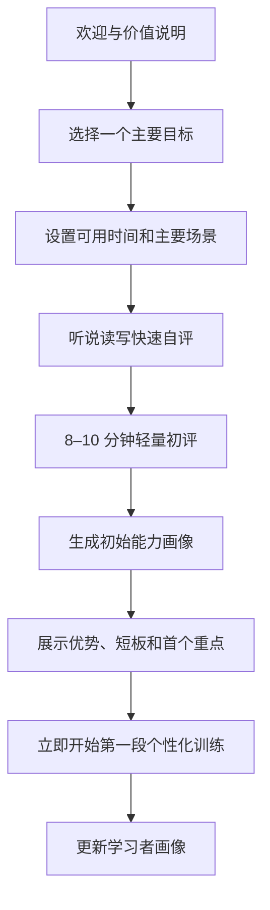
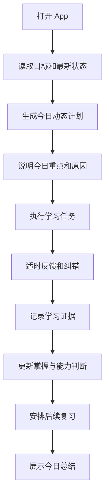

# English Tutor Agent 产品需求文档（PRD）

> 文档版本：`1.0.0`  
> 文档状态：`产品需求正式基线，含 2026-08-10 V1.0 范围修订`
> 产品阶段：`V1.0 Web-first 表达教练 MVP 重基线`
> 更新日期：`2026-08-10`
> 主要客户端：`Web`
> 文档用途：作为后续 UI 细化、概要设计、详细设计、开发拆解、测试验收和发布评审的产品依据。

---

> 2026-08-10 修订说明：`docs/modify/English_Tutor_Agent_V1.0_原始用户端产品需求.md`
> 将 V1.0 重点从 Android 语音/听力优先调整为 Web-first 的智能表达纠错教练。
> 本修订覆盖本文中与 Android-first、语音/听力首版完整交付冲突的旧描述。
> 已实现的 M0-M2 后端文字学习闭环继续保留，Android、ASR、TTS、听力播放器和完整 IELTS 后移。

## 0.0 V1.0 Web-first 修订摘要

### 新定位

English Tutor Agent V1.0 优先验证 **AI English Expression Coach**：

- 帮助用户把 passive vocabulary / passive grammar 转化为主动表达能力；
- 支持用户用英文或中英混合表达真实意图；
- 给出 grammar feedback、natural expression improvement 和表达结构解释；
- 引导用户 Try Again，通过改写、复述和再次表达形成闭环；
- 保存结构化学习证据，但不以复杂长期复习系统作为 V1.0 发布门槛。

### V1.0 必须完成

- Web 端表达教练首页；
- 文字对话输入与 SSE 流式回复；
- 分层纠错：错误定位、规则解释、自然表达建议；
- Try Again 改写/复述练习；
- 学习证据、每日总结、下一计划变化的最小展示；
- 隐私设置中保留“原文是否保存”的选择。

### V1.0 明确后移

- Android 录音状态机和完整移动端体验；
- 音频上传、ASR、TTS、听力播放器；
- 完整长期复习/周报/阶段测验；
- IELTS Speaking 完整模拟和 Rubric；
- 付费、团队、教师端和生产灰度发布体系。

### 版本边界

| 版本 | 核心目标 | 说明 |
|---|---|---|
| V1.0 | Web 智能表达纠错 | 最小成本验证用户是否愿意围绕“表达纠错 + 再输出”持续使用 |
| V1.5 | 主动训练系统 | 弱点记忆、个性化练习、常见错误聚合和更强训练生成 |
| V2.0+ | 语音/听力/Android/IELTS 完整闭环 | 接入 ASR/TTS、听力链路、移动端和专项考试能力 |


## 0. 文档说明

### 0.1 文档目标

本文档完整定义 English Tutor Agent 第一版本的：

- 产品背景与问题；
- 产品愿景、目标与非目标；
- 目标用户与核心场景；
- 产品设计理念；
- 第一版本功能范围；
- 核心业务流程；
- 功能需求、业务规则和验收口径；
- 内容与教学原则；
- 产品指标与数据需求；
- 产品风险、约束和版本管理方式。

本文档冻结后，概要设计与详细设计不得自行改变产品目标和业务规则。设计阶段如发现成本、体验或可行性问题，应先提出变更影响，再更新本 PRD。

### 0.2 本文档不包含

以下内容在后续专项文档中定义：

- Android 视觉规范与最终页面样式；
- 页面组件尺寸、颜色、字体和动效参数；
- 技术选型与系统架构；
- Agent 数量、编排方式和模型路由；
- 数据库表、接口协议和消息格式；
- Prompt、模型参数和评测实现；
- ASR、TTS、LLM 服务商选择；
- 部署、监控、成本控制与运维方案；
- 商业模式和订阅价格。

### 0.3 需求优先级

| 优先级 | 定义 |
|---|---|
| P0 | 第一版本必须具备；缺失则核心闭环不成立或无法发布 |
| P1 | 第一版本应具备；可在首个小版本内补齐 |
| P2 | 后续增强；不阻塞第一版本核心验证 |

---

# 1. 产品概述

## 1.1 产品名称

- 英文名：**English Tutor Agent**
- 中文定位：**自适应个人 AI 英语私教**

## 1.2 一句话定位

> English Tutor Agent 是一款面向具备一定英语基础的中文母语成年用户、以口语交流能力提升为核心、听说读写协同发展的自适应 AI 英语私教。

用户只需要说明“为什么学习英语”和“每天大致可投入多少时间”。系统通过轻量初评、日常训练、真实对话、复习和阶段测验持续了解用户，并自动决定当前最适合的学习内容、训练方式、难度和复习节奏。

## 1.3 核心产品原则

> **用户决定为什么学；Agent 决定当前学什么、怎么学以及何时复习。**

用户不需要每天浏览课程目录或自行设计学习计划，但可以针对当天时间、近期会议、考试或训练偏好进行临时调整。

## 1.4 产品形态

第一版本以 Android 手机端为主要载体，同时支持：

- 文字学习与对话；
- 语音输入；
- 语音播放；
- 听力材料；
- 跟读、复述和口语回答；
- 文字辅助、纠错和学习总结。

---

# 2. 产品背景与问题定义

## 2.1 用户现状

许多具备一定英语基础的成年人仍然存在明显的“输入能力高于输出能力”问题：

- 能阅读部分英文资料，但真实交流时无法快速组织语言；
- 慢速听力能理解，但自然语速、连续语流或多人讨论难以处理；
- 学过语法与词汇，却无法在实时对话中稳定调用；
- 容易使用中式英语，句子能被理解但不够自然；
- 被动词汇较多，主动词汇和可复用词块不足；
- 不清楚自己真正的能力缺口；
- 不知道每天应该学习什么、复习什么；
- 学习内容与真实工作、生活或考试场景脱节；
- 传统课程路径固定，不能持续根据个人表现调整；
- 通用 AI 能回答问题和纠错，但缺少长期教学规划、掌握判断和复习机制。

## 2.2 核心问题

产品需要解决的并不是“用户缺少更多英语内容”，而是以下五个连续问题：

1. **诊断问题**：系统是否知道用户当前真实能力和知识缺口？
2. **决策问题**：系统是否能决定用户今天最值得学习什么？
3. **训练问题**：训练是否能从“看懂答案”转化为“真实使用”？
4. **记忆问题**：错误和学习结果是否会影响未来教学？
5. **验证问题**：系统是否能判断用户已经掌握，而不是偶然答对？

## 2.3 市场机会

现有工具通常偏向以下单点能力：

- AI 自由聊天；
- 单次语法纠错；
- 背单词；
- 固定听力课程；
- 考试题库；
- 固定难度的口语练习。

English Tutor Agent 的差异化价值在于形成完整闭环：

```text
了解用户
→ 自动规划
→ 完成真实训练
→ 采集学习证据
→ 更新能力判断
→ 自动安排复习
→ 调整下一次计划
```

---

# 3. 产品愿景、目标与非目标

## 3.1 产品愿景

成为一位能够长期了解用户、持续调整教学方式、主动安排学习和验证学习效果的专业 AI 英语私教。

## 3.2 用户目标

用户使用产品后，应逐步获得以下结果：

1. 能更快理解真实英语输入；
2. 能更快把中文意图组织成英文；
3. 能在日常、职场或 IELTS 场景中完成真实沟通任务；
4. 减少高频语法、搭配和中式表达问题；
5. 将新词汇和表达从“认识”转化为“会用”；
6. 建立稳定而低负担的学习习惯；
7. 清楚了解自己的优势、短板、进步和下一阶段重点。

## 3.3 产品目标

### 第一阶段目标

建立并验证完整的自适应学习闭环，让用户能够明显感受到：

> “系统会根据我的实际表现改变教学，而不是只换一个话题继续聊天。”

### 中期目标

- 提升语音交互自然度；
- 提升听力训练与口语反馈质量；
- 扩大真实场景覆盖；
- 提升长期学习留存和完成率；
- 建立稳定的内容与评测质量体系。

### 长期目标

形成能够适配不同目标、职业、英语水平和学习习惯的个性化英语学习平台。

## 3.4 非目标

第一版本不追求：

- 完全替代专业真人教师；
- 提供官方 IELTS 成绩或证书；
- 服务完全零基础用户；
- 服务儿童英语启蒙或青少年校内同步学习；
- 覆盖专业翻译、文学写作或高级学术论文训练；
- 提供庞大的课程商城让用户自行选课；
- 一次初评就得出绝对准确、永久不变的能力等级；
- 每句话都进行详细语法批改；
- 将所有训练永久固定为统一流程或统一比例。

---

# 4. 目标用户与用户画像

## 4.1 第一阶段核心用户

> 具备一定英语基础，希望提升真实英语使用能力的中文母语成年用户。

典型特征：

- 可以阅读简单或中等难度的英文内容；
- 口语组织速度慢；
- 听力与即时理解能力弱于阅读；
- 语法知识存在但调用不稳定；
- 主动词汇少于被动词汇；
- 有职场交流、日常沟通或 IELTS 备考需求；
- 每天可投入 10–30 分钟；
- 不希望完成冗长测试或复杂选课；
- 需要持续、明确、可解释的学习指导。

## 4.2 代表性用户画像

### Persona A：职场技术人员

- 有英文技术文档阅读能力；
- 工作中需要描述进度、故障、原因和解决方案；
- 英文会议中难以跟上语速，也难以及时回应；
- 希望每天学习约 20 分钟；
- 需要优先提升听后回应与工作场景表达。

### Persona B：日常综合提升用户

- 有基础词汇和语法知识；
- 日常视频依赖字幕；
- 可以回答简单问题，但句型重复、停顿明显；
- 学习目标较长期，希望提高自然交流能力。

### Persona C：IELTS 口语用户

- 有明确考试目标；
- 需要 Part 1、Part 2、Part 3 和完整模拟；
- 希望获得练习参考评分、薄弱维度和针对性任务；
- 需要明确区分 AI 估算与官方成绩。

## 4.3 非目标用户

- 完全零基础学习者；
- 儿童英语启蒙用户；
- 只需要翻译、查词或一次性改作文的用户；
- 只需要官方考试报名、认证或真实考官评分的用户。

---

# 5. 用户价值主张

## 5.1 降低决策成本

用户打开 App 后可以直接开始适合自己的训练，而不是先选择课程、级别、题型和难度。

## 5.2 真正因人而异

系统根据用户目标、能力、错误、掌握状态、完成率和近期需求动态调整计划。不同用户不应获得相同的任务组合。

## 5.3 从“知道”转化为“会用”

训练不仅判断用户是否认识正确答案，还要验证用户是否能够：

- 听懂；
- 快速组织语言；
- 在互动中回应；
- 在新场景中使用；
- 延迟一段时间后继续正确使用。

## 5.4 长期改善而非单次纠错

系统不仅指出问题，还将问题转化为后续复习、迁移和延迟验证任务。

## 5.5 进步可见且可解释

用户可以理解：

- 当前优势是什么；
- 当前最需要提升什么；
- 今天为什么练这些；
- 哪些问题正在减少；
- 下一阶段准备练什么。

---

# 6. 产品设计理念

## 6.1 用户确定方向，Agent 负责教学决策

用户负责：

- 选择一个主要学习目标；
- 提供大致可用时间；
- 表达临时现实需求；
- 反馈内容太难、太简单或形式不合适。

Agent 负责：

- 判断当前最优先提升的能力；
- 安排每日任务；
- 分配新内容与复习；
- 选择训练形式与难度；
- 决定纠错时机；
- 安排再次复习和阶段测验。

## 6.2 低决策负担

默认体验应为：

> 用户打开 App，理解今天的重点和原因，然后直接开始。

## 6.3 口语优先，四项能力协同发展

产品以口语交流能力为首要目标，但不把口语孤立训练：

- 听力为互动提供输入；
- 阅读帮助接触结构和词汇；
- 写作帮助整理语言；
- 口语负责即时调用与真实沟通。

各能力比例根据用户实际情况动态变化，不在 PRD 中写死永久百分比。

## 6.4 初评轻量，评估持续

8–10 分钟初评只建立可用起点。真正的能力判断来自日常学习、复习、对话和阶段测验中的持续证据。

## 6.5 自评决定起点，不决定结论

用户自评用于选择初始题目难度。系统必须通过实际表现验证，并允许后续证据推翻初始判断。

## 6.6 真实交际任务优先

训练优先围绕真实沟通目的设计，例如：

- 说明发生了什么；
- 请求澄清；
- 确认理解；
- 表达观点和原因；
- 处理问题；
- 表达不同意见；
- 完成 IELTS 口语任务。

语法和词汇应嵌入任务，而不是始终脱离语境讲解。

## 6.7 计划可解释

系统需要用一至两句话说明今天的安排原因，例如：

> 你最近能听懂工作对话的大意，但很难立即回应。今天会重点练习短听力后的快速口头回答。

## 6.8 纠错服务于交流

纠错的目标是帮助用户继续表达，而不是不断证明用户说错了。每次训练只突出少量高价值问题。

## 6.9 能力变化基于多次证据

一次答对不能直接提高能力等级或标记掌握。系统需要综合多次、不同任务、不同场景和延迟后的表现。

## 6.10 内容可靠并尊重版权

可以借鉴成熟教学结构，例如分级听力、慢速与自然语速对照、词块解释、跟读、复述和场景迁移，但不得未经授权复制第三方课程音频、文本或完整内容。

---

# 7. 第一版本产品范围

## 7.1 平台范围

- Android 手机端为第一版本主要客户端。

## 7.2 学习目标范围

用户首次使用时只能选择一个主要目标：

1. 职场英语；
2. 日常综合英语；
3. IELTS 备考。

目标决定内容侧重点，但不替代能力诊断。

## 7.3 第一版本 P0 能力

1. 首次目标设置；
2. 每日时长、场景和偏好收集；
3. 听说读写自评；
4. 8–10 分钟轻量自适应初评；
5. 初始多维能力画像；
6. Agent 自动生成今日学习计划；
7. 文字输入与回复；
8. 语音输入和语音播放；
9. 听力训练；
10. 跟读、复述和口语回答；
11. 真实场景对话；
12. 分层纠错；
13. 历史错误与薄弱点复习；
14. 掌握状态跟踪；
15. 训练结果影响后续计划；
16. 简化能力画像与详细展开；
17. 临时调整当天任务；
18. 每日总结；
19. 每周学习总结；
20. 默认每四周阶段测验；
21. IELTS Speaking Part 1、2、3 训练；
22. IELTS Speaking 完整模拟和 AI 练习参考评分；
23. 可开关的学习提醒；
24. 用户控制原始学习记录保存和删除。

## 7.4 P1 能力

- 更丰富的场景库；
- 自定义近期目标持续时间；
- 更详细的能力趋势对比；
- 训练收藏与表达库；
- 训练中途恢复和跨设备同步；
- 更精细的提醒习惯适配；
- 多种语音角色与语速偏好。

## 7.5 P2 能力

- IELTS 写作、阅读和听力完整专项体系；
- 求职面试独立学习目标；
- 旅行英语独立学习目标；
- 真人教师协作；
- 小组学习或社交功能；
- 机构教学后台；
- 付费订阅与商业化能力。

---

# 8. 产品总体流程

## 8.1 完整学习闭环


## 8.2 首次使用流程



## 8.3 日常学习流程



## 8.4 用户临时调整流程

```text
用户提出临时需求
→ 判断对长期目标的影响
→ 调整近期任务优先级或形式
→ 完成短期训练
→ 保留有效学习证据
→ 临时目标结束后恢复长期路径
```

## 8.5 错误到掌握流程


---

# 9. 核心功能需求

## 9.1 模块 A：首次引导与目标设置

### FR-ONB-001 主要学习目标

- **优先级：P0**
- 用户首次使用时必须选择且只能选择一个主要学习目标。
- 可选目标：职场英语、日常综合英语、IELTS 备考。
- 用户可在后续主动修改目标，但修改应触发学习路径重新校准，而不是仅替换首页文案。

**验收条件：**

- 未选择目标时不能完成首次引导；
- 页面明确说明目标只决定侧重点，系统还会根据实际能力自动规划；
- 修改目标后，后续内容场景和计划重点发生合理变化。

### FR-ONB-002 基础偏好收集

- **优先级：P0**
- 收集每日大致可用时间、主要使用场景、纠错偏好、提醒偏好和近期明确任务。
- 每日默认推荐时长为 20 分钟。
- 用户可选择或输入其他可用时长。

### FR-ONB-003 首次体验原则

- **优先级：P0**
- 不展示庞大课程目录；
- 不要求理解 CEFR 等专业术语；
- 不要求填写冗长问卷；
- 完成初评后立即提供有价值的训练。

---

## 9.2 模块 B：能力自评与轻量初评

### FR-ASM-001 四项能力自评

- **优先级：P0**
- 用户分别对听力、口语、阅读、写作进行自评。
- 使用生活化行为描述，不直接要求用户选择 A1、A2、B1、B2 等专业等级。
- 自评仅用于选择初始难度。

### FR-ASM-002 自适应初评

- **优先级：P0**
- 首次正式学习前必须完成；
- 总时长目标为 8–10 分钟；
- 以选择题和短任务为主；
- 听、说、读、写均获得最小有效证据；
- 支持暂停与继续；
- 不以正式考试语气呈现。

### FR-ASM-003 难度适配

- **优先级：P0**
- 中等或普通自评用户：以低压力选择题、短听力、短口语和短写作为主；
- 较高自评用户：减少基础选择题，增加自由回答、听后复述、观点表达和目标场景任务；
- 自评与表现不一致时，系统平缓调整难度，不使用负面评价。

### FR-ASM-004 初评结果

- **优先级：P0**
- 默认展示：当前优势、优先提升方向、首个训练重点、建议学习时长；
- 支持展开查看更详细的分项结果与判断依据；
- 必须说明结果是初始判断，后续会自动校准；
- 不只展示单一总等级。

**示例：**

```text
当前优势：阅读理解、熟悉话题词汇
优先提升：听力反应、口语组织、自然表达
首个训练方向：在工作场景中快速说明发生了什么
推荐时长：每天约 20 分钟
```

---

## 9.3 模块 C：学习者画像

### FR-PRO-001 多维能力画像

- **优先级：P0**
- 系统持续维护以下能力维度：
  - 听力理解；
  - 口语流畅度；
  - 口语互动能力；
  - 发音可理解度；
  - 阅读理解；
  - 写作表达；
  - 语法准确性；
  - 词汇广度与主动词汇；
  - 表达自然度；
  - 目标场景能力。

### FR-PRO-002 知识与表达状态

- **优先级：P0**
- 对高价值知识点、词块、表达和错误模式记录学习状态。
- 状态至少体现：

```text
未稳定识别
→ 能在提示下处理
→ 能独立使用
→ 能在新场景迁移
→ 延迟后仍能使用
→ 基本掌握
```

### FR-PRO-003 画像持续更新

- **优先级：P0**
- 每次训练产生的有效证据均可更新画像；
- 一次答对或答错不能造成过大的能力跳变；
- 日常表现可以推翻初评判断；
- 画像变化必须可追溯到真实学习证据。

### FR-PRO-004 用户展示

- **优先级：P0**
- 默认展示简化结果：优势、薄弱点、趋势和当前重点；
- 用户可展开详细维度；
- 避免展示看似极其精确但缺乏依据的分数；
- 明确区分能力估计、趋势和官方认证。

---

## 9.4 模块 D：自适应学习计划

### FR-PLN-001 自动生成今日计划

- **优先级：P0**
- 用户无需自行选课；
- 系统每次进入今日学习时，根据最新状态生成任务；
- 计划至少参考：
  - 主要目标；
  - 当前能力；
  - 最近错误；
  - 复习到期内容；
  - 最近完成率；
  - 用户可用时间；
  - 临时需求；
  - 阶段测验结果。

### FR-PLN-002 动态任务组合

- **优先级：P0**
- 每日任务不使用永久固定结构；
- 可从听力、跟读、复述、对话、句子重写、阅读、短写作、词块训练、复习和测验中动态组合；
- 不同目标或能力的用户应获得明显不同的任务组合；
- 同一用户的后续计划应因表现变化而调整。

### FR-PLN-003 计划解释

- **优先级：P0**
- 每日计划提供一至两句原因；
- 解释应关联用户真实目标和近期表现；
- 不展示复杂内部算法。

### FR-PLN-004 时长调整

- **优先级：P0**
- 默认推荐 20 分钟；
- 根据完成率、疲劳信号和当天需求动态调整；
- 支持 5 分钟快速训练；
- 任务缩短时优先保留最高价值任务，而不是机械等比例删减。

### FR-PLN-005 临时干预

- **优先级：P0**
- 用户可表达：
  - 今天只有 5 分钟；
  - 今天不方便说话；
  - 明天有英文会议；
  - 想练某个具体场景；
  - 当前内容太难或太简单；
  - 想加强听力、口语或 IELTS。
- 临时调整只影响近期任务，不直接覆盖长期能力判断。

---

## 9.5 模块 E：训练任务与内容

### FR-TRN-001 训练载体

- **优先级：P0**
- 支持文字输入与回复；
- 支持语音输入；
- 支持语音播放；
- 支持听力音频；
- 支持文字辅助与对照；
- 支持口语回答、跟读和复述。

### FR-TRN-002 任务类型

- **优先级：P0**
- 第一版本允许动态使用：
  - 听力理解；
  - 听后选择、判断和填空；
  - 听后复述；
  - 跟读与影子练习；
  - 日常或目标场景对话；
  - 角色扮演；
  - 句子重写；
  - 中译英；
  - 改错；
  - 阅读理解；
  - 短写作；
  - 词块和常用表达训练；
  - 自由表达；
  - IELTS Speaking 任务；
  - 阶段测验。

### FR-TRN-003 听力到口语链路

- **优先级：P0**
- 推荐训练顺序：

```text
播放适合水平的音频
→ 检查主要含义
→ 必要时提供关键词或文本支持
→ 再次播放或切换自然语速
→ 用户复述或回应
→ 简短反馈
→ 在新场景中使用核心表达
```

### FR-TRN-004 分级辅助

- **优先级：P0**
- 用户可以按需查看关键词、文本或解释；
- 默认不强制先显示完整答案；
- 使用辅助后仍应安排主动输出；
- 系统记录用户对辅助的依赖程度，作为学习证据之一。

### FR-TRN-005 场景选择原则

- **优先级：P0**
- 场景由主要目标、能力、薄弱点和近期需要共同决定；
- 场景不是固定课程目录；
- 主要方向包括：
  - 职场：进度汇报、技术问题、会议澄清、风险说明、表达意见；
  - 日常：介绍、社交、购物、旅行、讲述经历、表达感受与观点；
  - IELTS：Part 1、Part 2、Part 3、完整模拟。

### FR-TRN-006 内容原创与合法使用

- **优先级：P0**
- 训练内容应使用原创生成、开放授权或合法采购内容；
- 可以借鉴 ESLPod 等产品的教学结构，但不得直接复制其受版权保护的音频、文本或完整课程。

---

## 9.6 模块 F：自由对话与场景互动

### FR-CON-001 自然交流优先

- **优先级：P0**
- Agent 应优先维持交流；
- 不应对每句话逐项批改；
- 用户卡住时可以提供渐进提示；
- 对话难度应匹配用户当前能力和目标。

### FR-CON-002 文字与语音模式

- **优先级：P0**
- 用户可使用文字或语音回答；
- 当用户不方便说话时，可切换为文字和听力模式；
- 模式变化不应丢失当前学习目标和任务进度。

### FR-CON-003 主动输出

- **优先级：P0**
- 训练不能长期停留在选择题；
- 每个合适的训练单元应逐步引导用户产生自己的英文；
- 对中高水平用户提高开放表达比例。

### FR-CON-004 提示策略

- **优先级：P1**
- 提示应从轻到重：关键词、句首、表达框架、示例答案；
- 给出完整示例后仍应要求用户重新表达；
- 记录用户使用何种提示后完成任务。

---

## 9.7 模块 G：分层纠错与表达优化

### FR-COR-001 纠错层级

- **优先级：P0**

| 问题类型 | 默认处理方式 |
|---|---|
| 严重影响理解 | 及时提醒并帮助重述 |
| 明显语法或用词错误 | 当前表达结束后提醒 |
| 轻微不自然 | 在适当时机或总结中提示 |
| 历史高频错误再次出现 | 明确说明这是历史问题 |
| 专项训练 | 可使用更严格的纠错 |
| 用户主动请求详细解释 | 提供解释、对比和练习 |

### FR-COR-002 纠错数量控制

- **优先级：P0**
- 每轮或每次训练优先突出 1–3 个最有价值的问题；
- 不一次展示大量语法知识；
- 低价值问题可记录但延后处理。

### FR-COR-003 自然表达建议

- **优先级：P0**
- 对“语法基本正确但不自然”的内容提供更自然表达；
- 可根据日常、职场、正式或 IELTS 场景提供不同风格建议；
- 用户需要有机会重新使用建议，而不是只查看答案。

### FR-COR-004 历史关联

- **优先级：P0**
- 高频错误再次出现时，系统应说明与历史问题的关系；
- 纠错结果可以转化为后续复习任务；
- 一次纠错不等于掌握。

---

## 9.8 模块 H：复习与掌握判断

### FR-REV-001 自动安排复习

- **优先级：P0**
- 用户无需自行选择复习内容；
- 系统根据错误频率、掌握状态、上次表现和时间间隔安排复习；
- 复习间隔不在产品阶段锁定单一固定公式。

### FR-REV-002 主动提取与迁移

- **优先级：P0**
- 复习不得只让用户重复阅读答案；
- 同一内容应通过不同任务重新出现：
  - 识别；
  - 补全；
  - 中译英；
  - 口语使用；
  - 新场景迁移；
  - 延迟验证。

### FR-REV-003 掌握判定

- **优先级：P0**
- 一次正确不能标记为掌握；
- 至少需要独立使用、场景迁移和延迟验证证据；
- 若错误再次出现，可降低掌握状态并重新安排训练。

### FR-REV-004 避免无效重复

- **优先级：P1**
- 已稳定掌握的内容减少出现频率；
- 多次失败时需要改变训练形式或降低难度，而不是机械重复同一道题。

---

## 9.9 模块 I：IELTS Speaking

### FR-IEL-001 Part 1 训练

- **优先级：P0**
- 支持熟悉话题问答；
- 训练自然、完整但不过长的回答；
- 引导增加原因、例子或细节；
- 提供薄弱点反馈与重答机会。

### FR-IEL-002 Part 2 训练

- **优先级：P0**
- 支持话题卡、准备时间和连续表达；
- 提供结构提示但不过度代答；
- 支持计时、录音、反馈和重答；
- 训练内容进入后续复习。

### FR-IEL-003 Part 3 训练

- **优先级：P0**
- 支持抽象问题、观点表达、原因、对比和延伸讨论；
- 难度根据用户当前能力调整；
- 反馈重点控制在可执行的 1–3 项。

### FR-IEL-004 完整模拟

- **优先级：P0**
- 支持 Part 1、Part 2、Part 3 连续模拟；
- 模拟前说明规则；
- 模拟中尽量减少教学式打断；
- 模拟结束后统一反馈。

### FR-IEL-005 评分边界

- **优先级：P0**
- 从流畅性与连贯性、词汇、语法、发音等维度提供练习反馈；
- 所有分数必须标识为“AI 练习参考”或“AI 估算”；
- 不得宣称是官方 IELTS 成绩；
- 应展示改进依据和下一步训练建议。

---

## 9.10 模块 J：总结、进步与阶段评估

### FR-RPT-001 每日总结

- **优先级：P0**
- 每次训练结束后展示：
  - 完成了什么；
  - 1–3 个最值得记住的内容；
  - 哪些表现形成了新证据；
  - 下一次计划可能如何调整。

### FR-RPT-002 每周总结

- **优先级：P0**
- 展示：
  - 学习时间与完成情况；
  - 本周主要训练方向；
  - 明显改善；
  - 仍反复出现的问题；
  - 下周重点。

### FR-RPT-003 阶段测验

- **优先级：P0**
- 默认每四周进行一次；
- Agent 可根据学习进度提前或延后；
- 测验内容与主要目标和当前能力相关；
- 测验后重新校准画像和计划；
- 用户应看到与上次阶段的变化及调整原因。

### FR-RPT-004 能力趋势

- **优先级：P0**
- 默认使用趋势、状态和行为描述；
- 支持查看详细维度；
- 展示具体进步证据，例如错误频率下降、独立回答增加、听力辅助减少、迁移成功。

---

## 9.11 模块 K：提醒与学习习惯

### FR-REM-001 提醒开关

- **优先级：P0**
- 用户可开启或关闭学习提醒；
- 不强制开启；
- 产品不得通过过度焦虑或惩罚性语言催促学习。

### FR-REM-002 提醒建议

- **优先级：P1**
- 系统可根据常用学习时间建议提醒时间；
- 用户可以修改或忽略建议；
- 提醒内容应说明今日训练价值，而不是只提示连续天数。

---

## 9.12 模块 L：学习数据控制

### FR-DAT-001 默认保存与用途说明

- **优先级：P0**
- 默认保存对话和训练记录，用于个性化学习；
- 明确说明保存目的；
- 不将原始记录用于与学习无关的功能而不告知用户。

### FR-DAT-002 原始内容保存开关

- **优先级：P0**
- 用户可关闭原始文字或语音内容保存；
- 关闭后可选择只保留错误摘要、能力变化和复习状态；
- 关闭原始保存后，系统需要说明可能对个性化精度产生的影响。

### FR-DAT-003 删除学习记录

- **优先级：P0**
- 用户可以删除自己的学习记录；
- 删除操作前明确影响；
- 删除后产品不得继续展示已删除记录形成的个性化结论，除非用户选择保留摘要。

---

# 10. 核心用户故事

## US-001 首次使用

> 作为一名不想研究课程体系的英语学习者，我只想说明自己的目标并完成一段轻量评估，以便系统直接告诉我应该从哪里开始。

**成功标准：** 用户在约 8–10 分钟内完成初评，并立即进入首段个性化训练。

## US-002 每日直接开始

> 作为时间有限的用户，我希望打开 App 就看到适合我的今日计划，不需要每天重新选择课程。

**成功标准：** 首页展示今日重点、原因、预计时长和可直接开始的任务。

## US-003 听力到口语

> 作为能看懂但听说较弱的用户，我希望从可理解的听力开始，逐步过渡到复述和真实回应。

**成功标准：** 训练包含理解、按需辅助、主动输出和场景迁移，而不只是播放音频。

## US-004 不中断的纠错

> 作为害怕频繁被纠正的用户，我希望系统优先和我交流，只提醒最重要的问题。

**成功标准：** 轻微问题延后处理；每次突出的问题数量有限；用户能够继续表达。

## US-005 长期记住问题

> 作为经常重复犯错的用户，我希望系统记得我的高频问题，并在未来用不同方式帮助我改掉。

**成功标准：** 历史问题会在合适时间复现；复习结果影响掌握状态和后续计划。

## US-006 临时会议强化

> 作为明天要参加英文会议的用户，我希望临时加强会议表达，但不想重做整个学习计划。

**成功标准：** 系统提高近期会议任务优先级，临时目标结束后恢复长期路径。

## US-007 IELTS 模拟

> 作为 IELTS 备考用户，我希望完成完整口语模拟并获得分维度的练习反馈。

**成功标准：** 完成 Part 1、2、3；评分明确为 AI 练习参考；生成后续训练重点。

## US-008 查看进步

> 作为长期学习者，我希望知道自己具体改善了什么，而不是只看到一个模糊总分。

**成功标准：** 展示趋势、薄弱点、已掌握表达和可验证的进步证据。

---

# 11. 信息架构与页面范围

> 本节定义产品信息架构，不规定最终视觉样式。

## 11.1 首次使用页面

1. 欢迎与产品价值；
2. 主要目标选择；
3. 时间、场景与偏好；
4. 听说读写自评；
5. 轻量能力初评；
6. 初始能力画像；
7. 第一份个性化计划。

## 11.2 日常学习页面

1. 今日首页；
2. 今日计划与原因；
3. 听力训练；
4. 语音或文字对话；
5. 跟读或复述；
6. 改写、翻译或阅读任务；
7. 纠错与表达建议；
8. 训练总结；
9. 临时调整面板。

## 11.3 长期学习页面

1. 能力与进步；
2. 当前优势和重点；
3. 知识与表达掌握状态；
4. 每周总结；
5. 阶段测验结果；
6. 学习目标和偏好；
7. 提醒设置；
8. 学习数据管理。

## 11.4 IELTS 页面

1. Part 1 训练；
2. Part 2 话题卡和计时；
3. Part 3 深入讨论；
4. 完整模拟；
5. 练习参考评分；
6. 薄弱维度与训练建议。

---

# 12. 关键业务规则

## BR-001 目标规则

- 每个用户同时只有一个主要学习目标；
- 修改主要目标需要重新调整内容侧重和阶段计划；
- 近期现实需求不等于修改主要目标。

## BR-002 初评规则

- 初评不可完全跳过；
- 支持暂停和继续；
- 必须控制负担与考试感；
- 初评结果为低到中等置信度起点，不是永久结论。

## BR-003 计划规则

- 默认自动生成；
- 不要求用户自行选择具体课程；
- 每日计划必须有可理解的安排原因；
- 用户临时调整不直接覆盖长期画像。

## BR-004 纠错规则

- 纠错时机由问题严重程度和训练模式决定；
- 自由交流中优先保证表达连续性；
- 每次只突出少量重点；
- 高频历史问题可以增强提醒。

## BR-005 掌握规则

- 一次正确不能标记掌握；
- 掌握需要独立使用、迁移和延迟验证；
- 再次出现错误可降低掌握状态。

## BR-006 能力更新规则

- 能力变化必须基于学习证据；
- 单次异常表现不应造成明显跳变；
- 初评、日常学习和阶段测验均可更新画像；
- 需要保留变化原因，供产品解释与问题追踪。

## BR-007 IELTS 规则

- 完整支持 Part 1、2、3；
- AI 评分不得表述为官方成绩；
- 模拟中尽量不教学式打断；
- 模拟后提供最重要的改进点和后续计划。

## BR-008 内容版权规则

- 不直接复制未经授权的第三方音频或文本；
- AI 生成内容也需要质量与版权风险控制；
- 教学结构可借鉴，具体内容必须原创、开放授权或合法采购。

---

# 13. 产品级非功能需求

> 具体技术指标在概要设计中细化，本节只定义用户可感知的产品要求。

## 13.1 响应体验

- 文字对话应尽快开始流式反馈，避免用户长时间面对空白等待；
- 语音任务应有清晰的录音、上传、识别和生成状态；
- 长耗时处理必须提供可理解的阶段反馈；
- 用户可取消录音、播放或当前生成。

## 13.2 弱网与异常体验

- 网络中断时保留用户已完成的输入和当前进度；
- 失败后支持重试；
- 不因单次模型失败丢失整段学习记录；
- 无法使用语音时提供文字替代路径；
- 错误提示使用用户语言说明，不直接暴露底层异常。

## 13.3 可恢复性

- 初评、阶段测验和较长训练支持暂停后继续；
- App 被切到后台后，短时间返回应保留进度；
- 未完成任务不应被误判为能力失败。

## 13.4 可访问性

- 核心操作适合单手手机使用；
- 录音、播放、暂停和提交状态清晰；
- 音频训练应提供可选文字辅助；
- 不只依赖颜色传达正确、错误和状态。

## 13.5 隐私与透明度

- 明确说明录音和对话数据的用途；
- 用户能查看、关闭和删除相关数据；
- IELTS 和能力评估明确说明估算性质；
- 计划解释不得伪装成绝对科学结论。

## 13.6 学习安全感

- 反馈保持鼓励、具体和可行动；
- 不因连续错误羞辱或打击用户；
- 不使用“你英语很差”等负面标签；
- 难度不匹配时优先调整任务，而非归责用户。

---

# 14. 内容与教学要求

## 14.1 内容组织原则

训练内容应围绕“输入理解—主动提取—真实使用—反馈—迁移—延迟复习”组织。

## 14.2 分级听力结构

可采用以下结构：

```text
可理解的分级或慢速音频
→ 主要含义检查
→ 关键词或文本辅助
→ 自然语速版本
→ 核心词块解释
→ 跟读或复述
→ 新场景主动使用
```

## 14.3 词汇与语法

- 优先训练高频、可复用词块和真实搭配；
- 语法讲解应简洁，并立即进入使用；
- 不以孤立规则记忆替代真实任务；
- 用户反复出现的语法问题应形成专项训练。

## 14.4 训练难度

### 降低难度信号

- 连续无法完成；
- 大量依赖中文；
- 听力几乎获取不到信息；
- 错误密度过高；
- 回答明显缩短；
- 多次跳过同类任务。

### 提高难度信号

- 持续独立完成；
- 主动使用新表达；
- 能在新场景迁移；
- 回答长度和连贯性提高；
- 延迟复习后仍表现稳定；
- 用户主动要求更高挑战。

## 14.5 质量要求

训练内容需满足：

- 英语表达自然、准确；
- 难度与用户匹配；
- 场景和学习目标相关；
- 答案与反馈一致；
- 不包含明显事实错误、偏见或不适合用户的内容；
- IELTS 内容符合口语训练形式，不误导为官方题目或评分。

---

# 15. 数据与产品指标

## 15.1 北极星指标候选

> **每周完成至少三次有效个性化训练的活跃用户数。**

“有效训练”需要包含真实任务完成和可用学习证据，不以单纯打开 App 计算。

## 15.2 核心产品指标

### 激活

- 首次引导完成率；
- 初评开始率；
- 初评完成率；
- 初评平均时长；
- 初评后首段训练完成率。

### 学习参与

- 日活和周活；
- 每周有效训练次数；
- 平均训练时长；
- 语音任务使用率；
- 主动输出任务完成率；
- 今日计划完成率；
- 提醒开启率和提醒后训练率。

### 自适应有效性

- 今日计划接受率；
- 用户手动调整计划比例；
- 难度过高或过低反馈率；
- 历史问题复习命中率；
- 计划变化后完成率变化；
- 不同画像用户计划差异度。

### 学习效果

- 高频错误下降趋势；
- 提示依赖下降；
- 新表达独立使用率；
- 场景迁移成功率；
- 延迟复习正确率；
- 口语回答长度、连贯性和反应速度趋势；
- 听力辅助使用率下降；
- 阶段测验变化。

### 留存与满意度

- 次日、7 日、30 日留存；
- 周连续学习率；
- 用户对计划相关性的评价；
- 用户对纠错体验的评价；
- 用户是否认为系统“了解自己”。

## 15.3 质量护栏指标

- 初评中途退出率；
- 语音识别失败率；
- 对话长时间等待率；
- 用户报告错误反馈率；
- 不自然或错误纠错率；
- IELTS 评分误导投诉；
- 隐私设置和删除失败率；
- 因过度纠错退出训练的比例。

---

# 16. 第一版本验收标准

## 16.1 首次使用验收

- 用户可选择一个主要目标；
- 用户可在约 8–10 分钟完成轻量初评；
- 初评同时获得听、说、读、写的基础证据；
- 中等水平用户不会感觉完成一套冗长考试；
- 高水平自评用户获得更多开放表达；
- 初评后立即得到画像、学习重点和首段训练。

## 16.2 个性化验收

- 目标不同的用户获得不同场景内容；
- 能力不同的用户获得不同难度和任务组合；
- 同一用户后续计划因近期表现发生变化；
- 系统能说明今天安排的主要原因；
- 用户无需自行选择具体课程。

## 16.3 语音和综合训练验收

- Android 端可通过文字和语音完成核心训练；
- 系统可提供听力材料并检查理解；
- 训练能从选择题过渡到主动口语输出；
- 阅读与写作任务服务于口语和综合能力；
- 用户不方便说话时存在替代路径；
- 语音失败不会造成整次学习记录丢失。

## 16.4 纠错验收

- 严重问题及时处理；
- 轻微问题不会持续打断交流；
- 每次只突出少量高价值问题；
- 高频历史错误再次出现时能够被识别；
- 用户有机会重新使用正确或自然表达。

## 16.5 复习与掌握验收

- 历史问题在合适时间再次出现；
- 一次正确不会标记掌握；
- 提示、独立使用、迁移和延迟验证均能形成证据；
- 复习结果能改变后续计划；
- 多次失败时系统会改变难度或任务形式。

## 16.6 IELTS 验收

- 可完成 Part 1、Part 2 和 Part 3 训练；
- 可完成完整口语模拟；
- 模拟过程中不过度教学式打断；
- 提供分维度反馈和后续训练建议；
- 所有分数明确标记为 AI 练习参考。

## 16.7 长期体验验收

连续使用一段时间后，用户能够清楚回答：

- 系统认为我的优势是什么；
- 我当前最需要提升什么；
- 今天为什么练这些；
- 哪些问题正在改善；
- 哪些表达已经基本掌握；
- 下一阶段准备练什么。

---

# 17. 边界、依赖与风险

## 17.1 产品边界

- 产品提供学习辅助和练习反馈，不提供官方认证；
- 产品允许 AI 估算，但必须表达置信边界；
- 产品不以一次测试决定长期能力；
- 产品不承诺固定周期内必然达到某分数。

## 17.2 关键依赖

后续设计需要重点验证：

- 语音识别对不同口音和环境噪声的可用性；
- 语音播放自然度和响应延迟；
- 听力内容生产与版权来源；
- 口语评估的稳定性和可解释性；
- 自适应计划能否通过规则与模型稳定生成；
- Android 弱网、后台切换和音频权限体验；
- 用户数据保存、删除和隐私告知方案。

## 17.3 主要产品风险

| 风险 | 影响 | 产品应对原则 |
|---|---|---|
| 初评过长或考试感强 | 首次流失 | 控制 8–10 分钟，选择题和微任务为主，允许暂停 |
| 计划看似个性化但实质重复 | 信任下降 | 计划必须关联真实证据，并验证不同用户差异 |
| 语音延迟高 | 对话体验差 | 展示状态、支持取消、提供文字替代路径 |
| 纠错过多 | 用户不敢表达 | 分层纠错、数量控制、交流优先 |
| AI 纠错或评分不稳定 | 学习误导 | 使用质量评测、明确估算边界、保留依据 |
| 内容质量或版权问题 | 无法发布 | 原创、开放授权或合法采购，建立审核机制 |
| 学习计划难度不合适 | 完成率下降 | 用户反馈、行为信号和持续校准 |
| 数据隐私顾虑 | 用户拒绝语音或长期记忆 | 清楚说明用途，提供保存开关和删除能力 |
| 第一版本范围过大 | 研发周期和质量风险 | 优先端到端闭环，按 P0 逐段交付和验收 |

---

# 18. 版本发布与阶段目标

## 18.1 产品验证顺序

尽管第一版本范围包含完整能力，开发时应按可运行的纵向闭环逐步交付：

### 里程碑 M1：首次使用闭环

```text
目标选择
→ 自评
→ 轻量初评
→ 初始画像
→ 第一份计划
```

### 里程碑 M2：每日文字学习闭环

```text
今日计划
→ 文字任务或对话
→ 分层纠错
→ 总结
→ 更新下一次计划
```

### 里程碑 M3：Web 表达教练闭环

```text
Web 进入教练
→ 用户表达
→ 流式回应
→ 语法纠错
→ 自然表达优化
→ Try Again 再输出
```

### 里程碑 M4：语音与听力闭环

```text
听力输入
→ 理解检查
→ 语音回答
→ ASR/TTS
→ 反馈
```

### 里程碑 M5：长期复习与进步闭环

```text
历史问题
→ 多形式复习
→ 迁移
→ 延迟验证
→ 掌握状态与趋势
```

### 里程碑 M6：IELTS Speaking 闭环

```text
Part 1/2/3
→ 完整模拟
→ AI 练习反馈
→ 针对性训练计划
```

### 里程碑 M7：发布候选版本

完成：

- 产品验收；
- Web 部署验收；
- Android 真机测试（若移动端进入当期发布范围）；
- 弱网与异常测试；
- 学习内容质量检查；
- 隐私与数据控制检查；
- 回归测试；
- 小范围灰度验证。

---

# 19. Vibe Coding 协作与变更流程

## 19.1 总体协作流程


## 19.2 当前阶段状态

- 需求论证：已完成；
- 产品决策确认：已完成；
- PRD 正式基线：本文档；
- UI 交互原型：已有首版样例；
- 下一阶段：概要设计。

## 19.3 设计与编码原则

1. 后续设计必须引用本 PRD 的需求编号；
2. 技术设计不能未经确认删除或改变 P0 产品能力；
3. 每个开发任务需要包含用户价值、边界、验收条件和测试要求；
4. 优先实现可端到端运行的纵向闭环；
5. 一次只实现一个可验证任务；
6. 生成代码前必须读取相关需求与现有代码；
7. 代码生成成功不等于功能完成，必须实际运行；
8. 每个阶段都需要测试与 Code Review；
9. 发现需求冲突时回到 PRD 与决策记录，不在代码中自行做产品决定；
10. 所有新需求先走变更流程。

## 19.4 产品变更流程

```text
提出变更
→ 描述用户价值和使用场景
→ 分析对产品范围、UI、架构、进度和测试的影响
→ 确定进入当前版本或后续版本
→ 用户确认
→ 更新 PRD、决策记录和版本号
→ 再进入设计或开发
```

---

# 20. 已确认产品决策

| 编号 | 决策项 | 最终决定 |
|---|---|---|
| D-001 | 第一阶段服务对象 | 以核心个人需求验证，同时兼顾其他中文英语学习者 |
| D-002 | 用户英语基础 | 面向具备一定基础的成年用户 |
| D-003 | 产品定位 | 自适应 AI 英语私教 |
| D-004 | 用户与 Agent 边界 | 用户决定目标，Agent 默认自动安排具体学习 |
| D-005 | 首次信息 | 目标、时间、场景、自评、纠错和提醒等轻量信息 |
| D-006 | 学习目标数量 | 同时只选择一个主要目标 |
| D-007 | 第一批目标 | 职场英语、日常综合英语、IELTS |
| D-008 | 初评方式 | 用户自评起步，选择题为主，按水平增加开放表达；听说读写均采样 |
| D-009 | 是否可跳过初评 | 不可完全跳过，但必须轻量、可暂停、非考试化 |
| D-010 | 初评时长 | 约 8–10 分钟 |
| D-011 | 第一版听力评估 | 包含在初评中 |
| D-012 | 第一版训练形态 | Web 优先支持文字表达、纠错、自然表达优化和 Try Again；Android/语音/听力后移 |
| D-013 | 核心训练方向 | 主动表达能力为主，围绕理解意图、表达模板、语法反馈和自然表达建立闭环 |
| D-014 | 默认学习时长 | 20 分钟，可动态调整 |
| D-015 | 每日训练结构 | 任务动态组合，不锁定固定结构 |
| D-016 | 临时干预 | 允许调整近期任务，不直接覆盖长期判断 |
| D-017 | 纠错方式 | 分层纠错 |
| D-018 | 能力画像展示 | 默认简化，可展开详细内容 |
| D-019 | 掌握判断 | 基于多次、多场景和延迟证据 |
| D-020 | 阶段测验 | 默认每四周，Agent 可提前或延后 |
| D-021 | IELTS 范围 | V1.0 不做完整 IELTS Speaking；保留后续专项能力 |
| D-022 | 科学性表述 | 证据驱动、自适应、持续校准 |
| D-023 | 主动提醒 | 用户可自行开启或关闭 |
| D-024 | 原始对话保存 | 默认保存，可关闭原文保存并只保留学习摘要 |
| D-025 | 成功标准 | 以完整自适应学习闭环成立为核心验收方向 |

---

# 21. 后续文档清单

本文档确认后，建议依次形成：

1. `UI_AND_INTERACTION_SPEC.md`：UI 页面、状态与交互规范；
2. `HIGH_LEVEL_DESIGN.md`：概要设计；
3. `DETAILED_DESIGN.md`：详细设计；
4. `DATA_AND_API_SPEC.md`：数据模型与接口；
5. `AGENT_AND_PROMPT_DESIGN.md`：Agent、工具和 Prompt；
6. `CONTENT_AND_ASSESSMENT_SPEC.md`：内容、初评和评测规则；
7. `DEVELOPMENT_PLAN.md`：里程碑与任务拆解；
8. `TEST_PLAN.md`：测试策略和验收用例；
9. `REVIEW_CHECKLIST.md`：代码和产品 Review 清单；
10. `RELEASE_PLAN.md`：灰度、发布和回滚方案。

---

# 22. 术语表

| 术语 | 定义 |
|---|---|
| Agent | 代表产品执行教学决策和流程协调的智能能力，不等同于单次模型调用 |
| 学习者画像 | 系统对用户目标、能力、薄弱点、掌握状态和学习行为的持续判断 |
| 学习证据 | 来自答题、对话、听力、口语、复习或测验的实际表现记录 |
| 主动词汇 | 用户可以在表达中主动调用的词汇和词块 |
| 分层纠错 | 根据错误严重程度、训练场景和用户偏好决定反馈时机与深度 |
| 场景迁移 | 用户在与原训练不同的情境中正确使用已学内容 |
| 延迟验证 | 学习一段时间后再次检查用户是否仍能正确使用 |
| AI 练习参考评分 | 由系统生成的训练估算，不是官方考试成绩 |
| 有效训练 | 用户完成了真实学习任务并产生可用于调整教学的学习证据 |

---

# 23. PRD 完成定义

本 PRD 满足以下条件后视为正式冻结：

- 产品定位、核心用户和价值明确；
- 第一版本范围和非目标明确；
- 核心流程与业务规则明确；
- P0 功能具有需求编号与验收口径；
- 产品待确认项全部关闭；
- UI、概要设计和详细设计可以直接引用本文档继续工作；
- 新需求必须通过变更流程进入后续版本。

**当前状态：满足，进入概要设计阶段。**
