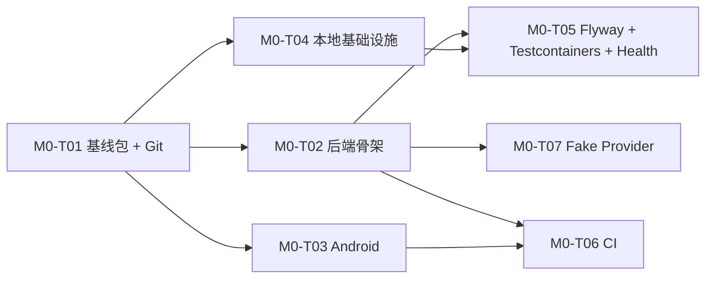

# 项目资料审阅与 M0-T01 / M0-T02 实施计划

已通读 `AGENTS.md`、`README.md`、`docs/prd/ENGLISH_TUTOR_AGENT_PRD_v1.0.0.md`、`docs/design/` 下概要/详细设计、`IMPLEMENTATION_PLAN.md`、`CURRENT_TASK.md`，并对照当前仓库状态（`validate_project.py` 已通过；**尚未 `git init`**；`server/` 仅有 README）。

---

## 一、资料冲突检查

按 `AGENTS.md` 优先级：**PRD > 已接受设计 > ADR > 契约 > 当前任务卡**。以下按严重程度排列。

### 1. 需决策或修复的冲突（可能影响实施）

| # | 冲突位置 | 内容 | 影响 | 建议处理 |
|---|---|---|---|---|
| **C1** | `README.md` L74 vs `CURRENT_TASK.md` / `TASK_BACKLOG.md` | README 写「M0-T01 仓库、**后端与 Android 工程初始化**」；任务卡将后端/Android 拆到 **M0-T02 / M0-T03** | 新开发者可能一次做过多工作 | M0-T01 修正 README；以 `TASK_BACKLOG` 为准 |
| **C2** | `docs/design/09_VIBE_CODING_EXECUTION_GUIDE.md` vs `IMPLEMENTATION_PLAN.md` | 设计指南用 **M1-001~M1-010**、示例卡 **TASK-M1-001**（含健康检查、Testcontainers）；实施计划用 **M0-T01~T08**，Flyway/健康检查在 **M0-T05** | M0-T02 范围易被扩大 | 以 `IMPLEMENTATION_PLAN` + `TASK_BACKLOG` 为任务边界；09 文档仅作流程模板，M0-T01 可加交叉引用说明 |
| **C3** | `docs/decisions/ADR_INDEX.md` vs `docs/design/08_ARCHITECTURE_DECISIONS_AND_RISKS.md` | INDEX 列出 ADR-0005/6/7，但 **仅 0001~0004 有文件**；INDEX 的 **ADR-0007 = Fake Provider**，设计 **ADR-007 = Spring Boot/Java 21** | ADR 编号与语义不一致 | M0-T01 同步 INDEX 或补齐 ADR 文件；技术栈以设计 08 ADR-007 + `server/README.md` 为准 |
| **C4** | `docs/design/00_README.md` §7 开发启动门禁 | 多项未勾选（架构确认、Provider 选定、部署环境等） | 严格解读下「未满足门禁不应编码」 | 用户已发起 M0 计划，视为对 M0 范围的默认可启动；Provider 本地已有 `fake` 默认（`.env.example`），生产 Provider 留 M1 前决策 |
| **C5** | `com.forever24.tutor` 包名 | 仅出现在 `02_DETAILED_DESIGN_BACKEND.md`，无 ADR/契约固化 | M0-T02 初始化时需定包名 | M0-T02 前确认组织域名；暂可按设计实施并记入 CHANGELOG |

### 2. 元数据陈旧（不阻塞 M0，但应记录）

| # | 位置 | 说明 |
|---|---|---|
| **M1** | PRD §0 元数据 | `产品阶段：概要设计前`，但 `docs/design/` 已齐全 |
| **M2** | 设计验收清单 | `01_HIGH_LEVEL_DESIGN.md`、`00_README.md` 中 checkbox 均未勾选 |
| **M3** | 目录命名 | 设计写 `english-tutor-agent-server/`、`android-app/`；仓库用 `server/`、`android/` — 属映射差异，非逻辑冲突 |

### 3. 已对齐、无冲突的核心结论

- **架构**：模块化单体、半双工 PTT、规则+LLM 分工、Provider 抽象 — PRD / 概要设计 / ADR-0001~0004 / `AGENTS.md` 一致  
- **技术基线**：Java 21、Spring Boot 4.1.x、Spring AI 2.0.x、MySQL 8.x、Redis 7.x、Flyway、Testcontainers — 设计、`server/README.md`、`.env.example`、`docker-compose.yml` 一致  
- **契约**：OpenAPI + JSON Schema + examples 已存在且校验通过  
- **任务依赖链**：T01 → T02/T03/T04 → T05 → T06/T07 → T08 与 `IMPLEMENTATION_PLAN` 一致  

### 4. 当前 M0-T01 完成度

| 验收项 | 状态 |
|---|---|
| `python scripts/validate_project.py` | ✅ 已通过 |
| 基线文件完整 | ✅ manifest 80 文件，必需项齐全 |
| Git 初始化 + 基线提交 | ❌ 无 `.git` |
| README 下一步说明 | ⚠️ 措辞与任务拆分不一致（C1） |
| 无密钥/生成目录入仓 | ✅ `.gitignore` 已配置 |

---

## 二、M0-T01 详细实施计划

**任务**：`M0-T01 建立仓库与目录结构`  
**目标**：确认编码启动包完整、可验证、可版本管理，为 M0-T02/T03 铺路。  
**原则**：**不写业务代码**（Spring Boot / Android 业务均不在范围）。

### 2.1 范围界定

**In scope**

- 校验启动包完整性（文档、契约、规则、基础设施模板）
- 修复文档链接/措辞/ADR 索引不一致（C1、C3）
- `git init` + 基线提交
- 更新 `CHANGELOG.md`、`CURRENT_TASK.md`、`TASK_BACKLOG.md`
- 按 `REVIEW_CHECKLIST.md` 做文档级 Review

**Out of scope**

- Spring Boot / Android 工程代码
- Flyway 迁移、业务表
- 真实 AI Provider
- CI 中 Java/Android 构建（属 M0-T06）

### 2.2 实施步骤

```text
Step 1  再次运行 validate_project.py（含 contracts/YAML）
Step 2  对照 manifest.json 与磁盘文件，确认无遗漏/多余
Step 3  修复 README.md §4「当前阶段」措辞（对齐 M0-T01/T02/T03 拆分）
Step 4  修复 ADR_INDEX 与 design/08 的编号/缺失文件（补齐 ADR-0005~0007 或修正 INDEX）
Step 5  在 design/09 或 README 增加说明：任务编号以 docs/plans/TASK_BACKLOG 为准
Step 6  cp .env.example .env（本地，不入仓）
Step 7  git init → git add → 基线提交
Step 8  更新 CHANGELOG [Unreleased]、CURRENT_TASK 状态 → REVIEW/DONE
Step 9  独立 Review（REVIEW_CHECKLIST 文档/流程项）
```

### 2.3 预计修改文件

| 操作 | 文件 |
|---|---|
| 修改 | `README.md` |
| 修改 | `docs/decisions/ADR_INDEX.md` |
| 新增（建议） | `docs/decisions/ADR-0005-mysql-redis-object-storage.md` |
| 新增（建议） | `docs/decisions/ADR-0006-android-compose-udf.md` |
| 新增（建议） | `docs/decisions/ADR-0007-spring-boot-java-baseline.md` |
| 修改（可选） | `docs/design/09_VIBE_CODING_EXECUTION_GUIDE.md`（任务编号说明） |
| 修改 | `CHANGELOG.md` |
| 修改 | `docs/plans/CURRENT_TASK.md` |
| 修改 | `docs/plans/TASK_BACKLOG.md` |
| 不修改 | `contracts/`、`server/`（保持空壳）、`android/` |

### 2.4 测试方案

| 类型 | 命令/检查 | 预期 |
|---|---|---|
| 文档完整性 | `python scripts/validate_project.py` | PASSED |
| 契约 JSON | `python scripts/validate_project.py --contracts-only` | 无 Invalid JSON/YAML |
| 文档 only | `make validate-docs`（或等价命令） | PASSED |
| Git 卫生 | `git status` | 无 `.env`、`.infrastructure-data/`、`target/`、`build/` |
| 密钥扫描 | 人工检查 staged files | 无 API key、密码硬编码 |
| 基础设施冒烟（可选） | `docker compose --env-file .env up -d` + `docker compose ps` | mysql/redis/minio healthy |

### 2.5 风险

| 风险 | 等级 | 缓解 |
|---|---|---|
| ADR 补齐时改写已接受决策 | 中 | 从 design/08 原文迁移，不自行改决策 |
| 基线提交过大/含意外文件 | 低 | 提交前 `git status` + `.gitignore` 复核 |
| Windows 下 Make/Docker 未装 | 低 | 文档注明 Python 脚本为最低要求 |
| 设计门禁未正式签署 | 中 | M0-T01 在 CHANGELOG 记录「M0 启动已获会话确认」 |

---

## 三、M0-T02 详细实施计划

**任务**：`M0-T02 初始化后端多模块工程`  
**依赖**：M0-T01 DONE  
**验收**（`TASK_BACKLOG`）：**Java 21 构建和测试通过**

### 3.1 范围界定（与 M0-T05/T07 的边界）

| 能力 | M0-T02 | 后续任务 |
|---|---|---|
| Maven 多模块骨架（8 模块） | ✅ | — |
| `mvnw`、父 POM、BOM、Java 21 toolchain | ✅ | — |
| `tutor-bootstrap` 最小 Spring Boot 启动 | ✅ | — |
| 模块依赖方向约束 | ✅ | — |
| 基础单元测试（模块/上下文） | ✅ | — |
| Flyway 迁移 + 业务表 | ❌ | M0-T05 |
| Testcontainers 集成测试 | ❌ | M0-T05 |
| `/actuator/health` 连真实 MySQL/Redis | ❌ | M0-T05 |
| Fake LLM/ASR/TTS Provider | ❌ | M0-T07 |
| 业务 API / OpenAPI 实现 | ❌ | M1+ |
| CI workflow（Java build） | ❌ | M0-T06 |

> **冲突消解**：`09_VIBE_CODING_EXECUTION_GUIDE` 示例卡 TASK-M1-001 中的健康检查、Testcontainers **不纳入 M0-T02**，避免与 M0-T05 重复。

### 3.2 目标工程结构

依据 `docs/design/02_DETAILED_DESIGN_BACKEND.md`，在 `server/` 下建立：

```text
server/
├── pom.xml                          # 父 POM：english-tutor-agent-server
├── mvnw / mvnw.cmd / .mvn/
├── tutor-bootstrap/                 # @SpringBootApplication、application.yml
├── tutor-api/                       # 空模块或占位（无业务 Controller）
├── tutor-application/
├── tutor-domain/
├── tutor-agent/
├── tutor-infrastructure/
├── tutor-observability/
└── tutor-test-support/
```

**包根**：`com.forever24.tutor`（待 C5 确认）  
**业务包占位**（仅目录/package-info，无实现）：`identity`、`onboarding`、`assessment`、`learner`、`planning`、`training`、`conversation`、`correction`、`review`、`ielts`、`reporting`、`content`、`ai`、`privacy`、`shared`

**模块依赖**（设计 §1.1）：

```text
bootstrap → api → application → domain
bootstrap → infrastructure → application/domain
bootstrap → agent → application/domain
observability：被外层引用，不反向依赖业务
test-support：测试专用，不被生产模块依赖
```

### 3.3 实施步骤

```text
Phase A — 工程脚手架
  A1  在 server/ 创建父 POM（packaging=pom，Java 21，Spring Boot 4.1.x BOM）
  A2  锁定 Spring AI 2.0.x dependencyManagement（仅 BOM，暂不接业务）
  A3  添加 Maven Wrapper（mvnw）
  A4  配置 flatten-maven-plugin 或 revision 属性（可选，统一版本号）

Phase B — 八模块骨架
  B1  为每个 tutor-* 子模块创建 pom.xml，声明正确 parent 与依赖
  B2  tutor-bootstrap：TutorApplication 主类 + application.yml（local profile，端口 8080）
  B3  tutor-domain：shared 包 + package-info（无 Spring 依赖）
  B4  tutor-api / application / agent / infrastructure / observability：最小占位类
  B5  tutor-test-support：测试 Fixture 基类占位

Phase C — 架构约束
  C1  在父 POM 配置 maven-enforcer（Java 21、禁止 snapshot 传递依赖等）
  C2  添加 ArchUnit 测试（可选但推荐）：domain 不依赖 spring-web/jpa；依赖方向检查

Phase D — 配置与文档
  D1  application.yml 读取 .env 对应项的结构预留（不连 DB 亦可启动）
  D2  更新 server/README.md：构建/测试命令
  D3  更新 docs/process/LOCAL_DEVELOPMENT.md §5（mvnw 命令）
  D4  新建 docs/plans/CURRENT_TASK.md 为 M0-T02 任务卡（完成后）

Phase E — 验证
  E1  ./mvnw -q clean verify（在 server/ 或根目录，取决于 POM 布局）
  E2  确认无业务表、无 Flyway、无真实 Provider 调用
```

**建议 POM 布局决策**：父 POM 放在 `server/pom.xml`（与仓库 `server/` 目录一致），不在仓库根目录引入 Java 构建，避免与 Android Gradle 冲突。

### 3.4 预计新增/修改文件（约 40+ 文件）

| 类别 | 路径模式 |
|---|---|
| 新增 | `server/pom.xml` |
| 新增 | `server/mvnw`, `server/mvnw.cmd`, `server/.mvn/wrapper/*` |
| 新增 | `server/tutor-*/pom.xml`（×8） |
| 新增 | `server/tutor-bootstrap/src/main/java/.../TutorApplication.java` |
| 新增 | `server/tutor-bootstrap/src/main/resources/application.yml` |
| 新增 | `server/tutor-bootstrap/src/test/java/.../TutorApplicationTests.java` |
| 新增 | `server/tutor-domain/src/main/java/com/forever24/tutor/shared/package-info.java` |
| 新增 | `server/tutor-test-support/src/main/java/...`（测试工具占位） |
| 新增（推荐） | `server/tutor-bootstrap/src/test/java/.../ModuleArchitectureTest.java` |
| 修改 | `server/README.md` |
| 修改 | `docs/process/LOCAL_DEVELOPMENT.md` |
| 修改 | `docs/plans/CURRENT_TASK.md`, `TASK_BACKLOG.md` |
| 修改 | `CHANGELOG.md` |
| 可能修改 | `.gitignore`（若需补充 Maven 相关项） |

**明确不创建**：`db/migration/*.sql`、业务 Controller、Repository、Fake Provider 实现。

### 3.5 测试方案

| 层级 | 测试项 | 命令 | 预期 |
|---|---|---|---|
| 编译 | 全模块编译 | `cd server && ./mvnw -q clean compile` | BUILD SUCCESS |
| 单元 | Spring 上下文加载（Test slice 或 `@SpringBootTest`，**排除 DataSource 自动配置**） | `./mvnw -q test` | 全部通过 |
| 架构 | ArchUnit 模块边界（若引入） | 同上 | domain 无 forbidden 依赖 |
| 依赖 | 无循环模块依赖 | `./mvnw dependency:tree` 人工 spot check | 符合设计方向 |
| 负面 | 故意违反依赖的 ArchUnit 用例（可选） | CI 本地 | 能捕获违规 |
| 集成 | Testcontainers / Flyway | **本任务不执行** | 留 M0-T05 |

**M0-T02 最低测试集**（满足 DoD「声明命令已运行」）：

1. `TutorApplicationTests` — 应用上下文可启动（`spring.autoconfigure.exclude` 排除 JDBC/Redis 或使用 test profile）  
2. `ModuleStructureTest` 或 ArchUnit — 验证 8 模块 artifact 存在、依赖方向正确  
3. 各空模块至少 1 个占位测试，保证 `mvn test` 非零用例  

### 3.6 风险

| 风险 | 等级 | 缓解 |
|---|---|---|
| Spring Boot 4.1.x / Spring AI 2.0.x 在本地 Maven 仓库不可用 | **高** | 实施前验证 BOM 可解析；若不可用标记 `BLOCKED_BY_DECISION`，需锁定可用补丁版本 |
| M0-T02 与 M0-T05 范围重叠（健康检查/Flyway） | 中 | 严格按 §3.1 边界；T02 仅 `contextLoads`，T05 再接 Testcontainers |
| `com.forever24.tutor` 包名不符合组织 | 低 | M0-T02 开始前确认；可用 `com.<org>.tutor` 替代并同步设计备注 |
| 一次生成 8 模块 + 15 业务包空壳被视为「未来里程碑空壳」 | 中 | 仅 package-info/空模块，**不**写业务接口；符合设计 §1.1 硬性要求 |
| Windows 路径与 mvnw 权限 | 低 | 使用 `mvnw.cmd`；文档双平台说明 |
| 父 POM 放 `server/` vs 仓库根 | 低 | 选 `server/` 并在 README 明确入口 |

---

## 四、两任务衔接关系



---

## 五、建议的下一步（仍不写业务代码）

1. **先完成 M0-T01**：`git init`、修 README/ADR_INDEX、基线提交。  
2. **M0-T02 前确认两点**（否则可能 `BLOCKED_BY_DECISION`）：  
   - Java 包名是否使用 `com.forever24.tutor`  
   - Spring Boot 4.1.x / Spring AI 2.0.x 在你本机/CI 环境是否可解析  
3. M0-T01 完成后，将 `CURRENT_TASK.md` 切换为 M0-T02 任务卡（可复用本文 §三 作为任务卡正文）。

如需，我可以在你确认后**直接执行 M0-T01**（仍不涉及 Spring Boot/Android 业务代码）。